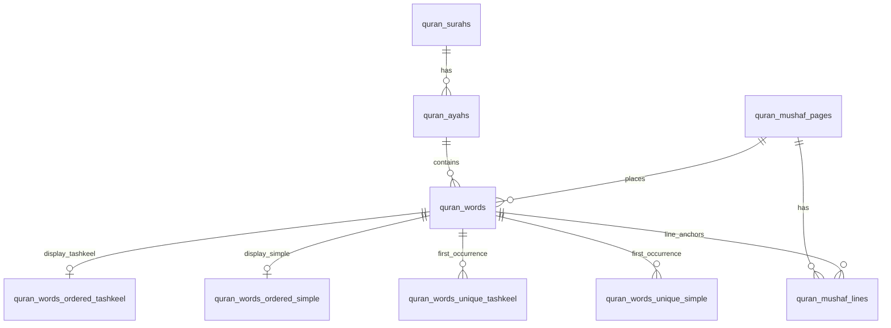
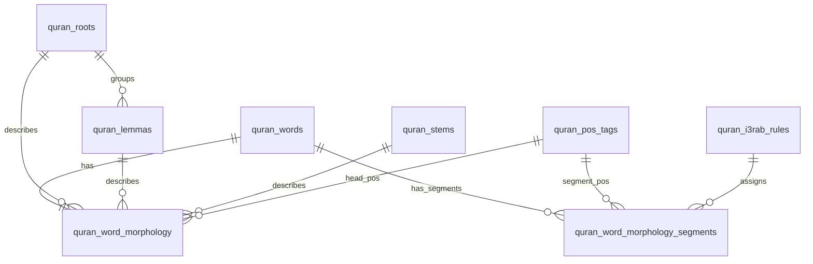
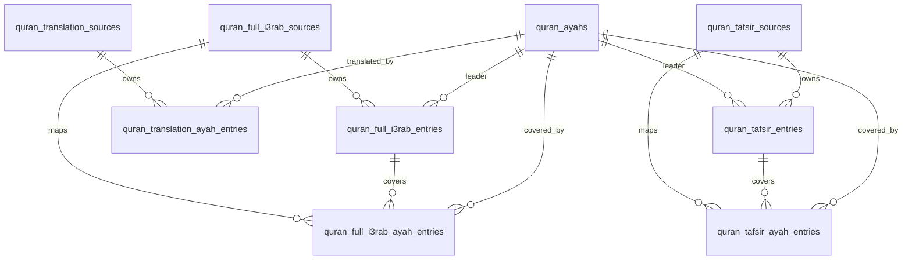
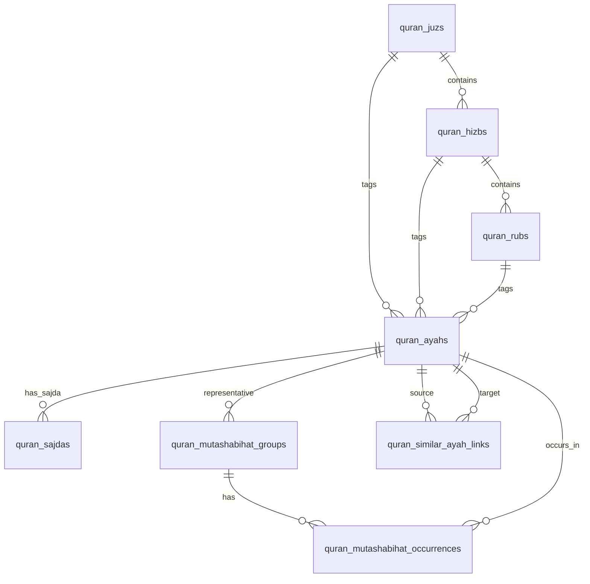

# Current Database Tables and Relationships Report

## 1. Executive summary

| Item | Value |
| --- | --- |
| Database | `quran_dashboard` |
| Inspection timestamp | `2026-06-17 17:10:08.271628+03` |
| Reset/reseed context | Local database inspected after clean drop/recreate, full migrations, and reseed/import sequence through Features 002→010. |
| Latest applied migration | `20260617104912_AddQuranFullI3rab` (`ProductVersion` `10.0.8`) |
| Application tables inspected | 31 tables (`public` schema, excluding `__EFMigrationsHistory`) |
| Inspection mode | Read-only metadata queries and direct `COUNT(*)` queries only. No migrations, importers, or database writes were run. |

## 2. Exact table row counts

All counts below are direct `COUNT(*)` results from the local PostgreSQL database.

### Quran foundation

| Table | Rows |
| --- | ---: |
| `quran_surahs` | 114 |
| `quran_ayahs` | 6,236 |
| `quran_mushaf_pages` | 604 |
| `quran_mushaf_lines` | 9,046 |
| `quran_words` | 83,668 |

### Words display tables

| Table | Rows |
| --- | ---: |
| `quran_words_ordered_tashkeel` | 77,432 |
| `quran_words_ordered_simple` | 77,432 |
| `quran_words_unique_tashkeel` | 21,294 |
| `quran_words_unique_simple` | 14,783 |

### Morphology

| Table | Rows |
| --- | ---: |
| `quran_word_morphology` | 77,432 |
| `quran_word_morphology_segments` | 128,219 |
| `quran_roots` | 1,642 |
| `quran_lemmas` | 4,793 |
| `quran_stems` | 12,108 |
| `quran_pos_tags` | 49 |

### Simple i3rab

| Table | Rows |
| --- | ---: |
| `quran_i3rab_rules` | 142 |

### Mutashabihat

| Table | Rows |
| --- | ---: |
| `quran_mutashabihat_groups` | 814 |
| `quran_mutashabihat_occurrences` | 3,557 |
| `quran_similar_ayah_links` | 3,552 |

### Tafsir

| Table | Rows |
| --- | ---: |
| `quran_tafsir_sources` | 84 |
| `quran_tafsir_entries` | 382,704 |
| `quran_tafsir_ayah_entries` | 523,824 |

### Translations

| Table | Rows |
| --- | ---: |
| `quran_translation_sources` | 167 |
| `quran_translation_ayah_entries` | 1,041,412 |

### Navigation metadata

| Table | Rows |
| --- | ---: |
| `quran_juzs` | 30 |
| `quran_hizbs` | 60 |
| `quran_rubs` | 240 |
| `quran_sajdas` | 15 |

### Full i3rab

| Table | Rows |
| --- | ---: |
| `quran_full_i3rab_sources` | 4 |
| `quran_full_i3rab_entries` | 14,513 |
| `quran_full_i3rab_ayah_entries` | 24,944 |

## 3. Table inventory

### Quran foundation

| Table | Purpose | Rows | Primary key | Natural/business keys and unique indexes | Important indexes | Main relationships |
| --- | --- | ---: | --- | --- | --- | --- |
| `quran_surahs` | Canonical surah metadata. | 114 | `surah_number` | Unique: `name_arabic`. | `IX_quran_surahs_name_arabic`. | Parent of `quran_ayahs`; referenced by `quran_mushaf_lines`. |
| `quran_ayahs` | Canonical ayah records and ayah-level navigation tags. | 6,236 | `id` | Unique: `(surah_number, ayah_number)`, `verse_key`. | Indexes on `surah_number/ayah_number`, `verse_key`, `juz_number`, `hizb_number`, `rub_number`. | Child of `quran_surahs`, `quran_juzs`, `quran_hizbs`, `quran_rubs`; parent of words, content mappings, navigation range endpoints, mutashabihat, tafsir, translations, full i3rab. |
| `quran_mushaf_pages` | Mushaf page boundaries and line counts. | 604 | `page_number` | Page number is the business key. | PK only. | Parent of `quran_mushaf_lines` and `quran_words`. |
| `quran_mushaf_lines` | Page-line layout metadata with optional word range anchors. | 9,046 | `id` | Unique: `(page_number, line_number)`. | Indexes on `page_number/line_number`, `surah_number`, `first_word_id`, `last_word_id`. | Child of `quran_mushaf_pages`; optionally references `quran_surahs`, first/last `quran_words`. |
| `quran_words` | Word occurrences and ayah-marker glyph rows in mushaf order. | 83,668 | `id` | Unique: `location`; important business order `(surah_number, ayah_number, word_number)`. | Indexes on `ayah_id`, `page_number/line_number/line_word_order`, `surah_number/ayah_number/word_number`, readable-word filtered indexes, unique-display id lookup columns. | Child of `quran_ayahs` and `quran_mushaf_pages`; parent of display tables, morphology, segments, and line anchors. |

### Words display tables

| Table | Purpose | Rows | Primary key | Natural/business keys and unique indexes | Important indexes | Main relationships |
| --- | --- | ---: | --- | --- | --- | --- |
| `quran_words_ordered_tashkeel` | Rebuildable ordered readable words preserving tashkeel. | 77,432 | `word_order_in_mushaf` | Unique: `quran_word_id`. | Indexes on `quran_word_id`, `(surah_number, ayah_number, word_order_in_ayah)`, `(surah_number, word_order_in_surah)`. | Child of `quran_words`. |
| `quran_words_ordered_simple` | Rebuildable ordered readable words in simplified/no-tashkeel identity form. | 77,432 | `word_order_in_mushaf` | Unique: `quran_word_id`. | Indexes on `quran_word_id`, `(surah_number, ayah_number, word_order_in_ayah)`, `(surah_number, word_order_in_surah)`. | Child of `quran_words`. |
| `quran_words_unique_tashkeel` | Rebuildable unique word identities by Uthmani/tashkeel text. | 21,294 | `id` | Unique: `text_uthmani`, `first_word_order_in_mushaf`. | Indexes on `first_quran_word_id`, first occurrence order, text. | Child of first-occurrence `quran_words`. |
| `quran_words_unique_simple` | Rebuildable unique word identities by simplified imlaei key. | 14,783 | `id` | Unique: `word_key_imlaei_simple`, `first_word_order_in_mushaf`. | Indexes on `first_quran_word_id`, first occurrence order, simple identity key. | Child of first-occurrence `quran_words`. |

### Morphology and simple i3rab

| Table | Purpose | Rows | Primary key | Natural/business keys and unique indexes | Important indexes | Main relationships |
| --- | --- | ---: | --- | --- | --- | --- |
| `quran_roots` | Root lexicon derived from morphology. | 1,642 | `id` | Unique: `root_text`, `first_word_order_in_mushaf`. | Index on `words_count`. | Parent of `quran_lemmas` and `quran_word_morphology`. |
| `quran_lemmas` | Lemma lexicon derived from morphology. | 4,793 | `id` | Unique: `lemma_text`, `first_word_order_in_mushaf`. | Index on `root_id`. | Optional child of `quran_roots`; parent of `quran_word_morphology`. |
| `quran_stems` | Stem lexicon derived from morphology. | 12,108 | `id` | Unique: `stem_text`, `first_word_order_in_mushaf`. | PK/unique indexes. | Parent of `quran_word_morphology`. |
| `quran_pos_tags` | Controlled POS tag catalogue. | 49 | `code` | `code` is the business key. | Indexes on `category`, `sort_order`. | Parent of morphology head POS and segment POS. |
| `quran_word_morphology` | One morphology head row per readable Quran word. | 77,432 | `quran_word_id` | Unique: `quran_word_id`; business key: `location`. | Indexes on `head_pos`, `root_id`, `lemma_id`, `stem_id`, `case_feature`, filtered verb tense/voice. | Child of `quran_words`, optional root/lemma/stem, and POS. |
| `quran_word_morphology_segments` | Segment-level morphology for readable words, extended with simple i3rab assignment. | 128,219 | `id` | Unique: `(quran_word_id, segment_number)`; business key: `segment_location`. | Indexes on `quran_word_id/segment_number`, `pos`, `i3rab_rule_id`, `arabic_render_tier`, filtered stem segments. | Child of `quran_words`, `quran_pos_tags`, and optionally `quran_i3rab_rules`. |
| `quran_i3rab_rules` | Simplified i3rab rule catalogue assigned to morphology segments. | 142 | `id` | Unique: `signature_key`. | Indexes on `signature_key`, `rule_family`. | Parent of `quran_word_morphology_segments`. |

### Mutashabihat

| Table | Purpose | Rows | Primary key | Natural/business keys and unique indexes | Important indexes | Main relationships |
| --- | --- | ---: | --- | --- | --- | --- |
| `quran_mutashabihat_groups` | Similar-ayah group headers with representative ayah. | 814 | `id` | Unique: `source_group_id`. | Index on `representative_ayah_id`. | Child of representative `quran_ayahs`; parent of occurrences. |
| `quran_mutashabihat_occurrences` | Ayah/word-span occurrences within mutashabihat groups. | 3,557 | `id` | Unique: `(group_id, ayah_id, word_from, word_to)`. | Indexes on `group_id/...`, `ayah_id`. | Child of `quran_mutashabihat_groups` and `quran_ayahs`. |
| `quran_similar_ayah_links` | Directed ayah-to-ayah similarity links. | 3,552 | `id` | Unique: `(source_ayah_id, target_ayah_id)`. | Indexes on source/target ayah ids. | Child of source and target `quran_ayahs`. |

### Tafsir

| Table | Purpose | Rows | Primary key | Natural/business keys and unique indexes | Important indexes | Main relationships |
| --- | --- | ---: | --- | --- | --- | --- |
| `quran_tafsir_sources` | Tafsir source catalogue and provenance metadata. | 84 | `id` | Unique: `source_key`, `package_file`. | Indexes on `language_code`, `(language_code, tafsir_kind)`. | Parent of tafsir entries and ayah mappings. |
| `quran_tafsir_entries` | Tafsir text entries, including grouped/range entries. | 382,704 | `id` | Unique: `(source_id, source_entry_key)`. | Indexes on `leader_ayah_id`, `(source_id, leader_ayah_id)`. | Child of tafsir source and leader `quran_ayahs`; parent of ayah mappings. |
| `quran_tafsir_ayah_entries` | Per-ayah mapping from tafsir source to tafsir entry. | 523,824 | `id` | Unique: `(source_id, ayah_id)`, `(source_id, verse_key)`. | Indexes on `(ayah_id, source_id)`, `tafsir_entry_id`, source/ayah keys. | Child of source, ayah, and tafsir entry. |

### Translations

| Table | Purpose | Rows | Primary key | Natural/business keys and unique indexes | Important indexes | Main relationships |
| --- | --- | ---: | --- | --- | --- | --- |
| `quran_translation_sources` | Translation source catalogue. | 167 | `id` | Unique: `source_key`. | Indexes on `language_code`, `(language_code, translation_type)`. | Parent of translation ayah entries. |
| `quran_translation_ayah_entries` | Per-source per-ayah translated text. | 1,041,412 | `id` | Unique: `(source_id, ayah_id)`. | Indexes on `(ayah_id, source_id)`, `(source_id, ayah_id)`. | Child of translation source and `quran_ayahs`. |

### Navigation metadata

| Table | Purpose | Rows | Primary key | Natural/business keys and unique indexes | Important indexes | Main relationships |
| --- | --- | ---: | --- | --- | --- | --- |
| `quran_juzs` | Juz header/range metadata. | 30 | `juz_number` | Juz number is the business key. | Indexes on `first_ayah_id`, `last_ayah_id`. | References first/last `quran_ayahs`; parent of `quran_hizbs` and ayah tags. |
| `quran_hizbs` | Hizb header/range metadata. | 60 | `hizb_number` | Hizb number is the business key. | Indexes on `juz_number`, `first_ayah_id`, `last_ayah_id`. | Child of `quran_juzs`; references first/last ayahs; parent of `quran_rubs` and ayah tags. |
| `quran_rubs` | Rub header/range metadata. | 240 | `rub_number` | Rub number is the business key. | Indexes on `hizb_number`, `first_ayah_id`, `last_ayah_id`. | Child of `quran_hizbs`; references first/last ayahs; parent of ayah tags. |
| `quran_sajdas` | Sajda positions and sajda type. | 15 | `sajdah_number` | Unique: `ayah_id`; business key: `verse_key`. | Unique index on `ayah_id`. | Child of `quran_ayahs`. |

### Full i3rab

| Table | Purpose | Rows | Primary key | Natural/business keys and unique indexes | Important indexes | Main relationships |
| --- | --- | ---: | --- | --- | --- | --- |
| `quran_full_i3rab_sources` | Full i3rab source catalogue and provenance metadata. | 4 | `id` | Unique: `source_key`, `package_file`. | Unique source/package indexes. | Parent of full i3rab entries and ayah mappings. |
| `quran_full_i3rab_entries` | Full i3rab HTML entries, including grouped/range entries. | 14,513 | `id` | Unique: `(source_id, source_entry_key)`. | Indexes on `leader_ayah_id`, `(source_id, leader_ayah_id)`. | Child of full i3rab source and leader `quran_ayahs`; parent of ayah mappings. |
| `quran_full_i3rab_ayah_entries` | Per-ayah mapping from full i3rab source to full i3rab entry. | 24,944 | `id` | Unique: `(source_id, ayah_id)`, `(source_id, verse_key)`. | Indexes on `(ayah_id, source_id)`, `entry_id`, source/ayah keys. | Child of source, ayah, and full i3rab entry. |

## 4. Relationship map

Delete behavior is taken from PostgreSQL foreign-key metadata (`pg_constraint.confdeltype`).

### Quran foundation

- `quran_ayahs.surah_number → quran_surahs.surah_number` — Delete: `CASCADE`. Meaning: each ayah belongs to one surah.
- `quran_mushaf_lines.page_number → quran_mushaf_pages.page_number` — Delete: `CASCADE`. Meaning: each mushaf line belongs to one page.
- `quran_mushaf_lines.surah_number → quran_surahs.surah_number` — Delete: `NO ACTION`. Meaning: a line may be associated with a surah.
- `quran_mushaf_lines.first_word_id → quran_words.id` — Delete: `NO ACTION`. Meaning: a line may point to its first word occurrence.
- `quran_mushaf_lines.last_word_id → quran_words.id` — Delete: `NO ACTION`. Meaning: a line may point to its last word occurrence.
- `quran_words.ayah_id → quran_ayahs.id` — Delete: `CASCADE`. Meaning: each word occurrence belongs to one ayah.
- `quran_words.page_number → quran_mushaf_pages.page_number` — Delete: `CASCADE`. Meaning: each word occurrence is positioned on one mushaf page.

### Words display tables

- `quran_words_ordered_simple.quran_word_id → quran_words.id` — Delete: `CASCADE`. Meaning: each ordered simple display row represents one readable source word.
- `quran_words_ordered_tashkeel.quran_word_id → quran_words.id` — Delete: `CASCADE`. Meaning: each ordered tashkeel display row represents one readable source word.
- `quran_words_unique_simple.first_quran_word_id → quran_words.id` — Delete: `CASCADE`. Meaning: each unique simple identity keeps its first source-word occurrence.
- `quran_words_unique_tashkeel.first_quran_word_id → quran_words.id` — Delete: `CASCADE`. Meaning: each unique tashkeel identity keeps its first source-word occurrence.

### Morphology and simple i3rab

- `quran_lemmas.root_id → quran_roots.id` — Delete: `NO ACTION`. Meaning: a lemma may be tied to a root.
- `quran_word_morphology.quran_word_id → quran_words.id` — Delete: `CASCADE`. Meaning: each morphology row belongs to one readable source word.
- `quran_word_morphology.head_pos → quran_pos_tags.code` — Delete: `RESTRICT`. Meaning: each morphology head uses a controlled POS tag.
- `quran_word_morphology.root_id → quran_roots.id` — Delete: `NO ACTION`. Meaning: a morphology row may reference a root.
- `quran_word_morphology.lemma_id → quran_lemmas.id` — Delete: `NO ACTION`. Meaning: a morphology row may reference a lemma.
- `quran_word_morphology.stem_id → quran_stems.id` — Delete: `NO ACTION`. Meaning: a morphology row may reference a stem.
- `quran_word_morphology_segments.quran_word_id → quran_words.id` — Delete: `CASCADE`. Meaning: each segment belongs to one source word.
- `quran_word_morphology_segments.pos → quran_pos_tags.code` — Delete: `RESTRICT`. Meaning: each segment uses a controlled POS tag.
- `quran_word_morphology_segments.i3rab_rule_id → quran_i3rab_rules.id` — Delete: `RESTRICT`. Meaning: a segment may be assigned one simple i3rab rule.

### Mutashabihat

- `quran_mutashabihat_groups.representative_ayah_id → quran_ayahs.id` — Delete: `CASCADE`. Meaning: each group has a representative ayah.
- `quran_mutashabihat_occurrences.group_id → quran_mutashabihat_groups.id` — Delete: `CASCADE`. Meaning: each occurrence belongs to one group.
- `quran_mutashabihat_occurrences.ayah_id → quran_ayahs.id` — Delete: `CASCADE`. Meaning: each occurrence points to one ayah.
- `quran_similar_ayah_links.source_ayah_id → quran_ayahs.id` — Delete: `CASCADE`. Meaning: each directed similarity link starts from one source ayah.
- `quran_similar_ayah_links.target_ayah_id → quran_ayahs.id` — Delete: `CASCADE`. Meaning: each directed similarity link targets one ayah.

### Tafsir

- `quran_tafsir_entries.source_id → quran_tafsir_sources.id` — Delete: `CASCADE`. Meaning: each tafsir entry belongs to one tafsir source.
- `quran_tafsir_entries.leader_ayah_id → quran_ayahs.id` — Delete: `CASCADE`. Meaning: each tafsir entry has a leader ayah for its source entry/range.
- `quran_tafsir_ayah_entries.source_id → quran_tafsir_sources.id` — Delete: `CASCADE`. Meaning: each tafsir ayah mapping belongs to one source.
- `quran_tafsir_ayah_entries.ayah_id → quran_ayahs.id` — Delete: `CASCADE`. Meaning: each tafsir mapping covers one ayah.
- `quran_tafsir_ayah_entries.tafsir_entry_id → quran_tafsir_entries.id` — Delete: `CASCADE`. Meaning: each per-ayah mapping resolves to one tafsir entry.

### Translations

- `quran_translation_ayah_entries.source_id → quran_translation_sources.id` — Delete: `CASCADE`. Meaning: each translation ayah entry belongs to one translation source.
- `quran_translation_ayah_entries.ayah_id → quran_ayahs.id` — Delete: `CASCADE`. Meaning: each translation ayah entry covers one ayah.

### Navigation metadata

- `quran_ayahs.juz_number → quran_juzs.juz_number` — Delete: `RESTRICT`. Meaning: each tagged ayah belongs to one juz.
- `quran_ayahs.hizb_number → quran_hizbs.hizb_number` — Delete: `RESTRICT`. Meaning: each tagged ayah belongs to one hizb.
- `quran_ayahs.rub_number → quran_rubs.rub_number` — Delete: `RESTRICT`. Meaning: each tagged ayah belongs to one rub.
- `quran_juzs.first_ayah_id → quran_ayahs.id` — Delete: `RESTRICT`. Meaning: each juz records its first ayah.
- `quran_juzs.last_ayah_id → quran_ayahs.id` — Delete: `RESTRICT`. Meaning: each juz records its last ayah.
- `quran_hizbs.juz_number → quran_juzs.juz_number` — Delete: `RESTRICT`. Meaning: each hizb belongs to one juz.
- `quran_hizbs.first_ayah_id → quran_ayahs.id` — Delete: `RESTRICT`. Meaning: each hizb records its first ayah.
- `quran_hizbs.last_ayah_id → quran_ayahs.id` — Delete: `RESTRICT`. Meaning: each hizb records its last ayah.
- `quran_rubs.hizb_number → quran_hizbs.hizb_number` — Delete: `RESTRICT`. Meaning: each rub belongs to one hizb.
- `quran_rubs.first_ayah_id → quran_ayahs.id` — Delete: `RESTRICT`. Meaning: each rub records its first ayah.
- `quran_rubs.last_ayah_id → quran_ayahs.id` — Delete: `RESTRICT`. Meaning: each rub records its last ayah.
- `quran_sajdas.ayah_id → quran_ayahs.id` — Delete: `RESTRICT`. Meaning: each sajda row marks one ayah.

### Full i3rab

- `quran_full_i3rab_entries.source_id → quran_full_i3rab_sources.id` — Delete: `CASCADE`. Meaning: each full i3rab entry belongs to one source.
- `quran_full_i3rab_entries.leader_ayah_id → quran_ayahs.id` — Delete: `CASCADE`. Meaning: each full i3rab entry has a leader ayah.
- `quran_full_i3rab_ayah_entries.source_id → quran_full_i3rab_sources.id` — Delete: `CASCADE`. Meaning: each full i3rab ayah mapping belongs to one source.
- `quran_full_i3rab_ayah_entries.ayah_id → quran_ayahs.id` — Delete: `CASCADE`. Meaning: each full i3rab mapping covers one ayah.
- `quran_full_i3rab_ayah_entries.entry_id → quran_full_i3rab_entries.id` — Delete: `CASCADE`. Meaning: each per-ayah mapping resolves to one full i3rab entry.

## 5. Quran data model overview

- **Surah → Ayah**: `quran_surahs` is keyed by `surah_number`; `quran_ayahs` references it by `surah_number` and also carries unique `verse_key` and `(surah_number, ayah_number)` identities.
- **Ayah → Words**: `quran_words.ayah_id` links every word/ayah-marker row to its ayah. `quran_words` contains 77,432 readable words plus 6,236 ayah markers.
- **Page/Line layout → Words**: `quran_mushaf_pages` owns pages; `quran_mushaf_lines` owns `(page_number, line_number)` layout rows and can point to first/last words; `quran_words` stores page/line/line-word ordering.
- **Words → Ordered/unique display tables**: ordered display tables map one-to-one to readable `quran_words`; unique display tables store canonical identity rows and point to the first source word occurrence.
- **Words → Morphology**: `quran_word_morphology` is keyed by `quran_word_id`, giving one morphology head row per readable word.
- **Morphology → Segments**: `quran_word_morphology_segments` stores ordered segments per `quran_word_id` using `(quran_word_id, segment_number)` uniqueness.
- **Segments → Simple i3rab rules**: each segment may reference `quran_i3rab_rules.id`; in this reset all 128,219 segments have i3rab assigned.
- **Ayah → Tafsir entries**: tafsir sources own text entries; `quran_tafsir_ayah_entries` maps every covered ayah/source pair to a tafsir entry.
- **Ayah → Translation entries**: `quran_translation_ayah_entries` maps each translation source to per-ayah translated text.
- **Ayah → Navigation metadata**: `quran_ayahs` stores denormalized `juz_number`, `hizb_number`, and `rub_number`; division tables store range headers and first/last ayah anchors; `quran_sajdas` marks sajda ayahs.
- **Ayah → Full i3rab entries**: full i3rab sources own HTML entries; `quran_full_i3rab_ayah_entries` maps every covered ayah/source pair to an entry.
- **Ayah → Mutashabihat occurrences and similar ayah links**: group/occurrence tables tie word spans to ayahs, while `quran_similar_ayah_links` stores directed source→target ayah similarity edges.

## 6. Coverage checks

### Quran foundation

| Metric | Count |
| --- | ---: |
| Surahs | 114 |
| Ayahs | 6,236 |
| Pages | 604 |
| Lines | 9,046 |
| `quran_words` total | 83,668 |
| Readable words | 77,432 |
| Ayah markers | 6,236 |

### Words display

| Metric | Count |
| --- | ---: |
| Ordered tashkeel | 77,432 |
| Ordered simple | 77,432 |
| Unique tashkeel | 21,294 |
| Unique simple | 14,783 |

### Morphology

| Metric | Count |
| --- | ---: |
| Morphology rows | 77,432 |
| Segment rows | 128,219 |
| Roots | 1,642 |
| Lemmas | 4,793 |
| Stems | 12,108 |
| POS tags | 49 |

### Simple i3rab

| Metric | Count |
| --- | ---: |
| I3rab rules | 142 |
| Segment rows with i3rab assigned (`i3rab_rule_id IS NOT NULL`) | 128,219 |
| Segment rows with i3rab text | 128,219 |

### Mutashabihat

| Metric | Count |
| --- | ---: |
| Groups | 814 |
| Occurrences | 3,557 |
| Similar links | 3,552 |
| Distinct source ayahs for similar links | 1,162 |

### Tafsir

| Metric | Count |
| --- | ---: |
| Sources | 84 |
| Entries | 382,704 |
| Ayah mappings | 523,824 |
| Distinct ayahs covered | 6,236 |

### Translations

| Metric | Count |
| --- | ---: |
| Sources | 167 |
| Ayah mappings | 1,041,412 |
| Distinct ayahs covered | 6,236 |

### Navigation metadata

| Metric | Count |
| --- | ---: |
| Juz | 30 |
| Hizb | 60 |
| Rub | 240 |
| Sajda | 15 |
| Ayahs tagged with juz | 6,236 |
| Ayahs tagged with hizb | 6,236 |
| Ayahs tagged with rub | 6,236 |

### Full i3rab

| Metric | Count |
| --- | ---: |
| Sources | 4 |
| Entries | 14,513 |
| Ayah mappings | 24,944 |
| Distinct ayahs covered | 6,236 |

## 7. Mermaid ER diagrams

### Quran core + words/display

### Morphology + simple i3rab

### Ayah content: tafsir, translations, full i3rab

### Navigation + mutashabihat

## 8. Notes and recommendations

- **Intentionally not enforced by FK / denormalized anchors**:
  - `quran_words.unique_simple_word_id` and `quran_words.unique_tashkeel_word_id` are indexed lookup columns but are not enforced as foreign keys to the unique display tables. They are derived identity links populated by the display-table rebuild process.
  - `quran_mushaf_pages.first_surah_number`, `first_ayah_number`, `last_surah_number`, and `last_ayah_number` are page-boundary values and are not FK-enforced to `quran_ayahs`.
  - Navigation tables keep `first_verse_key` / `last_verse_key` and `quran_sajdas.verse_key` as readable source keys while FK enforcement is through ayah ids.
  - Tafsir/full-i3rab mapping tables keep `verse_key` and source leader keys as traceability fields while FK enforcement is through ayah/source/entry ids.
- **Derived/rebuildable tables**:
  - `quran_words_ordered_tashkeel`, `quran_words_ordered_simple`, `quran_words_unique_tashkeel`, and `quran_words_unique_simple` are derived from `quran_words`.
  - Morphology lexicons (`quran_roots`, `quran_lemmas`, `quran_stems`, `quran_pos_tags`) and morphology rows are importer-derived from morphology source data.
  - `quran_i3rab_rules` and segment i3rab assignments are generated/importer-applied over morphology segments.
  - Navigation division tables and ayah navigation tags are importer-derived from the staged navigation package.
  - Tafsir, translation, mutashabihat, and full-i3rab tables are importer-populated from staged source packages and can be rebuilt by their feature import workflows.
- **Import-order dependencies**:
  - Quran foundation must exist first: surahs, ayahs, pages, lines, and words.
  - Words display depends on readable `quran_words`.
  - Morphology depends on readable `quran_words`; simple i3rab depends on morphology segments.
  - Mutashabihat, tafsir, translations, navigation metadata, and full i3rab all depend on canonical `quran_ayahs`/`verse_key` resolution.
  - Navigation metadata also relies on all 6,236 ayahs being present before tagging `juz_number`, `hizb_number`, and `rub_number`.
- **Schema documentation notes**:
  - EF Core creates many uniqueness rules as PostgreSQL unique indexes rather than named unique constraints; this report therefore lists important unique indexes as business-key enforcement.
  - Delete behavior is mixed intentionally: content/import tables mostly cascade from ayahs/sources; navigation tables use `RESTRICT` for range/tag safety.
  - This report intentionally does **not** include nullable/all-null column cleanup analysis or column-drop recommendations.

## 9. Verification

- Inspection tooling: `psql` against local PostgreSQL with connection settings sourced from safe local configuration/user-secrets handling. Passwords and full connection strings were not printed in this report.
- Read-only guard: queries were executed with `PGOPTIONS='-c default_transaction_read_only=on'`; inspection SQL used catalog reads plus direct `COUNT(*)` checks.
- Metadata queries used:
  - `SELECT ... FROM "__EFMigrationsHistory" ORDER BY "MigrationId" DESC LIMIT 1` for latest migration.
  - `pg_class` / `pg_namespace` for application table discovery.
  - Direct `SELECT COUNT(*) FROM <table>` for every application table and coverage metric.
  - `pg_constraint`, `pg_attribute`, and `pg_indexes` for primary keys, unique indexes, indexes, foreign keys, and delete behavior.
- No database writes were performed.
- No source code was changed; only this Markdown report file was created.
