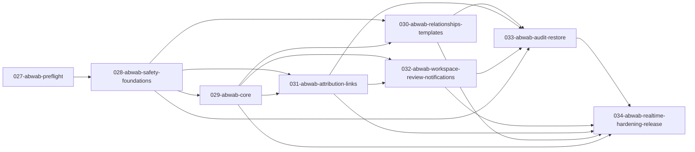

# Abwab / Categories Management — Master Plan

> **Canonical Abwab Master Plan — documentation only.** This document has passed an
> independent adversarial review and is the sole canonical product and architecture
> source for the eight Abwab Spec Kits `027`–`034`. It organizes the work as eight
> high-level Spec Kits with internal phases and is fully self-contained: no other
> planning, decision, remediation, or review document is required to understand or
> execute it.

## 1. Status, authorization, and canonical role

- **Status:** `CANONICAL — 027-ABWAB-PREFLIGHT AUTHORIZED`. The independent adversarial
  review passed; superseded planning sources have been removed; this Master Plan is now
  the canonical source. This status covers planning only and does not claim that any
  Spec Kit or implementation is complete.
- **Authorization:** `027-abwab-preflight` is authorized. Spec Kits `027`–`034` are
  generated from this document alone, strictly per the DAG and internal checkpoints
  below.
- **Task boundary:** this is a plan. No production code, test, migration, database,
  importer, package, Spec Kit, branch, commit, push, or PR action is part of this
  document.
- **Final implementation review:** a review-only authorization gate after `034`; it is
  not an implementation Spec Kit. Findings return to their owning Spec Kit.

This plan is self-contained. A downstream Spec Kit must not reopen a behavior, restore
class, permission code, persistence boundary, protection rule, frontend ownership rule,
dependency, or acceptance criterion recorded here.

## 2. Single source of truth

- `MASTER_PLAN.md` is the sole canonical product and architecture source for Abwab Spec
  Kits `027`–`034`.
- Repository source, configuration, and tests are authoritative only for verified
  current implementation facts.
- Historical planning, remediation, and review documents are not normative inputs and
  are not required to create or execute any Abwab Spec Kit.
- No later Spec Kit may reopen or reinterpret a locked product or architecture decision
  contained in this Master Plan. A genuinely required product or foundational
  architecture change returns to an independent amendment/re-review of this document; it
  is not a local “decision gate.”

The plan's own matrices, registries, and checklists are traceability aids that restate
decisions already made elsewhere in this same document; they are not external
dependencies.

### 2.1 Explicit supersessions that must not leak downstream

- `RepresentativeQuranExcerpt` is an optional, user-entered plain string. It has no
  representative-ayah identity, is not a Quran foreign key, and need not contain a
  whole ayah. Older identity-only representative-ayah wording is superseded.
- Relationship mutations and reorder-only operations do not activate or fall under
  the ordinary 24-hour gate. Older wording that treated them as ordinary 24-hour
  category edits is superseded.
- A grouped link always contains at least two ayahs. Removing a member from a
  two-member group offers delete-the-whole-block confirmation; confirmation deletes
  the whole aggregate, while cancellation changes nothing. There is no one-member
  grouped link and no conversion to a single link.
- Permission assignments and active System Owner membership are current security
  state outside Product Restore. Product Restore never re-grants, revokes, adds, or
  removes them.
- Canonical highlights use `QuranWord.Id`; `MushafWordId` is not a new identity type.
- Ordered notes replace stale source-description wording. Notes never own or embed
  word/highlight identifiers.

## 3. Scope

### 3.1 In scope

- Admin-dashboard management of sections, doors, hierarchy, ordering, search aliases,
  manual protection, relationships, templates, and template application.
- Surah, Single Ayah, and Grouped Ayah link aggregates; per-ayah word highlights;
  ordered link-owned notes; unified source selection and link-check.
- Personal attribution workspace, submit/resubmit, review, permanent workflow
  history, race-safe reservation, and durable notifications.
- Append-only audit, point-in-time Product Restore, persisted preview, safety points,
  irreversible timeline generations, maintenance mode, and the exact two-hour
  stabilization gate.
- Immutable System Owner identity, canonical permissions, optimistic concurrency,
  layered tracked-write enforcement, cache consistency, realtime hints, CI, migration
  safety, browser verification, performance, and operational release readiness.

### 3.2 Explicitly out of scope

- Public visitor pages, public APIs, SEO, publishing workflow, or speculative
  publication fields.
- Per-operation undo, selective restore, restore-of-restore, branch replay, or an
  early-end/bypass for stabilization.
- Drag-and-drop anywhere in the application.
- Direct door copy or creating a template from real doors.
- Copying Quran links between doors.
- An Outbox, email/external notifications, or SignalR as a source of truth.
- A frontend Quran projection, committed raw Quran source packages, or duplicated
  Quran/tafsir/translation/morphology text in Abwab tables.
- Mutashabihat word-position extraction/highlighting. Ayah-level linking from the
  selected mutashabihat group is in scope; word extraction remains deferred until a
  separate source-accuracy report locks it.
- A custom Roslyn analyzer in the initial implementation. Restricted abstractions,
  architecture/source tests, and CI enforcement are the locked first controls.
- Starter templates. Templates are authored manually by administrators.

### 3.3 Operational-fluency invariant

Abwab is a sustained daily curation surface, not a sequence of disposable forms.
Repeated create, move, reorder, link, workspace, and review operations minimize steps
without weakening confirmation or authorization. After a successful mutation, every
still-valid section/global tab, search and source filter, tree expansion, selection,
focus target, and scroll position is preserved. After a 409 or required authoritative
reload, unsaved input remains available and the UI preserves all still-valid context,
clears only invalidated selections, and shows current/new/conflict state explicitly
before the user chooses a fresh command. A full tree/domain refresh may be the data
mechanism, but it must not reset the user's working context.

## 4. Verified repository reality that constrains the plan

These are current implementation facts, not desired-state claims:

- Abwab is greenfield. The current DbContext contains Quran and Access data; no Abwab
  entities, permissions, System Owners, ChangeSets, restore previews, protections,
  requests, notifications, or SignalR implementation exists.
- Authentication is Logto plus DB-derived fixed roles. Owner bootstrap currently maps
  a configured email to the Owner role. `/me` has identity/status/role data only.
  Existing role policies are not permission infrastructure and are not attached to
  feature endpoints.
- `/me` may provision/promote a user and call `SaveChangesAsync`; the application is
  not wholly read-only even though Abwab writes are greenfield.
- Backend targets .NET 10 with EF Core 10.0.8 and Npgsql EF 10.0.0. The installed
  provider supports `uint Version` configured with `.IsRowVersion()` as PostgreSQL
  `xmin`; no current concurrency mapping or legacy provider-specific xmin shortcut is
  available.
- The API uses hand-written handlers/outcomes, `ApiResponse<T>`, offset
  `PagedResult<T>`, Arabic response messages, and cancellation tokens. The existing
  `Backend/scripts/check-api-contract` is reusable.
- Rate limiting is registered before authentication and is IP-partitioned, but the
  committed default configuration disables it. The plan verifies deployment
  enablement; it does not rebuild middleware or claim current operational protection.
- No tracked CI workflow exists. Startup does not auto-apply migrations and has no
  schema-head assertion. A production migration runner/authorization process is not
  established by tracked repository files; external Railway branch behavior is not
  treated as verified fact.
- Angular 20, Signals, CDK, Vitest/jsdom, and CDK virtual scrolling exist. There is no
  `@angular/forms`, SignalR client, Playwright/Cypress harness, Abwab domain port, or
  production mock adapter. `/gates` is an unguarded placeholder route.
- `ApiResponseCache` is a bounded 48-entry success-only/in-flight-deduplicating LRU,
  but it has no public targeted invalidation API.
- Real PostgreSQL/Testcontainers, API fixtures, SQL-command counting, and row
  materialization interceptors exist. Some fixtures migrate; others use
  `EnsureCreated`. There is no dedicated browser E2E or load harness. The existing
  frontend test suite depends on a Vitest fork-concurrency cap set through environment
  variables in `package.json` (currently `VITEST_MIN_FORKS=1` and `VITEST_MAX_FORKS=2`)
  that prevents test-run OOM/freeze; `vitest.config.ts` is ignored by the current
  `@angular/build:unit-test` builder, so this cap must remain in `package.json` and must
  not be “cleaned up” by moving it into an ignored config file. It may be replaced only
  by a substitute proven with the actual Angular builder and the full frontend suite.
- `QuranWord.Id` and canonical ayah IDs are source-preserved, non-generated keys.
  Current source identity does not prove arbitrary future source packages cannot
  renumber, so production imports must verify a pinned source identity/manifest.
  `WordMorphologySegment.Id` is not stable; `(QuranWordId, SegmentNumber)` is.
- The importer exposes multiple destructive `--force` paths. The foundation path
  currently executes `TRUNCATE ... RESTART IDENTITY CASCADE`; morphology,
  mutashabihat, tafsir, translation, navigation, full-i'rab, and rebuilding paths also
  require inventory and environment/privilege controls.
- `resources/` is local and gitignored. CI cannot assume staged source packages are
  present, and this plan does not require committing them.

## 5. Frozen vocabulary, labels, and catalogue inputs

There are no open product or architecture Decision Gates.

| Concern | Frozen value |
|---|---|
| Arabic entity term | `باب` / `أبواب`; never `تصنيف` for this entity |
| Backend entity terms | `Category`, `Section` |
| Existing route key | `/gates`; the visible page title is `الأبواب` |
| Permanent default section | `أبواب غير مصنفة` |
| Global root view | `كل الأبواب`; a view, never a persisted Section |
| Template UI label | `قوالب الأبواب` |
| Search-alias UI label | `أسماء البحث` |
| Link-note UI label | `ملاحظات الرابط` |
| Personal preparation page | `مساحة إعداد الطلبات` |
| Audit changed-value treatment | `--qd-accent-text`/allowed green plus a textual or icon indicator; never color alone |
| Complex editable forms | Angular Reactive Forms; Signals own page/UI state, not the same form-field values |

### 5.1 Arabic normalization contract

One algorithm is used for category names, category aliases, section names, template
names, and any database uniqueness/search projection that says “normalized”:

1. Unicode normalize to NFC using Unicode 16.0 / UAX #15 semantics. A future Unicode
   data-version change that alters any accepted normalization vector requires an
   independently reviewed Master Plan amendment; a downstream Spec Kit cannot silently
   inherit different runtime tables.
2. Trim leading/trailing whitespace and collapse internal Unicode whitespace runs to
   one ASCII space.
3. Remove tatweel (`ـ`).
4. Remove a scalar exactly when it is in this frozen Unicode-16 Arabic-mark set:
   `U+0610–U+061A`, `U+064B–U+065F`, `U+0670`, `U+06D6–U+06DC`,
   `U+06DF–U+06E4`, `U+06E7–U+06E8`, `U+06EA–U+06ED`,
   `U+0897–U+089F`, `U+08CA–U+08E1`, `U+08E3–U+08FF`, or
   `U+10EFC–U+10EFF`. Do not use a runtime-dependent “all marks” predicate and do not
   remove adjacent format characters or letters outside this set.
5. Normalize `أ`, `إ`, `آ`, and `ٱ` to `ا`.
6. Normalize `ى` to `ي`.
7. Do **not** normalize `ة` to `ه`.
8. Preserve the original display string; only comparison/search uses the normalized
   value.

The implementation must publish one canonical input/output fixture corpus used by
backend domain tests, database/index tests, API tests, and frontend search/parity tests.
It exhaustively covers every frozen mark-range boundary and gap, decomposed/composed
forms, each alef/maqsura mapping, tatweel, whitespace classes, `ة`, and supplementary-
plane scalars. The database stores normalized values written by the domain path;
uniqueness constraints are the final race-safe guard.

### 5.2 Canonical permission catalogue

The initial catalogue is exact and uses these codes only:

| Domain | Codes |
|---|---|
| Category | `category.view`, `category.add`, `category.edit`, `category.move`, `category.reorder`, `category.delete`, `category.restore` |
| Section | `section.view`, `section.add`, `section.edit`, `section.reorder`, `section.delete` |
| Manual protection | `protection.view`, `protection.apply`, `protection.lift` |
| Relationships | `relationship.view`, `relationship.add`, `relationship.edit`, `relationship.delete`, `relationship.restore` |
| Templates | `template.view`, `template.add`, `template.edit`, `template.delete`, `template.restore`, `template.apply` |
| Attribution | `attribution.view`, `attribution.request.create`, `attribution.request.withdraw`, `attribution.request.approve`, `attribution.request.reject`, `attribution.request.requestChanges` |
| Audit/restore | `audit.view`, `audit.restore`, `safetyPoint.view`, `safetyPoint.create`, `safetyPoint.edit` |
| Notifications | `notification.view`, `notification.markRead` |
| Permission administration | `permission.view`, `permission.grant`, `permission.revoke` |

Rules:

- `category.copy`, a grantable Owner-bypass permission, and a SystemOwner-direct-link
  permission do not exist.
- A current enabled System Owner satisfies every ordinary Abwab catalogue permission
  through the `SystemOwner` policy without persisted grant rows. This automatic
  authorization does not make ownership derive from permissions and cannot bypass
  manual protection or stabilization.
- The catalogue includes metadata for assignability. `permission.*`, `audit.restore`,
  and `safetyPoint.*` are `SystemOwnerOnly` and cannot be granted to ordinary users.
  System Owner direct link commands use the `SystemOwner` policy, not a catalogue code.
- `attribution.view` has `DashboardAdminBaseline` metadata. Every enabled dashboard
  administrator receives it from the base dashboard-admin policy and `/me` projection,
  independent of optional role/user assignment rows. Grant/revoke commands cannot
  remove or shadow this baseline while the account retains dashboard-admin access.
  Review-decision permissions remain separately assignable. Catalogue, seed, policy,
  administration UI, and tests all expose this distinction rather than relying on a
  convention that every role bundle happens to contain a removable grant.
- Identical strings and metadata are used by backend authorization, DB seed/storage,
  `/me`, frontend action visibility, generated contracts, and tests.
- Every new protected endpoint must use an existing catalogue code or update this
  canonical table before implementation; synonyms such as create/add or remove/delete
  are forbidden.
- Aggregate subresources do not invent child-CRUD permissions. CategorySearchAlias
  add/edit/remove is category direct-content editing and requires `category.edit`.
  `template.add` creates a DoorTemplate aggregate; `template.edit` owns TemplateNode
  and TemplateNodeSearchAlias add/edit/reparent/reorder/internal removal;
  `template.delete`/`template.restore` own aggregate lifecycle; and `template.apply`
  alone applies it to one real category. Handler, architecture/source, mock/HTTP parity,
  and negative-permission tests enforce these mappings.
- Backend handler enforcement is authoritative. Frontend visibility is UX only.

`027-abwab-preflight` records these frozen values in Spec Kit-ready traceability form;
it does not choose or alter them.

## 6. Cross-cutting architecture invariants

### 6.1 Write and audit boundary

All product-audited Abwab operations use one approved ChangeSet unit of work. One
completed product-audited operation has exactly one final, commit-correct
`ChangeSetSequence` and ordered `EventOrdinal`s. Permission/SystemOwner changes use a
separate approved permanent security-audit unit of work and do not become product
restore-head events. Failure of the applicable product or security audit rolls back the
entire mutation.

Layered enforcement is mandatory:

1. **Restricted persistence abstractions.** Abwab command handlers receive only the
   approved DbContext/ChangeSet unit of work and focused repositories/query services.
   Raw Npgsql, raw SQL command services, COPY writers, and unrestricted DbContext
   access are not exposed to Abwab writer namespaces.
2. **CI architecture/source tests.** CI fails if an Abwab writer namespace references
   `ExecuteUpdate`, `ExecuteDelete`, `ExecuteSqlRaw`, `ExecuteSqlInterpolated`, raw
   `DbCommand`, `NpgsqlConnection`, `NpgsqlCommand`, binary COPY, or another explicitly
   forbidden bypass. A narrow reviewed allowlist is allowed only for non-product,
   non-revertible infrastructure with an owner and rationale. A custom Roslyn analyzer
   is not planned initially.
3. **Runtime `SavingChanges` guard.** This guard observes only tracked entries sent
   through that DbContext. Within that boundary it requires an ambient ChangeSet for
   tracked revertible writes and rejects physical deletes of soft-deletable product
   state. It does not claim to observe set-based/raw/direct/other-connection writes.
   There are exactly two locked physical-delete shapes among soft-deletable product/
   personal state: (a) owner-authorized leave-wait deletes only that workspace item's
   WaitingListEntry; (b) eligible personal aggregate hard-delete removes its current
   proposal/source children and WaitingListEntry first, then its workspace row,
   atomically. No submitted request, immutable submission, decision, audit, or applied
   effect is in either exception. Physical removal
   of active SystemOwner membership is separate current-security-state handling through
   the permanent security-audit unit of work, not a product soft-delete exception.
4. **Database defense in depth.** ChangeSets/events and permanent security/workflow
   audit are append-only under the application role; the application role cannot
   TRUNCATE protected tables; RESTRICT/NO ACTION FKs, CHECKs, filtered unique indexes,
   and privileges enforce invariants that PostgreSQL can express.

Personal draft edits and notification read-state are explicitly outside the product
audit timeline and do not create restore coordinates. They still use tracked writes,
row concurrency, ownership authorization, and the global stabilization gate. Durable
notifications created by an audited domain operation are part of that operation’s
transaction and are not separate ChangeSets.

### 6.2 Commit ordering and retry policy

The final sensitive section of a product-audited write runs as follows. Security-audit
writes use the same barrier, live-authorization, tracked-transaction, audit-atomicity,
and post-commit rules but do not advance the Product Restore timeline head.

1. prepare non-sensitive reads;
2. begin one database transaction;
3. row-lock and evaluate the singleton `AbwabWriteBarrier` as the first writer gate;
4. row-lock the singleton `AbwabRevisionState` timeline head;
5. compare the command's `ExpectedTimelineGeneration` with the locked current
   generation, then reload and revalidate live authorization, account/System Owner state,
   stabilization, manual/ordinary protection, concurrency, no-op state, and targets;
   lock the current account/owner/security rows whose change would invalidate this
   sensitive command until commit;
6. apply tracked mutations and owning aggregate revision changes;
7. generate versioned audit events from tracked pre/post images;
8. advance `AbwabRevisionState.AuditHeadSequence` and assign one final sequence;
9. persist ChangeSet/events and required notification rows;
10. commit while holding both locks, then release them;
11. only after commit publish cache/store state and realtime hints.

Both product-write locks are held through commit, so a lower sequence cannot commit
after a higher one. Security-audit-only writes take the same barrier and revision-state
locks in that order to enforce generation freshness, then their dedicated serialized
security rows; they do not advance `AuditHeadSequence` or create Product Restore
events. PostgreSQL sequences are not used as the public commit-order coordinate.

Provider transient retries remain disabled for every Abwab manual transaction in this
scope. Enabling them later is outside this feature and requires an amended,
independently reviewed architecture; no downstream Spec Kit may choose it. Optimistic
conflicts, restore execution, and user commands are never silently retried or merged.

### 6.3 Audit snapshots and presentation contract

- Every event stores `SnapshotSchemaVersion`, entity/aggregate identity, restore class,
  full product before/after state, and historical section/path where applicable.
- Snapshots exclude `xmin`, logical revision counters, cache state, and realtime
  cursors.
- The main audit page shows one row per **main-log-eligible ChangeSet**, newest first,
  with real pagination and filters for sequence, domain, action, actor, reviewer,
  approval type, status, date, door name, and historical path.
- Direct audited domain operations, manual protection, template application, Approved/
  Rejected/ChangesRequested decisions, and Restore are eligible. A Restore row includes
  its `InvalidatedByRestore` transitions/details without creating duplicate per-request
  rows. Submit/Resubmit Pending ChangeSets remain permanent history but appear only in
  the request worklist/detail until an eligible decision renders their submission actor/
  time; they never appear as standalone main-log Pending rows. Withdraw is ineligible.
  Template CRUD remains in its separate history view; SafetyPoints, security audit,
  personal workspace, notification/read state, and technical barrier/head changes do
  not become main product-audit rows.
- Every main-list row exposes the locked columns: global ChangeSet sequence, domain,
  action, actor, status, reviewer, details summary, and notes summary. A value that is
  inapplicable is rendered explicitly rather than silently dropping the column.
- Actor and action time appear together; reviewer and decision time appear together.
  Direct structure actions show reviewer “غير مطلوب”. System Owner direct link actions
  show `Auto / اعتماد تلقائي` and `SystemOwnerDirect`.
- Newly created links render full-width; modifications and deletions render current
  state on the right and proposed/result state on the left. Mixed requests retain both
  treatments within one ChangeSet.
- Request/review detail shows the proposal's general explanation first. New-link cards
  show the full canonical ayah text; modifications distinguish added/removed highlights,
  removing every highlight while retaining the link, note-only changes, member-set
  changes, and deleting the entire link. One ayah contributed by multiple sources is
  rendered once, true no-ops are absent, and SystemOwnerDirect uses the same details.
- Category creation renders the complete new state—name, representative excerpt,
  description, aliases, section, parent, full path, and every order—with empty values
  shown as `غير محدد`. Category edit uses the same complete-field component with old
  state on the right, new state on the left, and changed-value green plus a non-color
  marker; it never hides unchanged or empty fields.
- One bulk move is one ChangeSet. Its detail shows the selected root count and, for
  each selected root, name, historical section/path/order before and after, moved
  descendant count and expandable moved subtree. Descendants are nested rather than
  reported as independent moves; sibling-order side effects are grouped by affected
  parent/order scope.
- One subtree delete/operation-restore is one ChangeSet. Its detail shows the selected
  root, DeletionOperationId, complete affected subtree, dormant attached-state counts,
  historical/current paths and orders, and any personal items notified; attached state
  is labelled dormant rather than falsely shown as deleted.
- Manual-protection detail shows target, each type, scope, actor/time, before/after,
  and every direct/inherited protection whose effective result changed.
- Template application stores and renders the template identity and frozen template
  snapshot at application time, target/path, complete created tree, all copied basic
  fields, and counts by level. Later template edits cannot change this rendering.
- The separate template-history view uses the same engine and shows actor/time, action,
  complete before/after template trees, and changed nodes/fields for manual create,
  edit, delete, and restore.
- Highlights render inline in canonical Quran text; internal IDs are hidden. Ordered
  pure-string notes render beneath their owning single/group block.
- Historical section/path at operation/decision time is immutable. Current door name,
  path, deletion/restoration state is fetched on open as an additional live view.
- While a request is Pending, its detail resolves the current live category name,
  section, and path. Approval, rejection, or ChangesRequested freezes the name/section/
  path at decision time; later opens add the current state or deleted/restored warning
  without rewriting history.
- Approved/rejected decisions, reviewer metadata, and review notes remain permanent.
  If restore removes an approved effect, the audit UI shows that the decision remains
  and links to the restore that removed the effect.
- Withdrawn work is absent from the main log. `ChangesRequested`, rejection,
  `InvalidatedByRestore`, restore, manual protection, and applied-template operations
  have their locked presentations. Template CRUD uses its separate history view over
  the same append-only audit engine.
- SafetyPoint creation/edit remains outside main audit rows and renders its name,
  description, creator, time, generation, target sequence, and eligibility in its own
  metadata view. A restore row renders target/SafetyPoint, executor/time, reversed
  ChangeSets, affected categories/links/data, invalidated Pending requests, actually
  affected notification recipients, result, abandoned boundary, new generation, and
  stabilization end time.

### 6.4 Concurrency and logical revisions

- Every mutable Abwab row has `uint Version` configured with `.IsRowVersion()` to
  PostgreSQL `xmin`. Append-only rows are immutable rather than updated.
- `xmin` is only a row concurrency token. It is never an audit coordinate, restore
  target, logical revision, or serialized inverse value.
- `TreeRevision`, `CategoryContentRevision`, `TemplateRevision`, `LinkRevision`, and
  `AttributionRequestRevision` are separate logical counters. A child mutation bumps
  its owning aggregate revision exactly once.
- Structural commands require `ExpectedTreeRevision`, reload/revalidate under the
  transaction, use tracked changes, and bump `TreeRevision` once for the grouped
  operation.
- Grouped operations are atomic. HTTP 409 responses use scoped safe codes, preserve
  unsaved input, and return enough authorized current state for explicit review. There
  is no silent retry or automatic merge.
- Opening a page or starting an edit acquires no session, browser, or pessimistic
  domain lock. Every final command revalidates current server state under its bounded
  transaction.
- Every Abwab mutation command and domain-port mutation envelope carries
  `ExpectedTimelineGeneration` from the authorized read that enabled it. Every such
  read exposes the current generation. After the barrier and revision-state locks are
  taken, a mismatch returns `abwab.timeline_generation_stale` and changes nothing—even
  when the target row's `xmin` and aggregate revision happen to be unchanged. Internal
  domain calls propagate the originating expectation; restore execution instead uses
  its preview-bound sealed capability and observed generation. This makes every
  pre-restore command stale after the generation changes, including commands against
  aggregates untouched by that restore.
- Restore never rewinds a logical revision. It creates a new `TimelineGeneration`,
  naturally produces new `xmin` values, and advances each affected logical revision
  exactly once from its current value for the whole restore ChangeSet; TreeRevision
  likewise advances once if any structure changed. Realtime/cache reconciliation uses
  generation plus scope revision, preventing ABA collisions.
- Timeline membership is persisted, not inferred from the current singleton. Every
  ChangeSet is stamped immutably with the `TimelineGeneration` in which it committed,
  and every successful restore inserts the append-only `TimelineGenerationBoundary`
  defined in §7.9. Restore target eligibility and replay use that lineage; a globally
  monotonic sequence alone never makes an abandoned-branch ChangeSet eligible.

### 6.5 System Owner and permissions

- System Owner authority is the active `(Issuer, Subject)` row in `SystemOwners` plus
  a currently enabled account in the correct environment. Multiple active owners are
  allowed. Role, email, `RoleId`, and permission bundles never establish authority.
- A current enabled System Owner satisfies ordinary Abwab permission policies
  automatically; persisted role/user grants remain independent current security state.
- Add/remove is an operational bootstrap process outside the dashboard. Bootstrap may
  temporarily use a verified email only to bind a fresh correct-environment issuer and
  immutable subject; it requires `email_verified`, enabled account, and permanent
  security audit. Temporary bootstrap email configuration is removed after success.
- The serialized zero-to-one bootstrap is explicit and idempotent; it is never automatic
  role/email promotion. Abwab cannot be enabled for deployment until at least one active
  membership resolves to an enabled correct-environment account.
- Add/remove is serialized under a dedicated transaction lock. Removal deletes the
  active membership row; the permanent audit remains. Two concurrent removals can
  never remove the last active owner.
- Disabled account or removed membership loses System Owner authority on the next
  request. Owner/permission caches are invalidated, and affected SignalR connections
  are reauthorized or disconnected. Ordinary roles remain independent.
- Role assignments use one current `RoleAbwabPermissionAssignment` row keyed uniquely
  by `(RoleId, PermissionCode)`; direct subject assignments use one current
  `SubjectAbwabPermissionAssignment` row keyed uniquely by
  `(Issuer, Subject, PermissionCode)`. Each row stores `IsGranted` and `Version`; an
  absent row means never assigned, while a retained false row is current revoked state,
  not product history. The permanent security audit is the history.
- Grant/revoke locks the target role or immutable subject account and then its
  assignment key in one transaction, validates catalogue assignability/current account
  and expected Version, mutates the tracked row, writes the permanent security audit,
  and commits atomically. A command already matching the current state is an idempotent
  success and creates no second security-audit event. A first-grant insert race is
  serialized by the target lock and protected by the database key. Concurrent
  grant/revoke commits in lock-acquisition order; each real state transition is audited
  and the later committed command is the current state—there is no lost update or
  duplicate active grant.
- Permission assignment mutations use current effective account/Owner state, are
  blocked during stabilization, are outside Product Restore, and have no inverse
  adapter. `DashboardAdminBaseline` and `SystemOwnerOnly` catalogue metadata is
  enforced before assignment: a baseline revoke or ordinary assignment of a
  SystemOwner-only code is rejected and cannot create a false assignment row.
- Product Restore reauthorizes at execution and never silently re-grants a permission
  or owner membership revoked after preview.

### 6.6 Global write gate and three protection layers

Every Abwab mutation—product, personal, security, operational, or notification
read-state—passes a central fail-closed global write gate. Its first check is the
singleton `AbwabWriteBarrier`, locked inside the writer transaction. No handler can opt
out. `RestoreExecuting` denies every ordinary handler/tool with maintenance status;
`Stabilizing` denies every write until the server end time. Ordinary reads do not take
the writer lock and remain available.

The sole `RestoreExecuting` domain/restore-transaction admission is a sealed,
non-user-mintable restore-execution capability issued after successful admission and bound to the active PreviewId, lease,
session-level restore lock, connection, and one domain transaction. The central gate—
not an adapter opt-out—validates that capability and the row-locked barrier identity on
every restore-transaction writer: inverse product adapters, forward Pending
invalidations, notification inserts, audit-head/ChangeSet/generation updates,
TimelineGenerationBoundary insertion, SafetyPoint eligibility updates,
StabilizationState creation, preview terminal state, and barrier transition. It still
requires live authorization, the Restore ChangeSet, expected replay ordering,
concurrency, and manual-protection checks. Missing, forged,
stale, wrong-preview, wrong-connection, or second-process capability fails closed. The
capability can transition the matching barrier only through the sealed restore state
machine; it is invalid after commit/rollback and is categorically invalid in
`Stabilizing`. It is an internal execution protocol, never a System Owner, manual-
protection, or post-restore bypass.

The only other `RestoreExecuting` write admission is a sealed terminal-recovery
capability for the automated worker in §12.2. It is issued only while holding the same
session-level lock after lease expiry and proof that no restore session/transaction or
Used preview exists; it may update only the matching preview and barrier back to the
locked failure state. It cannot run an adapter, create a notification/audit event,
change generation, or operate in Stabilizing. No HTTP, UI, operational-user, or generic
service path can mint either capability.

1. **Ordinary 24-hour category protection** applies only to category moves and edits
   of the category’s own protected content. It gates and is activated only by those
   operations. The last protected editor and a current System Owner may perform them;
   other administrators are blocked until expiry. A successful applicable edit
   restarts the window.
2. **Manual protection** has five types—CategoryData, InternalStructure,
   QuranContent, Deletion, Relationship—and two scopes—CategoryOnly and Subtree.
   Subtree inheritance is continuous. “Full protection” is a command preset that
   applies the five typed records; it is not a sixth type. No one bypasses manual
   protection. A holder of `protection.lift`, including an Owner, performs a separate
   audited lift before a later independent mutation.
3. **Post-restore stabilization** is whole-feature read-only for exactly two hours
   after every successful restore. It blocks everyone and every write, has no bypass,
   no early-end/shortening endpoint or field, and expires only by server time.

The ordinary-protection actor/time fields are reversible Category product state, not
technical revision tokens. Restore reproduces their target-point values but does not
itself start or restart an ordinary window. Their absolute `lastProtectedEditUtc + 24
hours` expiry continues to age while the stronger two-hour stabilization runs; after
stabilization, the restored ordinary window is enforced only if that absolute expiry is
still in the future.

The protection API returns server-derived `serverNowUtc`, `lastProtectedEditor`,
`lastProtectedEditUtc`, `ordinaryProtectionExpiresAtUtc`, remaining duration, direct
manual protections, inherited protections, and the nearest/source ancestor for each
inherited type. The frontend never trusts its local clock for authorization.

Product Restore is a real writer and never bypasses current manual protection. Restore
preview classifies every planned inverse action through this same action/target matrix
and displays every currently effective direct or inherited blocker. Before execution,
each blocker—including an active protection that the inverse plan would remove—must be
lifted through its own separately authorized and audited operation. That lift advances
the audit head, makes the existing preview stale, and requires a newly rebuilt preview.
Execution rechecks effective protection after entering the exclusive barrier and again
inside the domain transaction before any inverse write. Once no current protection
blocks execution, the reversible `ManualProtection` adapter may recreate, remove, or
change protection rows to reproduce the selected product point; it never supplies a
bypass for other planned effects. In strict reverse-history replay, a protection event
may invert its own matching record even when that replay-state record is active, just as
an authorized lift can remove itself; before every non-protection inverse, the central
gate resolves the then-current replay state and rejects it if that action is protected.

### 6.7 Product Restore boundary

Product Restore is full point-in-time inverse application only. It is atomic,
irreversible, and cannot selectively undo one operation.

**Reversible product state:** sections/order; categories/content/hierarchy/ancestry/all
orders; relationships; manual protections; templates/nodes; template-created real
category structure; Surah/Single/Grouped link aggregates, members, highlights, ordered
notes; and approved-request effects applied to those aggregates.

**Permanent history:** approved/rejected decisions, reviewer identity/time/notes,
workflow decision history, `InvalidatedByRestore` history, ChangeSets/events,
permission security audit, and System Owner security audit.

**Current state outside inverse restore:** permission assignments, active System Owner
membership, user/role/account state, all personal workspace state, waiting-list state,
notifications/read-state, restore previews, physical/logical concurrency tokens,
caches, and realtime cursors.

**Timeline/operational metadata:** Safety Points are never inverse-restored. Restore
creates a new generation/boundary and makes every still-eligible SafetyPoint object
created in the parent generation permanently ineligible, including one whose target
coordinate remains in the retained lineage prefix. The retained coordinate may still
be selected directly; the old point object cannot. All points and abandoned-tail
ChangeSets remain append-only history. Stabilization state is created by successful
restore and is never loaded from an old snapshot.

At restore start, the exact current `Pending` request set moves forward to
`InvalidatedByRestore` in the restore transaction. Draft, WithdrawnRework,
ChangesRequestedRework, SubmittedReadOnly, and waiting-list state survives unchanged.
Existing notifications are not rewound.

### 6.8 Quran immutability and importer safety

- Abwab never mutates or duplicates canonical Quran, tafsir, translation, morphology,
  navigation, mutashabihat, or related source data as a canonical projection, source
  column, or snapshot. Link relations store stable IDs and read/audit presentation
  resolves canonical text from the source of truth.
- Only stable canonical IDs are stored for Surah/Ayah/QuranWord relations. The plain
  representative excerpt and LinkNote.Value are user-authored plain strings that may
  contain typed or copied Quran excerpts; they remain noncanonical content with no
  identity/provenance semantics and no canonical FK.
- Before the first actual Abwab Quran FK (in `031`), `028` inventories every
  destructive/force path, restricts production environment/roles, removes or blocks
  destructive CASCADE effects on Abwab dependents, and verifies a pinned source
  identity/ID manifest.
- Destructive preflight and execution share a lock also honored by Abwab dependent
  writers, closing check-then-write races. Any Abwab dependent—including soft-deleted
  rows—causes production destructive foundation operations to fail closed.
- The application role cannot TRUNCATE protected tables. Development/test resets use
  separate explicitly restricted identities and cannot run against production.
- Real-PostgreSQL tests prove refusal with Abwab dependents and prove RESTRICT/NO
  ACTION behavior. No raw source package is required in Git.

### 6.9 Frontend ownership and local consistency

The dependency direction is fixed:

`Component → feature store/facade → stable domain port → mock or HTTP adapter`.

- Components import neither mocks, `HttpClient`, generated clients, nor
  `ApiResponse<T>` transport wrappers.
- The `028` shared-frontend workstream owns only the shell/conventions, DI conventions, central tree-store and
  IndexedDB foundations, generic cache invalidation primitive, common loading/error/
  conflict UI, persistent side actions, form strategy, Playwright harness, and a
  bounded 2–3k synthetic tree spike.
- The tree spike may use a narrow local synthetic stub. It is not a production domain
  adapter and cannot freeze production DTOs.
- Every domain Spec Kit owns its port, production mock, backend contract, HTTP adapter,
  mapping, parity suite, domain UI, cache keys, post-commit local-store update,
  invalidation, rollback/conflict behavior, and stale-read regressions.
- Angular Reactive Forms own complex form values/validation/dirty/server-error mapping;
  Signals own page/UI state. `@angular/forms` is added in the `028` security workstream
  when the real permission grant/revoke form first imports and tests it—not earlier as
  shared-foundation preparation. Later domain forms reuse it.
- Local initiating-client correctness depends on the committed response and domain
  invalidation, never SignalR. SignalR is a remote hint only.
- One reusable Playwright harness covers RTL, keyboard navigation, focus restoration,
  ARIA basics, critical dialogs, virtualization, and large-tree behavior. Each domain
  adds its own scenarios.

## 7. Canonical domain and persistence model

All names below are logical schema contracts; EF migrations are generated later by the
owning Spec Kit and are never hand-written. Every mutable row has `uint Version` mapped
to `xmin`. Every soft-deletable row carries explicit deletion metadata. Append-only
history rows are inserted but never updated/deleted.

Every reversible owned child—CategorySearchAlias, TemplateNodeSearchAlias,
LinkAyahMember, LinkHighlight, and LinkNote—has soft-delete actor/time/operation
metadata in addition to `Version`. Remove/member-edit/delete-whole commands use tracked
soft delete; reorder updates order fields without physical deletion. The SavingChanges
guard rejects physical delete of every such family. Only the two personal
workspace/wait shapes in §6.1 and active SystemOwner membership removal may physically
delete as explicitly classified. Permission revoke updates its retained keyed
assignment row to `IsGranted=false`; it does not physically delete that row.

### 7.1 Sections, categories, aliases, and revisions

**Section**

- `SectionId`, `Name`, `NormalizedName`, `SortOrder`, `IsPermanentDefault`,
  soft-delete metadata, and `Version`.
- Active normalized section names are unique.
- Exactly one permanent default row is seeded with name `أبواب غير مصنفة`. It may be
  reordered but not renamed, deleted, or duplicated.
- A non-default section may be deleted only when it has no active root doors. Root
  reassignment is an explicit category-move command, never a hidden side effect.

**Category**

- `CategoryId`, `Name`, `NormalizedName`, optional
  `RepresentativeQuranExcerpt` (plain string), optional `Description`,
  `ParentCategoryId`, `SectionId`, `SiblingOrder`, `SectionOrder`, `GlobalOrder`,
  `AncestorIds`, `Depth`, ordinary-protection actor/time fields,
  `CategoryContentRevision`, soft-delete metadata, and `Version`.
- Root shape: `ParentCategoryId = null`, non-null `SectionId`, null `SiblingOrder`,
  non-null `SectionOrder` and `GlobalOrder`, `AncestorIds=[]`, `Depth=0`.
- Descendant shape: non-null `ParentCategoryId`, null `SectionId`, non-null
  `SiblingOrder`, null `SectionOrder`/`GlobalOrder`; `AncestorIds` is root-to-parent and
  excludes self; `Depth = AncestorIds.Length`.
- Active sibling normalized names are unique. All roots share one global normalized
  name scope even across sections. Create, rename, move, template application, and
  restore preflight all use the same rule.
- Creating or promoting a root without an explicit `SectionId` places it in the
  permanent default section. A new root appends to both `SectionOrder` and
  `GlobalOrder`. Moving an existing root between sections preserves `GlobalOrder` and
  changes only its section placement/order unless a separate global-reorder command is
  submitted in the same audited operation.
- A move rejects self-parenting, a destination inside the moved subtree, inactive/
  missing destinations, and overlapping ancestor/descendant selections in one bulk
  request. It revalidates under the transaction, rewrites `AncestorIds`/`Depth` for
  every descendant, and returns a safe 409 without partial order changes.
- Every child has explicit `SiblingOrder`. Root `SectionOrder` and `GlobalOrder` are
  independent. All reorder commands track every changed row, validate affected-row
  counts, and bump `TreeRevision` once.
- `RepresentativeQuranExcerpt` is audited/restorable direct category content. It is
  not parsed as Quran identity, not validated as a whole ayah, and never treated as
  canonical Quran source data.

**Category subtree deletion/restore**

- A user category delete soft-deletes the selected category and its entire currently
  active subtree atomically, records one `DeletionOperationId`, and bumps
  `TreeRevision` once. It checks `Deletion` protection on every affected category and
  `InternalStructure` on the surviving parent. It is not an ordinary 24-hour action.
- Any Pending request for any affected category rejects the whole deletion. Other
  request/workspace states do not reserve deletion; their personal rows survive and
  receive the locked affected-item notification.
- Delete/restore locks every affected Category row in deterministic ID order. Submit/
  resubmit/approve locks its target Category row before reservation/status checks, so
  submit-versus-delete has one serial outcome and cannot leave Pending on an inactive
  category.
- Attached links, notes, highlights, and relationship rows are not cascade-deleted.
  They become dormant because their ordinary reads/mutations require active category
  endpoints and become visible again only if their category is restored.
- ManualProtection rows on soft-deleted category IDs remain effective protection controls,
  readable and separately liftable through the authorized protection path. They are
  not exposed through ordinary category content surfaces. Explicit operation restore
  resolves direct/inherited `Deletion` across every deleted category in the selected
  subtree and `InternalStructure` on the surviving/restored parent before it writes.
- Explicit category restore restores exactly the categories soft-deleted by the chosen
  `DeletionOperationId`, parent-first and atomically. It revalidates parent existence,
  normalized names, all three order scopes, Deletion/InternalStructure protection, and
  every row/tree revision. Conflicts change nothing.
- Inside one category ChangeEvent, Product Restore may use deterministic child-first or
  parent-first FK steps, but it never moves that event across the strict reverse-history
  order in §12. It observes the same final shape, uniqueness, dormant-dependent, and
  technical-revision rules.

**CategorySearchAlias**

- `CategorySearchAliasId`, `CategoryId`, `Value`, `NormalizedValue`, soft-delete
  metadata, and `Version`.
- Duplicate normalized aliases within one category are rejected. Aliases are not
  categories, do not participate in category-name uniqueness, and need not be globally
  unique.
- Primary category search covers normalized name and aliases. Description is not part
  of the primary search contract.

**Feature revision and audit-head state**

- The singleton technical `AbwabRevisionState` holds globally monotonic
  `AuditHeadSequence`, current `TimelineGeneration`, `TreeRevision`, and `Version`.
  `AuditHeadSequence` is the commit-order coordinate stored as observed head in a
  preview; a Restore ChangeSet advances it like every successful audited operation and
  a new generation never resets it. Aggregate revision fields remain on their owners.
- These counters are current concurrency/reconciliation state, not product snapshot
  values and not inverse-restored. Rollback leaves all three unchanged.

### 7.2 Manual protection

`ManualProtection` stores `ManualProtectionId`, `CategoryId`, typed `ProtectionType`,
typed `ProtectionScope`, applied/lifted actor and timestamps, active/soft-delete state,
and `Version`.

- Valid types: `CategoryData`, `InternalStructure`, `QuranContent`, `Deletion`,
  `Relationship`.
- Valid scopes: `CategoryOnly`, `Subtree`.
- The “Full protection” command carries one selected `CategoryOnly` or `Subtree` scope
  and atomically idempotent-upserts all five typed records to that same scope; it is not
  persisted as a sixth type. An existing same-scope record is unchanged. Every existing
  different-scope record requires its Expected Version and becomes an audited scope
  edit; missing types are inserted. If all five already match, the command is an
  idempotent success with no ChangeSet. Any stale/constraint/protection failure rolls
  back all five. Each type may later be lifted independently.
- A filtered unique database constraint permits exactly one active record per
  `(CategoryId, ProtectionType)`; `ProtectionScope` is the current scope on that record.
  Applying the same active type/scope is idempotent and creates no ChangeSet. Changing
  scope requires expected Version and is one audited reversible edit. Concurrent
  duplicate same-scope apply converges to the one existing record; competing scope
  changes return a safe conflict rather than creating CategoryOnly+Subtree duplicates.
- Inheritance is evaluated from current `AncestorIds`; no descendant snapshot is stored.
- Apply/lift is one tracked, audited, reversible ChangeSet. An existing protection does
  not block its authorized lift; stabilization always does.
- Effective-protection reads and authorized lifts address a soft-deleted category by
  immutable CategoryId, so deleting a category cannot hide or strand a protection.
  That narrow security surface does not make the deleted category available to any
  ordinary content, relationship, link, template, workspace, or request command.
- Applying QuranContent protection does not invent or change a request status. An
  already Pending request remains Pending/reserving, but approval revalidation is
  blocked and shows the protection; an authorized reviewer may explicitly choose
  ChangesRequested/Reject, or protection must be lifted separately before approval.

### 7.3 Category relationships

One `CategoryRelationship` table uses a typed shape:

- Mutual `Similar`/`Opposite`: non-null `LowerCategoryId` and `HigherCategoryId`, where
  `LowerCategoryId < HigherCategoryId`; directional columns are null.
- `BroaderNarrower`: non-null `SourceCategoryId` (broader) and `TargetCategoryId`
  (narrower); mutual columns are null. The inverse label is derived for display.
- Common fields: `CategoryRelationshipId`, `RelationshipType`, soft-delete metadata,
  and `Version`.

CHECKs enforce the one-shape rule, canonical lower/higher ordering, and no self-link.
Filtered unique indexes prevent duplicate active mutual pairs per type and duplicate
active directional edges. Broader/Narrower writes reject cycles under the transaction;
an explicit direct A→C is allowed even when A→B→C already exists. Protection targets
are the union of current and proposed endpoints for edit, the stored endpoints for
delete/restore, and proposed endpoints for add. Applicable direct/inherited
`Relationship` protection on any target blocks the entire mutation, so an edit cannot
escape protection by replacing a protected old endpoint.

### 7.4 Templates and application

**DoorTemplate** stores identity, name/normalized name, optional description,
`TemplateRevision`, soft-delete metadata, and `Version`.

**TemplateNode** stores template ownership, parent node, `Name`/`NormalizedName`,
optional plain-string `RepresentativeQuranExcerpt`, optional `Description`, explicit
`SiblingOrder`, soft-delete metadata, and `Version`. `TemplateNodeSearchAlias` mirrors
the category alias value/normalization/soft-delete contract.

- Templates and nodes are created only in the template editor. There is no endpoint,
  command, UI action, or backend service that reads real categories into a template.
- Applying one template to one real category creates every template root as a direct
  child, recursively copies only name, representative excerpt, description, aliases,
  order, and structure, and produces independent real categories.
- It copies no Surah/Ayah links, members, highlights, notes, requests, sources,
  decisions, notifications, audit/workflow history, or technical revisions.
- Destination uniqueness, manual InternalStructure protection, current category state,
  concurrency, and order allocation are revalidated in one transaction. The application
  is one ChangeSet and one `TreeRevision` bump.
- Template-node create/reparent/reorder uses expected TemplateRevision and tracked rows.
  It rejects self-parenting and a destination inside the moved node's descendant tree,
  validates the parent chain under the transaction, updates affected sibling orders
  atomically, and bumps TemplateRevision once. No cyclic template can be saved, applied,
  rendered, or restored.

### 7.5 Quran link aggregate

`CategoryQuranLink` is the aggregate root with `LinkKind`, `CategoryId`,
`LinkRevision`, soft-delete metadata, and `Version`.

`LinkKind` is immutable after creation. There is no Surah↔SingleAyah↔GroupedAyah
conversion command; changing shape requires delete plus a separately validated create,
and any future direct conversion is outside this Master Plan.

- `Surah`: one stable `SurahId`, no ayah member and no word highlight. Active
  `(CategoryId, SurahId)` is unique and Surah links display before ayah links.
- `SingleAyah`: exactly one `LinkAyahMember`.
- `GroupedAyah`: at least two members; creation and member-set editing occur only from
  Mushaf. Members may be non-adjacent and cross pages/surahs; the group is one
  displayed/audited/restored block. Current-door management may edit group-level
  notes, per-member highlights, or delete the block without changing membership.

`LinkAyahMember` stores stable `AyahId`, canonical `MemberOrder`, soft-delete metadata,
and `Version`. A filtered unique constraint on active
`(CategoryQuranLinkId, AyahId)` prevents one ayah appearing twice in a link. Backend
cardinality counts distinct AyahIds and rejects duplicate IDs before sorting/hashing.
Member sets are sorted canonically before computing an indexed member-set key; hash
matches are verified against exact member identity so collisions cannot establish
equality. Active full member combinations are unique within a category.

`LinkHighlight` stores `LinkAyahMemberId`, stable `QuranWordId`, soft-delete metadata,
and `Version`, with a filtered unique composite index. The writer verifies the word
belongs to that member’s ayah.
Highlights are optional structured relations and independent of note text.

`LinkNote` stores `CategoryQuranLinkId`, `SortOrder`, plain-string `Value`, and
soft-delete metadata plus `Version`. Notes are unlimited and explicitly ordered.

- A SingleAyah link’s notes belong to that link.
- A GroupedAyah link has one group-level note list. No member owns a note.
- The current scope defines ordered notes for SingleAyah and GroupedAyah links; Surah
  links do not own word highlights or link notes.
- A note has no ayah/member/word/highlight ID, HTML, markup contract, or hidden metadata.

The grouped writer rejects creation/update with fewer than two members. Membership
commands add or remove exactly one ayah at a time while auditing the whole aggregate.
If removal from a two-member group is requested, the UI clearly warns that the entire
group block will be deleted and the server requires an explicit delete-whole
confirmation token bound to the current revision. Confirmation soft-deletes the link,
all group notes, both members, and all member highlights atomically; cancellation or a
missing/stale token changes nothing. It never converts the group to SingleAyah.

### 7.6 Attribution selection, personal workspace, and submitted workflow

**Selection envelope**

A versioned typed envelope normalizes Surah/Ayah/member/highlight/note proposals and
source provenance. Each source records `SourceKind`, stable source identity, filter
contract version, and validated filter values as historical selection context—not as a
dynamic rule that changes approved links. `031` owns this contract and validation, not
workspace/request persistence. `032` owns persisted workspace proposal/source/filter
children and immutable submission snapshots. A SystemOwnerDirect operation has no
Request row, so its immutable ChangeEvent stores the validated envelope/source context
needed for historical rendering.

**AttributionWorkspaceItem** is personal current state with immutable owner
`(Issuer,Subject)`, target `CategoryId`, workspace status (`Draft`,
`WithdrawnRework`, `ChangesRequestedRework`, or non-editable `SubmittedReadOnly`),
optional stable `RequestId`, general explanation, current proposal, sources,
`WorkspaceRevision`, and `Version`. Wait membership is not a field on this row; the read
DTO derives `isWaiting` from the canonical `WaitingListEntry` below.

- Only its owner may read it. Edit/delete requires one of the three editable personal
  statuses; `SubmittedReadOnly` is never returned by editable-workspace queries.
- The owner may hard-delete it in the three editable personal statuses. The transaction
  physically deletes its `WaitingListEntry`, proposal/source children, and personal
  workspace row as the one bounded aggregate hard-delete path. It deletes no submitted
  request, submission version, decision, independent audit event, or applied effect.
- It is outside Product Restore and survives unchanged. During stabilization it is
  read-only like every other Abwab state.

**AttributionRequest** starts at Submit and has stable identity, owner, category,
formal status (`Pending`, `Approved`, `Rejected`, `Withdrawn`, `ChangesRequested`,
`InvalidatedByRestore`), `AttributionRequestRevision`, and `Version`. There is no
`Draft` or `Failed` request status.

**AttributionRequestSubmission** is an immutable versioned snapshot for every
submit/resubmit. **AttributionDecisionHistory** is append-only permanent evidence with
actor, time, outcome, and notes. Rejection and ChangesRequested require notes; approval
notes are optional. Review applies to the whole request only—never partially.

The request/workspace state machine is exact:

| Command/event | Required request state | Required workspace state | Atomic result |
|---|---|---|---|
| Initial Submit | no Request exists | `Draft` | create the stable Request and immutable submission, set Request `Pending`, set workspace `SubmittedReadOnly`, clear waiting |
| Resubmit | `Withdrawn` | `WithdrawnRework` | append submission, set Request `Pending`, set workspace `SubmittedReadOnly`, clear waiting |
| Resubmit | `ChangesRequested` | `ChangesRequestedRework` | append submission, set Request `Pending`, set workspace `SubmittedReadOnly`, clear waiting |
| Withdraw | `Pending` | `SubmittedReadOnly` | append the permanent transition, set Request `Withdrawn`, rebuild/reactivate workspace as `WithdrawnRework`; no notification |
| Request changes | `Pending` | `SubmittedReadOnly` | append reviewer decision, set Request `ChangesRequested`, rebuild/reactivate workspace as `ChangesRequestedRework`, create required notification |
| Approve | `Pending` | `SubmittedReadOnly` | append reviewer decision, apply link effects, set Request `Approved`, leave personal workspace `SubmittedReadOnly` unchanged, create required notifications |
| Reject | `Pending` | `SubmittedReadOnly` | append reviewer decision, set Request `Rejected`, leave personal workspace `SubmittedReadOnly` unchanged, create required notification |
| Restore invalidation | `Pending` at restore admission | `SubmittedReadOnly` | append the permanent restore transition, set Request `InvalidatedByRestore`, leave all personal workspace state unchanged, create required owner notification |

There are no other transitions. `Approved`, `Rejected`, and `InvalidatedByRestore` are
terminal. Only `ChangesRequested` or `Withdrawn` can return to `Pending`, and only by
their matching Resubmit row above. Every existing-Request transition supplies and
checks `ExpectedAttributionRequestRevision`, bumps that revision exactly once on
success, and changes nothing on stale or illegal input. Initial Submit instead checks
the workspace/category/link-check revisions before it creates the Request. Table-driven
domain/API/real-PostgreSQL tests cover every legal edge, every other state/command pair,
and concurrent competing transitions.

- Submit and Resubmit require a fresh server-side link-check immediately before the
  transaction. It classifies current, new/changed, no-op-excluded, and conflicting
  items from authoritative links; the UI must show that result for explicit
  confirmation. The transaction rebuilds/revalidates it with the proposal revision,
  excludes only true no-ops, rejects conflicts or zero actual changes, then records the
  immutable submission, moves the stable Request to Pending, and atomically closes the
  workspace item as `SubmittedReadOnly` and physically deletes any waiting-list entry
  for it. `SubmittedReadOnly` can never have a current waiting entry. The immutable
  submission—not the closed row—is the sole review truth, and no edit API can mutate it
  while Pending.
- Withdraw/ChangesRequested returns editable proposal state to the owner while keeping
  the same RequestId and all history by atomically reactivating/rebuilding that owner's
  workspace from the latest immutable submission. Resubmit adds a new submission
  version and makes it `SubmittedReadOnly` again while moving the same request back to
  Pending. Approval, Rejection, and restore invalidation never rewrite that personal
  row. Reactivation never auto-adds the item to a waiting list.
- A filtered unique index allows exactly one Pending request per active category.
- Pending alone reserves a category. Draft, WithdrawnRework, ChangesRequestedRework,
  Rejected, Approved, and InvalidatedByRestore do not.
- `WaitingListEntry` is the sole canonical wait membership. It stores identity,
  `WorkspaceItemId`, immutable owner, `CategoryId`, copied `EditableWorkspaceStatus`,
  `CreatedAtUtc`, and `Version`; a
  unique constraint permits at most one current entry per workspace item. Only the item
  owner may add it after a current
  Pending conflict. It never auto-submits. Reservation release reads current entries,
  notifies the owner to recheck and submit, and leaves the entry active so another
  blocker cycle can still be reported; the owner's successful Submit/Resubmit clears it.
  Notifications use that exact WorkspaceItemId as SubjectIdentity, so two items owned by
  the same user never collapse into an ambiguous “latest item” link.
- The workspace row exposes a unique composite `(WorkspaceItemId, OwnerIssuer,
  OwnerSubject, CategoryId, WorkspaceStatus)`. `WaitingListEntry` has a matching
  non-deferrable RESTRICT composite FK using `EditableWorkspaceStatus`, plus a CHECK
  allowing only `Draft`, `WithdrawnRework`, or `ChangesRequestedRework` in that child.
  Wrong-owner/category/status and orphan entries are impossible, and no database row
  can pair waiting with SubmittedReadOnly. Submit/Resubmit and eligible full hard-delete
  remove the child before changing/deleting the parent; an attempted status transition
  that omits that step fails and maps to `abwab.workspace_state_conflict`.
- Leaving the waiting list physically deletes that personal row through the same bounded
  owner-authorized hard-delete abstraction; no soft-retained wait-membership history is
  created.
- Ordinary category subtree deletion and Product Restore preserve workspace and waiting
  rows unchanged. A deleted target becomes unavailable and produces the locked affected-
  item notification; it cannot submit or receive a reservation-release notification
  until a meaningful active-category reservation later exists. The owner may remove the
  waiting entry or hard-delete an otherwise eligible personal item.

Approval revalidates request revision, reviewer≠submitter, permissions, current account,
category existence, manual QuranContent protection, stabilization, current links,
link-check/no-op rules, and uniqueness; decision, applied effects, audit, and required
notifications commit in one transaction. A technical failure leaves the prior request
state and domain data unchanged and goes to system logs, not a `Failed` state.
An application conflict leaves the request Pending, presents the authorized current
versus submitted difference, and allows the reviewer to perform a separate explicit
ChangesRequested decision; it never silently applies or auto-transitions.

System Owner link operations bypass this workflow completely: no Request or fake
auto-approved row is created. The direct command uses the same link-check, link writer,
protection, concurrency, audit, and transaction rules and records approval type
`SystemOwnerDirect` / display `Auto`.

**Exact attribution authorization**

All checks use live backend policy plus ownership/status; frontend visibility is not
authority. A current enabled SystemOwner satisfies the ordinary catalogue policy as in
§5.2 but still follows the direct-command/workflow split.

| Action/read | Required policy and ownership |
|---|---|
| Pending general count/list/detail and authorized blocker summary | enabled-dashboard-admin baseline `attribution.view`; response still redacts other users' personal workspace and rechecks current item visibility |
| Read/open one's personal workspace, immutable submissions, and decision state | `attribution.view` plus request/workspace ownership |
| Create/edit workspace proposal or sources; run submission link-check; join waiting; Submit/Resubmit | `attribution.request.create` plus workspace ownership; Submit also uses every invariant in this section |
| Leave waiting or hard-delete eligible personal workspace aggregate | baseline `attribution.view` plus ownership, so permission loss cannot strand private preparation data; stabilization still blocks the write |
| Withdraw Pending request | `attribution.request.withdraw` plus request ownership; it does not also require create permission |
| Approve | `attribution.request.approve`, enabled account, and reviewer ≠ submitter |
| Reject | `attribution.request.reject`, enabled account, and reviewer ≠ submitter |
| ChangesRequested | `attribution.request.requestChanges`, enabled account, and reviewer ≠ submitter |
| SystemOwner direct link command | current enabled SystemOwner policy only; no request permission or Request row |

If `attribution.request.create` is revoked, existing personal state is preserved and
remains owner-readable/deletable under the baseline, and a current waiting entry may be
left, but edit, source changes, link-check, join-wait, Submit, and Resubmit fail on the
next request. Reactivated ChangesRequested/Withdrawn work is read-only until permission
returns or the owner deletes it. An independent withdraw permission continues to govern
withdrawal of an existing Pending request.

### 7.7 Permissions, ownership, and permanent security audit

- `Permission` is the seeded canonical catalogue row. Assignment rows cover role
  bundles and direct user grants, each with `Version`.
- Effective ordinary permissions are the union of active role-permission and direct-
  user assignments, plus the current enabled SystemOwner automatic policy. Revocation
  removes the named assignment source; it is not a hidden deny and cannot remove the
  same permission supplied by another source. Administration reads show every source
  and resulting effective state so an Owner can grant/remove reviewer permissions
  deliberately.
- `SystemOwner` has composite `(Issuer,Subject)`, creation metadata, and `Version`.
  Removal physically removes active membership as a locked exception outside Product
  Restore.
- Permission and System Owner changes write permanent append-only security events in
  the same transaction. Their current state is never inverse-restored.

### 7.8 Notifications

`Notification` stores immutable recipient identity, type, stable source-operation
identity, subject/navigation descriptor, created time, and `Version`. A unique key over
`(SourceOperationId, NotificationType, RecipientIssuer, RecipientSubject,
SubjectIdentity)` makes required creation idempotent without depending on the final
ChangeSet sequence.

`NotificationReadState` stores notification/recipient/first-read time and `Version`.
Its primary/unique key is `(NotificationId, RecipientIssuer, RecipientSubject)`, with a
composite FK proving that identity is the immutable Notification recipient. There is
exactly one row per recipient notification. Mark-read is idempotent: the first
authorized commit fixes `ReadAtUtc`; repeated or concurrent marks return that same state
without a second row or timestamp rewrite, and the database key is the race-safe guard.
Opening the list does not mark anything read. Selecting an individual notification
always resolves its latest authorized navigation as a read and issues the recipient's
mark-read command. Outside stabilization that command marks it read; during
stabilization the command is rejected, the item remains unread, a clear read-only
message is shown, and the authorized navigation still proceeds. Explicit mark-read
uses the same write path and denial. Loss/absence of `notification.markRead` likewise
cannot block separately authorized `notification.view` navigation; it leaves the item
unread and reports only the safe mark failure. Notification rows and read state are
outside product audit and Product Restore.

### 7.9 Audit, restore previews, safety points, and stabilization

`ChangeSet` and `ChangeEvent` are append-only. Each ChangeSet records its immutable
`TimelineGeneration`; each event records `SnapshotSchemaVersion` and one restore class.
`ChangeSetSequence` is assigned from the row-locked
`AbwabRevisionState.AuditHeadSequence`; `EventOrdinal` is deterministic within the
operation. The head is globally monotonic across timeline generations.

`TimelineGenerationBoundary` is append-only technical lineage metadata. Generation
zero has one immutable root row. Every successful restore inserts exactly one row with
the new `TimelineGeneration`, `ParentTimelineGeneration`, selected
`BaseTargetTimelineGeneration`, `BaseTargetSequence`, `RestoreChangeSetSequence`,
`PriorHeadSequence`, and `CreatedAtUtc`. The Restore ChangeSet is stamped with the new
generation in that same transaction. None of these fields can be edited or inverse-
restored.

Target membership is resolved recursively from those rows. A ChangeSet stamped in the
current generation is on the current branch. A ChangeSet from an ancestor generation
is on the branch only when it was on the parent branch and its sequence is at or before
the child boundary's selected base target. Thus after generation 0 at head 100 is
restored to generation-0 sequence 50, generation-0 sequence 80 is permanently
ineligible even though it remains append-only history; a later restore from generation
1 to generation-0 sequence 30 also abandons all generation-1 work. Planner replay
includes only current-lineage ChangeSets after the selected eligible coordinate. The
database lineage query—not a mutable SafetyPoint flag, client input, or numeric
sequence comparison alone—is authoritative.

`RestorePreview` is a dedicated mutable table with at least:

- `RestorePreviewId`;
- `OwnerIssuer`, `OwnerSubject`;
- target sequence and optional safety-point identity;
- server-resolved target timeline generation, observed audit-head sequence, and
  observed current timeline generation;
- `PlannerVersion`, `SnapshotSchemaVersion`, canonical `PlanHash`;
- `CreatedAtUtc`, `ExpiresAtUtc`;
- status `Pending`, `Executing`, `Used`, `Expired`, or `Cancelled`;
- one-time successful-use metadata and `Version`.

`SafetyPoint` stores target sequence/generation, the generation in which the point was
created, name, description, creator, created/modified timestamps, system-derived
eligibility, and `Version`. Identity, target sequence/generation,
`CreatedTimelineGeneration`, creator, and created time are immutable. `safetyPoint.edit`
changes name/description only. Crossing a restore boundary may monotonically mark an
old-branch point ineligible; no command or later edit can requalify it or rewrite its
target/generation. Every still-eligible SafetyPoint created in the parent/current
generation becomes ineligible at a successful restore, whether its target is before or
after the selected cut. The retained ancestral target coordinate may remain directly
eligible through lineage, but the old SafetyPoint object never is; a new-generation
point must be created to name it again. It is timeline metadata, not an audit row and
not inverse-restored.

`safetyPoint.create` may name any existing ChangeSet coordinate that the authoritative
lineage walk says is on the current branch, including an eligible retained-prefix
coordinate; it is not restricted to the head. A restore preview may target either an
eligible SafetyPoint or an eligible unnamed ChangeSet coordinate. Missing/future/non-
ChangeSet coordinates and abandoned-tail coordinates are rejected. For the canonical
example, after a cut from generation-0 sequence 100 to 50, sequence 30 remains eligible
as retained prefix and sequence 80 is rejected; every SafetyPoint object created in
generation 0 is nevertheless ineligible.

`StabilizationState` is one insert per successful restore with generation,
database-generated `StartedAtUtc = clock_timestamp()`, exact
`EndsAtUtc = StartedAtUtc + 2 hours` derived from that same value, restore identity,
and `Version`. There are no early-end, override, or shortened-duration fields.

`AbwabWriteBarrier` is one singleton operational row with `Mode` (`Writable`,
`RestoreExecuting`, `Stabilizing`), active preview/restore identity, execution lease
owner/expiry, optional `StabilizationStateId`, and `Version`. It is never inverse-
restored. Every writer locks and evaluates it before any real mutation. Once the exact
stabilization end has passed, the next locked gate evaluation may normalize the mode to
`Writable`; no operation can normalize it early.

RestorePreview transitions are exact. Its current owner, while still a current enabled
SystemOwner, may perform `Pending→Cancelled` under the global gate. A server expiry
transition performs `Pending→Expired`. Restore admission alone performs
`Pending→Executing`; atomic success performs `Executing→Used`. A verified pre-success
failure or automated lease recovery performs `Executing→Pending` when still unexpired,
otherwise `Executing→Expired`. `Used`, `Expired`, and `Cancelled` are terminal. Cancel,
expiry, and execute row-lock the preview, so exactly one transition wins; no endpoint
can reset a terminal preview or cancel an Executing preview.

`AbwabFeatureStatus` computes effective mode without mutating: when persisted mode is
`Stabilizing` and database server time is at or after its exact `EndsAtUtc`, the read
returns `Writable` immediately even if no writer has yet normalized the row. The next
writer row-locks the barrier, normalizes it, and proceeds in the same transaction.
Thus a quiet system cannot leave the banner/actions falsely read-only past the boundary.

## 8. Aggregate, audit, concurrency, protection, and restore registry

Every mutable state has exactly one restore class. “No adapter” is an explicit class,
not missing work. Domain Spec Kits own versioned inverse adapters; `033` composes and
fails closed over the accepted registry.

| Mutable state | Owner/writer | Audit capture | Concurrency | Protection | Restore class | Adapter / planner prerequisite |
|---|---|---|---|---|---|---|
| Sections and section order | `029` | Product ChangeSet | `xmin` + TreeRevision | manual InternalStructure only where a category child-set is targeted; global 2h | **Reversible product state** | Section adapter owned/accepted by `029`; required at `033` entry |
| Category aggregate: Category, CategorySearchAlias, content, hierarchy/ancestry, SiblingOrder/SectionOrder/GlobalOrder, subtree soft-delete/operation-restore, ordinary-protection actor/time | `029` | Product ChangeSet | row `xmin` + TreeRevision + CategoryContentRevision | action matrix below; reorder is not ordinary 24h and restore does not restart it; global 2h | **Reversible product state** | One Category aggregate/deletion/order adapter `029`; required at `033` entry |
| ManualProtection | `029` | Own Product ChangeSet | `xmin` | defines manual layer; apply/lift blocked by 2h | **Reversible product state** | ManualProtection adapter `029`; explicitly checked at `033` entry |
| CategoryRelationship | `030` | Product ChangeSet | `xmin` + affected-row checks | either endpoint Relationship manual protection; no ordinary 24h; global 2h | **Reversible product state** | Relationship adapter `030`; direct `030→033` |
| DoorTemplate aggregate: DoorTemplate, TemplateNode, TemplateNodeSearchAlias | `030` | Unified engine, template history view | child/root `xmin` + TemplateRevision | no ordinary/manual category gate for editor; global 2h | **Reversible product state** | One Template aggregate adapter `030`; direct `030→033` |
| Quran-link aggregate: CategoryQuranLink, LinkAyahMember, LinkHighlight, LinkNote | `031` link writer; reused by `032` approval | Product or mixed ChangeSet | child/root `xmin` + one LinkRevision bump | QuranContent manual protection; no ordinary 24h; global 2h | **Reversible product state** | One Link aggregate adapter `031`; direct `031→033` |
| AttributionRequest formal status (Pending, Approved, Rejected, Withdrawn, ChangesRequested, InvalidatedByRestore), every immutable submission plus owned proposal/source snapshot children, and reviewer/time/notes decision history | `032`; Pending invalidation performed by `033` | Append-only submissions/decision history plus tracked current request status transition | request row `xmin` + technical monotonic AttributionRequestRevision; immutable history | global 2h on transitions; restore barrier for invalidation | **Permanent workflow state/history; never inverse-restored. Pending has the sole forward `Pending→InvalidatedByRestore` transition at restore start** | No inverse adapter; exhaustive state-machine/preservation rule accepted by `032` and required by `033` |
| Personal workspace aggregate: Draft/WithdrawnRework/ChangesRequestedRework/SubmittedReadOnly row plus persisted proposal/link/member/highlight/note/source/filter children | `032` owner-only workspace writer | Outside main product audit except independent historical workflow events | child/root `xmin` + WorkspaceRevision | ownership + global 2h; manual content only on submit/resubmit | **Outside Product Restore; preserved current state while present** | No inverse adapter; explicit no-op classification from `032` |
| WaitingListEntry | `032` owner-only waiting writer | Outside product audit | `xmin`; unique WorkspaceItemId; editable-status composite FK/CHECK | ownership + global 2h | **Outside Product Restore; preserved current state** | No inverse adapter; category-delete and restore no-op classification from `032` |
| Notifications | storage `028`; event writers `032`/`033` | In producing tx; no separate Product ChangeSet | `xmin` | global 2h for ordinary creation/management; restore creates required rows before stabilization begins | **Outside Product Restore; preserved current state** | No inverse; storage capability `028` required directly by `033` |
| NotificationReadState | `028` capability / user mark-read | Outside product audit | `xmin` | global 2h | **Outside Product Restore; preserved current state** | No adapter |
| Permission catalogue plus retained role/direct assignment state | catalogue/administration `028` | Permanent security audit for each real grant/revoke transition; catalogue is seeded frozen configuration | assignment `xmin`; exact unique role/subject keys; target-key serialization | current SystemOwner policy + global 2h for grant/revoke | **Outside Product Restore; preserved current security/configuration state** | No adapter and no permission-to-planner inverse edge |
| Active SystemOwners | `028` operational bootstrap | Permanent security audit | serialized lock + `xmin` | enabled-account check + global 2h | **Outside Product Restore; preserved current security state** | No adapter |
| User/Role/account state | existing Access domain | Existing Access rules | existing rules | account state + global 2h for Abwab-owned mutations | **Outside Product Restore** | No adapter |
| ChangeSets/ChangeEvents/security audit | `028` kernel and all audited writers | Append-only source of truth; every ChangeSet has immutable generation | transactional sequence; immutable events | n/a | **Permanent history** | Planner and lineage input; never inverse-written |
| AbwabRevisionState (`AuditHeadSequence`, `TimelineGeneration`, `TreeRevision`) | `028` kernel and every product writer; restore `033` | Technical commit-order/reconciliation state | singleton row lock + `xmin`; all counters monotonic as specified | global gate transaction | **Technical current state; never inverse-restored** | Foundation `028`; planner observes it and successful Restore ChangeSet advances it in `033` |
| TimelineGenerationBoundary | root/foundation `028`; one new row per restore `033` | Append-only machine-readable branch lineage | immutable generation/parent/base target/restore sequence/prior head | written only by sealed restore capability | **Permanent technical timeline metadata; never inverse-restored** | No inverse; authoritative planner/target-membership input |
| RestorePreview | `033` | Operational metadata | `xmin`, owner/target generation+sequence/observed head+generation/hash/exact status machine | global 2h blocks create/cancel/execute | **Outside Product Restore** | No inverse; planner-owned persistence |
| SafetyPoint | `033` | Timeline metadata, not main audit row | `xmin`; immutable target coordinate/created-generation/creator/time; system-monotonic eligibility | global 2h | **Permanent timeline metadata; every point created in the parent generation becomes ineligible at its restore boundary and may only move true→false** | No inverse |
| StabilizationState | `033` restore transaction | Recorded by restore ChangeSet | serialized restore + `xmin` | is global 2h layer | **Current operational state created by restore** | No inverse |
| AbwabWriteBarrier | foundation `028`; restore state machine `033` | Operational/security telemetry, not product timeline | singleton row lock + `xmin` + session restore lock | central first gate for every write | **Technical current operational state; never inverse-restored** | No product adapter; lifecycle required by `033` |
| Per-row xmin; CategoryContentRevision, TemplateRevision, LinkRevision, AttributionRequestRevision and other aggregate logical revision fields; cache contents; realtime cursors | `028` + domain writers | Excluded from inverse snapshots | technical | n/a | **Technical current state; never inverse-restored** | Adapter framework must ignore/advance/invalidate; Pending invalidation bumps AttributionRequestRevision, other preserved Request statuses do not rewind; generation/tree/head are owned by AbwabRevisionState above |

`033` cannot start until `028`, `030`, `031`, and `032` are accepted (its exact direct
predecessors); `030`, `031`, and `032` each have `029` as a hard/transitive
prerequisite. Its entry checklist names and verifies the `029`
Section/Category/Order/ManualProtection adapters explicitly, so no reversible `029`
writer is hidden by the high-level graph.

The registry is keyed by persisted aggregate/type, not by the command that happened to
mutate it. Template application creates ordinary Category aggregate rows and therefore
uses the one Category adapter; it is not a second “template-created category” adapter.
Approval applies ordinary Quran-link aggregate events and therefore uses the one Link
adapter; `032` validates that those events are reversible while Request/submission/
decision events in the same mixed ChangeSet remain permanent. Static metadata tests map
every persisted type and audited event kind to exactly one restore class and, where
reversible, exactly one adapter; duplicate as well as missing registrations fail CI.

## 9. Action and protection matrix

The ordinary 24-hour gate applies only to the two F1 classes below. A “No” in the
ordinary column means the action neither starts nor is blocked by that layer. Manual
and stabilization rules still apply. “Last editor/Owner allowed” never overrides
manual protection or stabilization.

| Action | Ordinary 24h | Manual checks and protected targets | Two-hour stabilization | Actor behavior |
|---|---|---|---|---|
| Section add/edit/reorder | No | No category manual target | Blocked | Required permission; default section constraints |
| Delete non-default empty section | No | No category target because non-empty deletion is rejected | Blocked | `section.delete` only |
| Create root category | No | No parent; normal validation | Blocked | `category.add`; appends both root orders |
| Create child category | No | Parent `InternalStructure`, direct or inherited | Blocked | `category.add` |
| Edit Name/Description/SearchAliases/RepresentativeQuranExcerpt | **Gated and starts/restarts** on target | Target `CategoryData`, direct or inherited | Blocked | Active window: last protected editor or System Owner only |
| Move one or multiple non-overlapping selected category roots across parent/level/root section | **Gated and starts/restarts** on each selected category only; descendants carried as side effects get no window | Each selected category `CategoryData`; old/new parent `InternalStructure`; inherited scopes included | Blocked | Every selected target must pass last-editor/Owner rule; cycle-safe atomic batch; one TreeRevision |
| Reorder child SiblingOrder | No | Reordered category `CategoryData`; parent `InternalStructure` | Blocked | Explicit action/form; tracked atomic rewrite |
| Reorder root SectionOrder/GlobalOrder | No | Reordered root `CategoryData`; no coupling between orders | Blocked | Explicit action/form; one TreeRevision |
| Category subtree soft-delete/operation-restore | No | `Deletion` on every affected category; surviving/restored parent `InternalStructure` | Blocked | Any affected Pending rejects; other personal state survives/notifies; one atomic TreeRevision |
| Relationship add/edit/delete/restore | No | `Relationship` on union of current+proposed endpoints for edit, stored endpoints for delete/restore, proposed endpoints for add; any protected target blocks all | Blocked | Permission + concurrency; no ordinary window created |
| Template CRUD | No | No real-category manual target | Blocked | Template permission; separate history view |
| Apply template | No | Target category `InternalStructure` | Blocked | Atomic create-as-children; no ordinary window created |
| Direct SystemOwner link mutation | No | Target category `QuranContent` | Blocked | Current SystemOwner required; no Request; no bypass |
| Draft/workspace create/edit, waiting-list join/leave, personal aggregate hard-delete | No | No manual content gate while privately preparing | Blocked | Owner-only; physical delete limited to eligible workspace aggregate rows |
| Submit/resubmit request | No | Target category `QuranContent` | Blocked | Mandatory fresh link-check, proposal/request revisions, category exists, actual non-no-op change, one-Pending race guard, notifications in tx |
| Withdraw request | No | No manual gate; releases reservation | Blocked | Request owner only; no self notification |
| Reject/request ChangesRequested | No | No manual gate because no domain effect is applied | Blocked | Authorized non-submitter reviewer; notes required |
| Approve/apply request | No | Target category `QuranContent` | Blocked | Authorized non-submitter reviewer; atomic apply |
| Apply/lift ManualProtection | No | Authorized lift is the required separate operation; existing protection does not make lift impossible | Blocked | `protection.apply/lift`; one reversible ChangeSet |
| Permission grant/revoke | No | No category manual target | Blocked | Current SystemOwner-only; permanent security audit |
| SystemOwner add/remove | No | No category manual target | Blocked | Operational, serialized, cannot remove final owner |
| Notification mark-read | No | No category manual target | Blocked | Recipient-only; outside product audit/restore |
| SafetyPoint create/edit | No | No category manual target | Blocked | Current SystemOwner-only; edit name/description only |
| RestorePreview create/cancel/execute or another restore | No and restore does not start/restart it; target actor/time is restored and keeps its absolute expiry | Preview lists every current manual blocker; execute requires none, so each is separately lifted and a new head-bound preview built | Blocked | No bypass; no preview write during active stabilization; execution rechecks protections under the barrier and transaction |

Successful restore creates its own required notifications and StabilizationState in the
restore transaction; the two-hour window begins at that successful commit. There is no
post-commit notification writer exemption.

## 10. Durable notification event and recipient matrix

All required rows are created in the producing domain transaction. No Outbox is added.

| Event | Recipients | Exclusions / navigation |
|---|---|---|
| Submit new Pending request | Distinct current enabled immutable identities satisfying at least one of `attribution.request.approve`, `attribution.request.reject`, or `attribution.request.requestChanges`, including enabled current SystemOwners through automatic policy | Resolve live authorization in the Submit transaction; exclude submitter; deduplicate across role/direct/Owner paths; open latest authorized Pending detail |
| Resubmit same request | The same exact live reviewer-recipient set as Submit | Resolve again in the Resubmit transaction; exclude submitter; deduplicate; same RequestId/latest submission |
| Approve | Request owner | Reviewer is another user; open permanent decision and current applied-effect state |
| Reject | Request owner | Open decision and mandatory reason |
| ChangesRequested | Request owner | Open the same request’s editable workspace with reviewer notes, never a new draft |
| Withdraw | None for withdrawer | Reservation-release notifications below may still go to other waiting users |
| Pending reservation released by approve/reject/ChangesRequested/withdraw | Every current WaitingListEntry for that category, one notification per WorkspaceItemId | Exclude the producing actor for their own item; never auto-submit or remove the entry; deduplicate by source/recipient/item and open that referenced item after authorization/category recheck |
| Category subtree deleted with Draft/WithdrawnRework/ChangesRequestedRework/SubmittedReadOnly/waiting items on any affected category | Every affected workspace item, one notification per WorkspaceItemId | Exclude deleting actor for their own item; fold its waiting impact into the same item row; deduplicate by source/recipient/item; preserve/open that item with unavailable-category message |
| Restore invalidates Pending | Owner of every invalidated request | Exclude restore executor; open `InvalidatedByRestore` history and restore detail |
| Restore final state affects preserved Draft/WithdrawnRework/ChangesRequestedRework/SubmittedReadOnly/waiting work | Every affected workspace item, one notification per WorkspaceItemId | Exclude restore executor for their own item and deduplicate per restore/recipient/item. A Pending invalidation row for the same Request/WorkspaceItem has precedence and folds this impact; a reversed-approved-effect row for the same Request/WorkspaceItem is next; otherwise create one workspace-impact row. If target is inactive, suppress reservation-release/recheck and use missing-target impact. If target is active and its Pending blocker was invalidated or authoritative link-check baseline changed, use one actionable recheck row folding all reasons. Preserve the item and WaitingListEntry unchanged; open that item's latest authorized state |
| Restore reverses an applied approved effect | Owner of that approved request | Exclude restore executor; decision remains permanent; open decision plus removing restore |
| Restore reverses a user-attributed direct ChangeSet | Distinct original actor whose product state actually changed | Exclude restore executor; deduplicate per restore/recipient; open restore detail |

Normal structure edits create no default notification. Technical failures create no
business notification. A user receives no notification merely for their own operation
unless another user later makes the relevant decision. Notification reads and opens
always recheck live account, permission, ownership, and target visibility; if access is
lost, only a safe “العنصر لم يعد متاحًا” result is shown. Links resolve to the latest
authorized state and never expose stale sensitive payloads.

## 11. API and command contract

All endpoint families use the existing `ApiResponse<T>` envelope and offset
`PagedResult<T>` where lists are paged. Generated-contract drift is checked by the
existing script. Backend handlers enforce permissions/SystemOwner identity,
stabilization, manual/ordinary protection, concurrency, and domain invariants.
Every mutation request DTO/domain command includes `ExpectedTimelineGeneration`; every
read DTO that can enable an action includes `TimelineGeneration`. Mock and HTTP ports
share those versioned contracts and cannot manufacture a current expectation.

Composite reads are exact. The complete tree snapshot and category search require both
`category.view` and `section.view`, because every result exposes section/path context.
With those two codes but without `protection.view`, the tree exposes only generic
server-derived action-blocked/effective-manual-protection flags needed for safe UX; it
omits ManualProtection type/scope/actor/time/direct/inherited/source-ancestor data.
Full manual-protection metadata and the dedicated effective-protection read require
`protection.view`. Ordinary 24-hour last-editor/time/expiry remains Category protection
state required by §6.6 and is returned with an authorized category view. Backend DTO
projection—not frontend hiding—enforces all redaction.

| Family | Required operations / contract |
|---|---|
| Identity | `/me` adds exact `permissions[]` and `isSystemOwner`; result uses current enabled account and owner membership |
| Feature status | read-only `AbwabFeatureStatus` exposes database server time and effective `Writable`/`RestoreExecuting`/`Stabilizing`; stabilization includes restore target/label, start, and exact end time; at/after expiry it returns Writable even before persisted-row normalization; reads remain available |
| Permission administration | current-SystemOwner `permission.view` list, `permission.grant`, and `permission.revoke` over canonical codes and retained exact-key role/subject assignment rows, with ExpectedTimelineGeneration/expected assignment Version, assignability guards, idempotent no-audit same-state result, permanent security audit for transitions, stabilization gate, and no SystemOwner-membership dashboard operation |
| Tree/read | `category.view` + `section.view` full `AbwabTreeSnapshot` with generation/revision/schema/time and sections/categories; full manual metadata additionally requires `protection.view`, otherwise only generic blocked flags are projected |
| Sections | read/add/edit/reorder/delete-empty; permanent-default guards |
| Categories | add/edit/single-or-bulk move/reorder/subtree-delete/operation-restore/search; explicit action endpoints, expected row/tree revisions, no drag semantics |
| Manual protection | `protection.view` effective direct/inherited sources, including by immutable ID for soft-deleted targets; `protection.apply/lift` map to typed mutations through that narrow security path |
| Relationships | add/edit/delete/restore with canonical mutual or directional shape and endpoint revisions |
| Templates | manual-editor aggregate create/edit/delete/restore/apply-to-one-category; node/alias internals map exactly to `template.edit`; no create-from-existing operation |
| Link-check | `attribution.request.create` for workspace submission checks or current SystemOwner for direct commands; normalized current/new/no-op-excluded projection; source-specific validation |
| Links | `attribution.view` reads; current-SystemOwner direct mutation policy; grouped edit/delete-whole confirmation; no cross-door copy or link-block reorder |
| Workspace | exact §7.6 permission/ownership and state-machine tables; owner-only draft/edit/delete plus canonical waiting-entry add/remove; successful submit/resubmit clears waiting and sets `SubmittedReadOnly`; only Withdraw/ChangesRequested reactivate their matching editable status without auto-wait, while Approved/Rejected/Invalidated leave it unchanged; mandatory server link-check before submit/resubmit; conflict response exposes authorized blocker summary plus keep/delete/join-wait-list choices |
| Review | Pending list/detail plus general count use non-removable baseline `attribution.view`; approve/reject/requestChanges each use their exact named code and reviewer≠submitter; needs-review count uses the applicable decision permissions; whole-request decision only |
| Notifications | list/counters/open require `notification.view` plus recipient; mark requires `notification.markRead` plus recipient; list does not mark; selecting resolves latest authorized navigation and attempts mark; stabilization leaves it unread without blocking navigation read |
| Audit | `audit.view` paged log/detail; exact specialized render DTOs; historical plus current path data |
| Restore | `audit.restore` preview create/read/cancel/execute with current SystemOwner, step-up and confirmation; preview may target an eligible SafetyPoint or unnamed current-lineage ChangeSet coordinate; `safetyPoint.view/create/edit` map exactly, create names any eligible coordinate, and edit changes name/description only—never identity/target/generation/eligibility; no early-end endpoint |

For ordinary catalogue domains, each family verb maps exactly to its same-name code
(`view`, `add`, `edit`, `move`, `reorder`, `delete`, `restore`, `apply`, or `lift`);
one permission never silently authorizes a different verb. The only non-mechanical
mappings are frozen explicitly in §5.2 and §7.6 and in the SystemOwner-direct rows above.

List caps are explicit: audit/request lists default 50 and maximum 100; notifications
default 30 and maximum 100; restore-preview affected items default 50 and maximum 200.
The tree snapshot is a versioned complete snapshot rather than a paged hierarchy.

The HTTP 409 conflict catalogue is exact; handlers, named database-constraint mapping,
generated contracts, frontend conflict UI, mocks, and tests use these strings only:

| Code | Exact conflict |
|---|---|
| `abwab.row_stale` | an expected `xmin` fails and no more-specific revision code below applies |
| `abwab.timeline_generation_stale` | command `ExpectedTimelineGeneration` differs from the locked current generation |
| `abwab.tree_revision_stale` | expected TreeRevision fails |
| `abwab.template_revision_stale` | expected TemplateRevision fails |
| `abwab.link_revision_stale` | expected LinkRevision fails |
| `abwab.workspace_revision_stale` | expected WorkspaceRevision fails |
| `abwab.request_revision_stale` | expected AttributionRequestRevision fails |
| `abwab.pending_exists` | another Pending request owns the category reservation |
| `abwab.invalid_request_transition` | command/request/workspace status pair is not a legal §7.6 edge |
| `abwab.workspace_state_conflict` | a personal edit/delete/wait action is invalid for its current workspace state |
| `abwab.category_name_conflict` | normalized sibling/root name uniqueness fails, including move/template/restore |
| `abwab.category_alias_conflict` | duplicate active normalized alias exists in one category |
| `abwab.section_name_conflict` | active normalized Section name uniqueness fails |
| `abwab.section_not_empty` | delete is attempted while a non-default Section still has an active root |
| `abwab.category_cycle` | category structural operation would create a cycle |
| `abwab.category_overlapping_move` | one bulk move selects an ancestor and its descendant |
| `abwab.category_unavailable` | required active category/parent no longer exists |
| `abwab.category_reserved_by_pending` | deletion intersects a Pending request |
| `abwab.permanent_default_section` | an operation would rename/delete/duplicate the permanent default section |
| `abwab.manual_protection` | applicable direct/inherited manual protection blocks the mutation or restore |
| `abwab.manual_protection_scope_conflict` | same active category/protection type is found with a different scope during apply |
| `abwab.ordinary_protection` | another administrator is inside the category's ordinary 24-hour window |
| `abwab.stabilization_active` | any mutation is attempted before the exact two-hour end |
| `abwab.relationship_duplicate` | canonical mutual/directional relationship already exists |
| `abwab.relationship_cycle` | Broader/Narrower edge would create a cycle |
| `abwab.template_cycle` | template node create/reparent would create a cycle |
| `abwab.link_check_stale` | submitted confirmation no longer matches authoritative links/proposal/source revisions |
| `abwab.request_no_changes` | authoritative link-check contains no actual non-no-op change |
| `abwab.link_kind_immutable` | an operation attempts to convert Single/Grouped/Surah kind |
| `abwab.link_duplicate` | the same active Surah, SingleAyah, or exact GroupedAyah member-set link already exists in the category |
| `abwab.group_minimum_members` | GroupedAyah would contain fewer than two distinct ayahs |
| `abwab.group_member_duplicate` | the same AyahId would occur twice in one group |
| `abwab.group_delete_confirmation_stale` | the two-to-one delete-whole confirmation no longer matches current group revision/members |
| `abwab.permission_assignment_stale` | expected retained role/subject assignment state or Version changed |
| `abwab.permission_baseline_locked` | command tries to revoke baseline access or assign a non-assignable catalogue code |
| `abwab.last_system_owner` | removal would leave zero active enabled System Owners |
| `abwab.restore_target_ineligible` | target coordinate/SafetyPoint is outside current lineage or ineligible |
| `abwab.restore_preview_stale` | observed head/generation/lineage/hash no longer matches |
| `abwab.restore_preview_invalid` | preview is expired, terminal, wrong-state, or otherwise not executable/cancellable |
| `abwab.restore_schema_unsupported` | planner, snapshot schema, or adapter version is unsupported |
| `abwab.safety_point_immutable` | command attempts to edit immutable SafetyPoint identity/target/generation/eligibility fields |

Malformed field/domain input uses HTTP 400 `abwab.validation_failed`; authenticated
authorization failures use HTTP 403 `abwab.permission_denied`,
`abwab.system_owner_required`, or `abwab.ownership_denied`; existence is redacted with
HTTP 404 `abwab.not_found`; active RestoreExecuting maintenance uses HTTP 503
`abwab.restore_executing`. Ordinary authentication challenges reuse the existing
authentication challenge/401 format; the restore step-up reauthentication itself is new
work owned by `033` and bound as specified in §12.2, not a pre-existing reusable
step-up mechanism. No Spec Kit may add, rename, or remap an Abwab error code without
amending this canonical plan and its cross-layer contract fixtures. Responses never
expose another user's proposal, permission, membership, or security details.

## 12. Restore preview, planner, and execution protocol

### 12.1 Preview

1. Require current SystemOwner, enabled account, `audit.restore`, and no stabilization.
2. Resolve the target's immutable generation/sequence coordinate through the
   `TimelineGenerationBoundary` lineage. It may be an eligible prefix coordinate from
   an ancestor generation, but it must be on the current branch; reject every abandoned
   coordinate or ineligible SafetyPoint.
3. Read the current audit head and build the inverse server-side with one versioned
   planner and versioned adapters. Top-level replay order is strictly descending
   `ChangeSetSequence`, then descending `EventOrdinal`; only versioned event-local
   child/FK steps may be topologically ordered inside one adapter. The planner never
   globally regroups historical events by table, aggregate, or adapter type.
4. Fail closed before persistence if any event schema or adapter is unsupported.
5. Classify every planned inverse action through the protection matrix against current
   effective direct/inherited ManualProtection. Persist/display the exact blockers,
   including an active record the plan would inverse-remove; blockers do not disappear
   merely because a later adapter step could change protection state.
6. Canonicalize the ordered plan, protection classification, and blocker identities and
   compute `PlanHash`.
7. Persist a Pending `RestorePreview` with owner, target sequence and server-resolved
   target generation, observed head/current generation, planner/snapshot versions,
   hash, timestamps, and expiry.
8. Return summaries/counts/warnings, protection blockers, and paged affected items—not a trusted executable
   inverse plan.

Preview does not block normal writes. Product-audit writes advance the head and make it
stale. Current security/personal/notification changes outside that head are still
rechecked by ownership/authz and do not get inverted.

### 12.2 Execution

1. Load the preview and perform fresh step-up/reauthentication bound to preview ID,
   target, observed head, plan hash, owner, and expiry.
2. Acquire the dedicated PostgreSQL session-level restore lock. In a short admission
   transaction, row-lock the preview and singleton `AbwabWriteBarrier`; reverify current
   owner/account, Pending status, expiry, generation, one-time state, and no active
   stabilization; mark the preview Executing and barrier RestoreExecuting with a
   bounded server lease; commit. From that commit every writer fails closed while reads
   remain available. While retaining that same session lock/connection, issue the
   sealed execution capability bound to this preview, barrier lease, and forthcoming
   domain transaction.
3. While retaining the session restore lock, reauthorize current SystemOwner/account
   and reject any changed audit head or generation/lineage membership. Rebuild the plan
   server-side from current-lineage ChangeSets only; verify target coordinate, planner
   version, every event snapshot schema, current protection classification, and
   canonical hash. Any effective blocker rejects execution; the user must separately
   lift it, which advances the head and requires a new preview.
4. Preflight every adapter, FK, uniqueness, hierarchy, ordering, and capacity rule in
   the exact reverse-history order. Simulate/re-resolve direct and inherited
   ManualProtection at each replay step so an inverse domain effect is allowed only at
   a historical point where the protection state permits it; a protection adapter may
   not be globally moved ahead of older domain events. Compute the exact Pending
   invalidation set and final-state-aware affected-user notification set, including
   preserved personal items whose resulting target is absent or whose authoritative
   link-check baseline changes. Unsupported, protected, or colliding state fails before
   inverse mutation.
5. Begin the one domain transaction; row-lock and verify the same preview/barrier lease,
   then row-lock `AbwabRevisionState` in the global writer order; verify live
   authorization, account (held against concurrent disable), unchanged audit head,
   rebuilt hash, sealed capability binding, and absence of every current manual blocker
   once more. Through the central gate, apply all inverse product effects in the hashed
   reverse-history order, preserve permanent/outside state, advance technical
   revisions/generation and `AuditHeadSequence` for the Restore ChangeSet, insert the
   immutable `TimelineGenerationBoundary`, invalidate the exact Pending set, mark every
   still-eligible SafetyPoint created in the parent generation ineligible, insert every
   required durable notification, append one
   irreversible Restore ChangeSet, and stage one StabilizationState plus barrier
   Stabilizing and preview Used as tracked entities. The ChangeSet references that
   stabilization identity; it does not copy a client clock value.
6. After all other business work is complete, the terminal tracked `SaveChanges` batch
   inserts `StabilizationState.StartedAtUtc` from a PostgreSQL `clock_timestamp()`
   database default—not transaction-start `now()`/`CURRENT_TIMESTAMP`—and derives
   `EndsAtUtc` from that same stored value plus exactly `interval '2 hours'`. The same
   batch persists the staged inverse/forward/audit/head/preview/barrier state. No
   business query or mutation follows it; commit immediately. The timestamp and exact
   interval become visible only on success. Then release the
   session restore lock, invalidate/rebuild caches, and emit minimal revision hints.
   The abandoned branch and old Safety Points remain append-only history but ineligible.
7. Any stale, authorization, hash, schema, or preflight failure before the domain
   transaction runs a terminal cleanup transaction under the same session lock: it
   verifies no inverse mutation began, resets the barrier to Writable, and returns the
   preview to Pending if still current/unexpired or to Expired otherwise.
8. Any failure after the domain transaction begins rolls that transaction back in full,
   including effects, invalidations, lineage boundary/SafetyPoint eligibility,
   notifications, audit/head, generation, stabilization, barrier terminal state, and
   Used state. Only after
   verified rollback does the same cleanup rule run. If
   cleanup itself fails, RestoreExecuting remains fail-closed; it never opens writes.
9. If the process/connection dies, PostgreSQL rolls back the domain transaction and
   releases the session lock. After the server lease expires, an automated recovery
   worker—not a user endpoint—may acquire that same lock, prove the preview is not Used
   and no restore transaction/session remains, then reset the preview/barrier as in
   step 7. Recovery can clear failed pre-success maintenance only; it can never shorten
   or clear a successfully committed Stabilizing state.

The domain transaction cannot be cancelled after inverse mutation begins. Operational
progress may be exposed without becoming product state. There is no browser-provided
plan, selective restore, inverse of the restore, bypass, or early stabilization end.

## 13. Attribution-source, note, and current-door contracts

Every source is implemented and accepted by `031-abwab-attribution-links`; `032` reuses
the same typed proposal and apply service for requests. A source adapter may translate
an existing explorer selection into a versioned proposal, but it cannot become a
cross-door copy mechanism or persist canonical Quran text in Abwab tables.

Every applicable discovery source permits all results or an explicit filtered subset,
and ayah-only linking or optional explicit QuranWord highlights. Non-Mushaf language/
morphology sources create one SingleAyah link per selected ayah even when many are
selected in one operation; they never create a GroupedAyah link. Multiple different
sources may contribute to one proposal for one target category, but canonical ayahs/
links are deduplicated and each actual link appears once.

| Source | Selection and validation contract | Acceptance evidence |
|---|---|---|
| Mushaf | Select stable Surah/Ayah/QuranWord identities from the canonical Mushaf. A selected word may pivot to the same vocalized/unvocalized word, root, lemma, stem, word type/subtype, and their available filters before explicit occurrences are chosen. Group membership is created and edited here only. Word clicks may add structured highlights and insert copied words into the active note. | Direct and pivoted single/group create, member add/remove, cross-page/surah group, word-belongs-to-ayah rejection, filter and stale-selection conflicts |
| Unique words | Support vocalized and unvocalized explorers. Resolve selected canonical QuranWord occurrence(s), not display text alone; carry stable word and ayah identities into the proposal. | Both explorer mappings and parity tests against source-backed fixtures; no text-as-ID fallback |
| Root | Record stable morphology root identity plus the user-selected canonical occurrences. A root selection is never reevaluated dynamically after submission. | Filter-version/history test and selected-occurrence validation |
| Lemma with type | Lemma identity and the selected type are both required historical source context; selected occurrences remain explicit. | Same lemma/different-type isolation and stale/invalid occurrence rejection |
| Stem | Record stable stem identity and explicit selected occurrences. | Mapping/parity and identity tests |
| Word type/subtype | Preserve the exact type/subtype/filter and selected canonical occurrences, including supported noun, particle, and verb branches such as all/past/present/imperative. | Type/subtype/filter contract-version and source parity tests |
| Current-door management | Edit/delete the current door's existing link aggregates, including ordered-note reordering and group notes/highlights/delete, but not a grouped member set. Link blocks have no user-defined SortOrder or reorder command. It is not an attribution source for another door and exposes no cross-door copy action. | Negative route/action/API tests for copy-from-door, link-block reorder, and non-Mushaf group-membership behavior |
| Near-ayah | The anchor ayah is always added to the explicit selection, is visibly labelled in link-check/history, and is validated with every selected nearby ayah; it is never inserted invisibly. | Missing/stale/hidden anchor rejection and historical rendering test |
| Mutashabihat | Link only explicitly selected ayahs from the selected similarity group/segment; never pull other groups on the page. Word-highlight extraction from mutashabihat is explicitly outside this Master Plan; ordinary Mushaf word selection may still add highlights later. | Selected-group ayah-level tests, no-other-group test, and absence of a mutashabihat highlight-extraction action |

Source filters are historical attribution context. Approval applies the immutable latest
submission snapshot; it never reruns a changing explorer query. Deleted/unavailable
canonical identities make validation fail closed instead of substituting text.

### 13.1 Ordered note editing

- Notes are unlimited ordered plain strings. Persistence and transport contain only
  `SortOrder` and `Value` in addition to row/link identity and concurrency fields.
- Note input accepts ordinary text. Clicking selected Quran words copies their current
  display text at the caret; this is insertion assistance, not structured note metadata.
- Canonical word order, not click order, determines adjacency and run order. Adjacent selected words form one run inside one pair of Arabic guillemets, for example
  `«word1 word2»`. Non-adjacent runs use separate guillemet pairs separated by exactly
  ` - `, for example `«word1» - «word4 word5»`.
- The insertion preserves text before/after the caret and supports undo. It introduces
  no IDs, HTML, highlight markers, hidden spans, serialized selection, or zero-width
  metadata.
- Quoted words need not be highlighted. Removing a highlight never edits note text;
  editing or deleting a note never changes `LinkHighlight` rows.
- Single-link notes belong to the SingleAyah link. Grouped-link notes belong to the
  whole group block; an individual group member never owns notes.

Unit and browser tests cover caret positions, RTL input, adjacent and non-adjacent
runs, duplicate display words with distinct IDs, undo, paste-as-plain-text, note
reordering, highlight independence, and HTML/hidden-metadata rejection.

## 14. Frontend state, ownership, cache, and realtime contract

### 14.1 Shared foundation versus domain slices

The shared-frontend workstream inside `028-abwab-safety-foundations` owns only the shell and conventions, stable-port DI
conventions, the central tree-store primitive, IndexedDB foundation, generic cache
invalidation primitives, loading/error/conflict primitives, the persistent side-action
infrastructure, the form strategy, the reusable Playwright harness, and a bounded
2,000–3,000 synthetic-node tree feasibility spike. The spike uses a narrow local stub;
it is not a production adapter and defines no future backend DTO.

The permission-administration domain is a security workstream inside `028`, separate
from that shared frontend foundation. It owns its focused port, production mock,
backend commands/contracts, HTTP adapter/mapping, Owner-only dashboard UI, parity
tests, security cache keys, and post-grant/revoke invalidation. Operational
SystemOwner-membership add/remove remains outside the dashboard and has no UI adapter.

Every later domain Spec Kit owns its complete vertical slice:

| Spec Kit | Domain-owned port, adapters, UI, and cache responsibility |
|---|---|
| `028` security workstream | permission-administration port/mock/backend/HTTP/UI/parity/cache; not part of the shared frontend mega-foundation |
| `029` | section/category/tree/protection ports; its mock adapter, backend contracts, HTTP mapping, tree and editor UI, parity tests, tree/category cache keys and invalidation |
| `030` | relationship and template ports; separate domain mock/HTTP mappings, editor/application UI, parity tests, relationship/template cache behavior |
| `031` | link/source/link-check ports; mock/HTTP mappings, Mushaf/source UI, note/highlight/group UI, parity tests, link/source cache behavior |
| `032` | workspace/request/review/notification ports; mock/HTTP mappings, personal/reviewer UI, parity tests, workflow/notification cache behavior |
| `033` | audit/restore/SafetyPoint ports; mock/HTTP mappings, specialized audit/preview/restore UI, parity tests, audit/restore cache behavior |
| `034` | SignalR hint transport and reconciliation around existing domain ports; no replacement mega-port or mega-adapter |

Components import domain ports and domain models only. They never import mock or HTTP
transport implementations directly. Each domain runs the same contract/parity suite
against mock and HTTP adapters. There is no central all-domain mock, all-domain HTTP
adapter, or foundation phase that invents all domain DTOs.

Angular Reactive Forms are used for complex editable forms; Signals own page and UI
state. A field cannot have competing Signal and form-control sources of truth.
`@angular/forms` is added only when the first real permission-administration form in
the `028` security workstream imports and tests it. It is not added by the earlier
shared-foundation stages or by `027` as unused preparation; `029` and later domains
reuse the installed package.

### 14.2 Tree and action behavior

- The store consumes one complete, versioned `AbwabTreeSnapshot`, normalizes it by ID,
  and derives section, sibling, and global-root projections without duplicating truth.
- `أبواب غير مصنفة` is a permanent real section. `كل الأبواب` is a projection sorted by
  independent `GlobalOrder`; it is never persisted as a Section.
- Large-tree rendering is virtualized only after the bounded spike proves keyboard,
  expansion, focus, selection, RTL, and scroll restoration behavior at 2,000–3,000
  nodes. Failure triggers a renderer-local redesign inside `028`, not a domain DTO
  change.
- All move and reorder behavior uses explicit actions/forms exposed through the
  persistent side-action list and filtered by permissions. Drag-and-drop libraries,
  handles, events, gestures, and hidden shortcuts are absent everywhere in the app.
- Domain stores separate durable working context from replaceable server projections.
  After success or authoritative reload they preserve every still-valid tab, filter,
  expansion, selection, focus anchor, and scroll anchor; a removed/unauthorized target
  is cleared with an explicit reason. Conflict UI keeps unsaved form/proposal state and
  presents authorized current/new/conflicting values before another explicit command.
- Backend authorization remains authoritative. Hidden/disabled frontend actions are
  UX only, and live action invocation handles permission loss safely.
- Protection presentation uses server-provided `serverNow`, `lastProtectedEditor`,
  `lastProtectedEditAt`, and `expiresAt`; the client displays remaining time without
  treating its clock as authority. It identifies direct versus inherited manual
  protection and the source ancestor.
- A feature-wide banner consumes `AbwabFeatureStatus`. During RestoreExecuting it says
  restore is in progress and all edits are unavailable; during Stabilizing it shows
  the restored target/SafetyPoint and server-derived exact end time. Reads, search,
  navigation, and audit remain usable. The banner exposes no end/bypass action.

### 14.3 Cache correctness

The shared primitive provides namespaced keys, version/generation stamps, targeted
eviction, transactional publication hooks, and IndexedDB invalidation. Each domain
defines its keys and an explicit mutation-to-invalidation table.

- A command response updates or invalidates local state only after the server commit.
- A failed/rolled-back command publishes no cache, revision, or realtime state.
- A 409 invalidates the smallest safe domain projection and reloads authoritative data;
  it preserves the §3.3 working context and unsaved input; there is no silent retry or
  automatic merge.
- Restore commit invalidates every Abwab domain namespace and advances generation.
- Permission/SystemOwner changes invalidate identity/action caches immediately.
- Domain correctness works with SignalR disconnected. Read-after-write and stale-read
  regression tests use HTTP responses and versioned reads, not realtime timing.

### 14.4 SignalR is a hint channel

`034` sends only minimal event identity, domain key, `TimelineGeneration`, and
aggregate/tree revision. Clients fetch authorized current state through domain ports.
Hints cover notification/unread counts, general/needs-review Pending counts and state,
reservation release, tree/template changes, applied links, restore generation, and
affected screens. On reconnect or any generation/revision gap clients discard affected
projections and reconcile; they never apply an unverified event payload as truth. Hub
connect, subscription, delivery, and fetch all reauthorize current account,
permissions, ownership, and SystemOwner membership. An item decided, moved, or renamed
elsewhere updates safe read-only projections and disables invalid actions, but never
overwrites a dirty form or unsaved selection; the user receives an explicit reconcile/
conflict choice. Removing ownership/permission or disabling an account invalidates
caches and reauthorizes or disconnects affected connections.

## 15. Migration, CI, and verification strategy

No migration is created by this Master Plan. Later Spec Kits generate EF migrations
through the repository's normal tooling and validate them against real PostgreSQL.
Product Restore is not schema rollback.

### 15.1 Migration ownership and ordering

| Spec Kit | Exact direct predecessors | Future additive schema responsibility | Migration-specific predecessor condition |
|---|---|---|---|
| `027` | None | None; documentation only | Independent plan PASS and decision-file cleanup |
| `028` | `027` | audit/timeline kernel, ChangeSet generation stamp, immutable generation-zero lineage root, current revision/time state, SystemOwner/retained permission-assignment security state, durable notification storage, migration/deployment assertions and database defense | No Abwab domain FK or writer precedes these controls |
| `029` | `028` | sections, categories, aliases, ancestry/order, manual protection, default-section seed | `028` foundations accepted; read schema precedes writers internally |
| `030` | `028`, `029` | canonical relationships, templates/nodes/aliases and their constraints | `029` category identity/schema accepted |
| `031` | `028`, `029` | link/member/highlight/note structures, typed source-envelope validation/contracts, SystemOwnerDirect audit payload, and first actual stable Quran FKs; no workspace/request source tables | `028` destructive-import refusal accepted and `029` target categories accepted |
| `032` | `029`, `031` | personal workspace plus proposal/source/filter children, immutable submission source snapshots, requests, permanent decisions, waiting list, request-notification constraints | `029` deletion seam and `031` envelope/apply service/link schema accepted |
| `033` | `028`, `030`, `031`, `032` | RestorePreview, non-root TimelineGenerationBoundary insertion path, SafetyPoint, stabilization/barrier metadata and any versioned snapshot-support tables | every reversible adapter and notification capability accepted |
| `034` | `029`, `030`, `031`, `032`, `033` | Only measured hardening indexes/operational metadata if evidence requires them | all domain schemas and restore accepted |

Each migration is additive or uses an explicit staged expand/backfill/validate/contract
sequence. It has a forward rehearsal, rollback/restore-from-backup procedure for the
deployment itself, lock-time and data-volume review, exact model/snapshot check, and a
clean-database plus previous-schema upgrade test. The application never auto-applies
migrations at startup. Deployment applies reviewed migrations explicitly, then startup
fails closed on an incompatible expected schema/version. The existing mixed
`Migrate`/`EnsureCreated` test practice is replaced for Abwab integration suites with
one migration-based Testcontainers path.

### 15.2 Required CI gates established in `028`

1. Backend format/build/unit tests and migration/model-snapshot consistency.
2. Real-PostgreSQL Testcontainers suites for constraints, transactions, locks,
   concurrency, audit rollback, restore adapters, importer refusal, and query plans.
3. Architecture/source tests rejecting forbidden Abwab write APIs and physical deletes.
   The frontend source gate also rejects drag/drop packages, directives, handles, and
   event wiring anywhere under the application source tree.
4. API contract generation/drift checks using the existing `ApiResponse<T>` contract
   tooling plus domain contract snapshots.
5. Frontend typecheck/build/Vitest and mock-versus-HTTP parity suites.
6. One reusable Playwright browser project covering Chromium initially and the locked
   RTL, keyboard, focus, ARIA, virtualization, and dialog scenarios; later domains add
   scenarios to that harness.
7. Source-backed Quran fixtures staged under
   `resources/import-sources/<source>/`; CI uses a licensed/minimal canonicalized test
   package or generated ID-safe fixtures and never requires raw production resources in
   Git.
8. Dependency/security audit and secret/license checks appropriate to the repository.
9. Preservation of the Vitest fork-concurrency cap (`VITEST_MIN_FORKS`/`VITEST_MAX_FORKS`
   env vars in `package.json`) that prevents frontend test-run OOM/freeze, kept there
   because `vitest.config.ts` is ignored by the `@angular/build:unit-test` builder; any
   replacement must be proven with the actual Angular builder and the full frontend suite
   before Abwab frontend suites rely on shared execution.

The CI configuration itself is implemented in `028`; later domain Spec Kits cannot be
accepted with required gates absent or skipped.

### 15.3 Cross-cutting negative, failure, race, and performance proof

The owning Spec Kit adds ordinary behavior tests and all applicable entries below.
`033` reruns every applicable foundation/domain entry owned through `033` before
restore execution is accepted; it has no dependency on `034`-owned work. `034` then
runs the complete final matrix, including its realtime/load/browser/reconnect rows.

| Invariant | Required proof and owner |
|---|---|
| Audit atomicity | Real PostgreSQL: injected audit/event failure rolls back domain rows; no ChangeSet is half-written (`028`) |
| Audit head | Concurrent audited commits receive one globally increasing `AuditHeadSequence`; rollback leaves head/generation/tree unchanged; successful restore advances rather than rewinds the head across its new generation (`028`,`033`) |
| Tracked-write boundary | Tracked reversible write without ambient ChangeSet and all unapproved physical deletes are rejected; the only personal exceptions are owner leave-wait deleting one WaitingListEntry and eligible aggregate hard-delete deleting children/wait/workspace in order. Positive/negative ownership, wrong-shape, partial-failure rollback tests exercise both (`028`,`032`) |
| Reversible child deletion | Physical delete is rejected for category/template aliases and link members/highlights/notes; tracked soft remove/member edit/delete-whole and adapter round trips preserve audit/restore across every child family (`029`–`031`,`033`) |
| Bypass prevention | Source/architecture fixtures containing ExecuteUpdate/Delete, raw SQL write, DbCommand, direct Npgsql, and COPY fail CI; narrow allowlist has owner and reason (`028`) |
| Commit publication | Cache/revision publication occurs only after commit; rollback publishes nothing (`028`, every domain parity suite) |
| Logical conflicts | Every Section 11 named constraint/revision/race maps to its exact HTTP/code across backend, generated contract, mock, HTTP adapter, and UI; competing writes yield one success and no retry/merge (`028`–`033`) |
| No edit-session lock | Opening/starting an edit writes no lock/owner/session state; concurrent editors read freely and only final commands conflict through expected versions (`029`–`032`) |
| Group atomicity | Backend rejects 0/1-member group; 2→1 requires delete-whole confirmation; cancel/stale confirmation makes no change; confirmed operation deletes group children atomically (`031`) |
| Ordering | Concurrent move/reorder and restore collision tests prove tracked atomic positions, uniqueness, and one TreeRevision bump (`029`, `033`) |
| Pending reservation and waiting lifecycle | Concurrent submit to one door yields exactly one Pending; loser remains editable and may explicitly join once; the editable-status composite FK/CHECK rejects direct or raced SubmittedReadOnly+waiting state; successful Submit/Resubmit and hard-delete remove waiting child-first, reactivation does not auto-wait, and notifications are idempotent/navigable per WorkspaceItemId even when one owner has multiple items for a category (`032`) |
| Category deletion | A subtree is atomically soft-deleted/restored by operation; any affected Pending blocks, all other personal/waiting/workflow states survive and receive locked effects/notifications, ordinary attached domain state is dormant rather than cascade-deleted, and protections on deleted IDs remain queryable/liftable and enforced on restore (`029`,`032`) |
| Owner lifecycle | Concurrent attempts cannot remove the final SystemOwner; removal/disable loses authority on next HTTP and SignalR check (`028`, `034`) |
| Permission assignment races | Role/direct exact keys, retained revoked rows, idempotent no-audit no-ops, first-grant uniqueness, grant/revoke lock-order outcomes, expected-Version conflicts, permanent audit atomicity, `/me`/policy/cache/UI convergence, baseline/SystemOwnerOnly denial, and stabilization all pass on real PostgreSQL (`028`) |
| Dashboard-admin baseline | Revoking optional role/user grants cannot remove `attribution.view` from an enabled dashboard admin; disabling/removing dashboard-admin access does remove it; `/me`, Pending API/count, catalogue metadata, seed, and UI agree (`028`,`032`) |
| Attribution authorization | Live revocation matrix proves create loss preserves owner read/leave-wait/hard-delete but denies edit/source/link-check/join/Submit/Resubmit; withdraw uses its independent code; approve/reject/requestChanges each require only their exact named decision code plus reviewer rules; SystemOwnerDirect uses no request code (`032`) |
| Composite tree authorization | Every `category.view`/`section.view`/`protection.view` combination proves full tree/search admission and DTO-level manual-metadata redaction, including mock/HTTP/UI parity and no source-ancestor leak (`029`) |
| Stabilization | Every listed writer, including mark-read, permission/owner, workspace, SafetyPoint, preview, and second restore, is blocked for the server-derived two hours. A held-open restore proves terminal `clock_timestamp()` rather than transaction-start time is used; feature status and writes are tested just before, exactly at, and just after expiry with no intervening writer (`033`) |
| Maintenance lifecycle | Admission makes RestoreExecuting visible before planning/execution; ordinary writers fail closed and reads continue; the valid bound executor alone passes the central gate for inverse, Pending, lineage-boundary, SafetyPoint eligibility, notification, audit/head, preview, stabilization, and barrier writes, while missing/forged/stale/wrong-preview/wrong-connection/second-process capabilities fail on representative writes in each class; stale/preflight/domain failure, cleanup failure, process death, expired lease recovery, success-to-Stabilizing, and no-early-clear paths follow §12.2 (`033`) |
| Restore preview and manual protection | Exact Pending/Executing/Used/Expired/Cancelled transitions, cancel/expiry/execute races, owner/head/target-lineage/hash/planner/schema tampering, and unsupported adapters fail closed; browser payload cannot alter inverse plan; every current direct/inherited blocker is displayed, execution denies it, separate lift stales the preview, and only a rebuilt blocker-free preview may execute (`033`) |
| Reverse-history/protection replay | Planner/hash/execution use descending ChangeSetSequence/EventOrdinal with only event-local child ordering; a protected→lifted→domain-change→reprotected→pre-restore-lift sequence inverses the domain only while replay protection permits it and ends with target protection (`033`) |
| Restore atomicity and lineage | Adapter/notification/audit/boundary failure rolls back effects, invalidations, preview, generation boundary, SafetyPoint eligibility, audit head, and stabilization; multi-restore cuts prove retained-prefix membership, permanent abandoned tails, one new-generation ChangeSet/boundary, and correct permanent/outside state (`033`) |
| Request-state restore classes | Restore never inverses any formal status, immutable submission, or decision record; non-Pending technical AttributionRequestRevision never rewinds, while the exact Pending-at-start set alone advances status to InvalidatedByRestore and bumps its revision; approved applied effects alone may inverse (`032`,`033`) |
| Request state machine | Table-driven legal/illegal command×request×workspace transitions, terminal states, ExpectedAttributionRequestRevision, competing transitions, SubmittedReadOnly preservation, and notification/application rollback match §7.6 (`032`,`033`) |
| Restore ABA | Every mutation carries ExpectedTimelineGeneration; old commands against affected and untouched domain/personal/security/notification rows fail with `abwab.timeline_generation_stale`; xmin and business revisions never rewind (`028`,`029`–`033`) |
| SafetyPoint/target lineage | Named and unnamed eligible head/retained-prefix targets succeed; missing/future/non-ChangeSet/abandoned-tail targets fail; every parent-generation SafetyPoint object becomes permanently ineligible even when its target remains in the retained prefix (`033`) |
| Restored ordinary window | Controlled-clock restore reproduces target actor/time, never uses restore executor/time, lets the absolute 24h expiry age during stabilization, and enforces or expires it correctly when stabilization ends (`029`,`033`) |
| Quran safety | Every destructive/force path refuses with Abwab dependents under race; application role cannot TRUNCATE protected tables; stable source identity/IDs verified (`028`) |
| Manual protection query | Direct/inherited answers are correct for deep trees and meet a real-PostgreSQL explain/query budget fixed by `029` before writer acceptance (`029`, load rerun `034`) |
| Manual protection write races | Real PostgreSQL proves one active CategoryId/type, idempotent same-scope apply with no extra ChangeSet, versioned audited scope change, conflicting scopes, apply-versus-lift, Full preset atomicity, stable blocker identity, and restore round trips (`029`,`033`) |
| Tree/UI | 2,000–3,000-node spike and final scenario prove bounded load/render, RTL keyboard/focus, action list, and no drag behavior (`028`, `029`, `034`) |
| Operational fluency | Repeated create/move/reorder/link/workflow scenarios preserve every still-valid tab/filter/expansion/selection/focus/scroll context after success and safe 409 reload, retain unsaved input, and show current/new/conflict state without excess steps (`029`–`032`, final browser sweep `034`) |
| Notification open/read | List/counter reads never mark; selecting one item marks and navigates outside stabilization; under stabilization mark-read is denied/left unread while authorized navigation still succeeds with clear UX; explicit mark follows the same boundary (`032`,`033`) |
| Notification read-state race | Real PostgreSQL concurrent select/explicit marks for one recipient create exactly one composite-key row and one first-read time; wrong-recipient FK/auth fails, counters converge, and idempotent conflict handling creates no retry notification/audit (`032`) |
| Notification permissions | `notification.view` loss denies list/counter/open without data leak; `notification.markRead` loss leaves authorized navigation readable but unread; restoring permission observes current state with no frontend-authority assumption (`032`) |
| Realtime | Dropped/duplicate/out-of-order hints, reconnect gaps, generation change, and live authorization loss reconcile through HTTP without leaking data (`034`) |

Performance budgets use recorded hardware/data assumptions and p95 measurements; the
domain Spec Kit freezes numeric query/response/browser budgets before its writer or UI
is accepted. This is a measurement gate, not permission to weaken correctness.

## 16. One authoritative dependency DAG

The following direct edges are the complete top-level DAG. There are no hidden
prerequisites, implicit writer edges, or alternative graph interpretations.

### 16.1 Renderer-independent edge list

1. `027 -> 028`
2. `028 -> 029`
3. `028 -> 030`
4. `029 -> 030`
5. `028 -> 031`
6. `029 -> 031`
7. `029 -> 032`
8. `031 -> 032`
9. `030 -> 033`
10. `031 -> 033`
11. `032 -> 033`
12. `028 -> 033`
13. `033 -> 034`
14. `032 -> 034`
15. `031 -> 034`
16. `030 -> 034`
17. `029 -> 034`

### 16.2 Direct dependency table

| Spec Kit | Exact direct predecessors |
|---|---|
| `027` | None; it can be selected only after an independent PASS and separate removal of superseded decision files |
| `028` | `027` |
| `029` | `028` |
| `030` | `028`, `029` |
| `031` | `028`, `029` |
| `032` | `029`, `031` |
| `033` | `028`, `030`, `031`, `032` |
| `034` | `029`, `030`, `031`, `032`, `033` |

### 16.3 Safe parallelism

- `027` completes before `028`; neither starts in parallel with the other.
- `029` begins only after `028` is accepted.
- Once both `028` and `029` are accepted, `030` and `031` may run in parallel.
- Once `031` and `029` are accepted, `032` may begin while `030` is still running.
- `033` cannot begin until `028`, `030`, `031`, and `032` are all accepted. This is the
  exhaustive restore barrier: every reversible writer/adapter plus notification storage
  is present before planner work starts.
- `034` cannot begin until `029`, `030`, `031`, `032`, and `033` are all accepted.

Internal tasks may parallelize only when the owning Spec Kit's mandatory ordering below
permits it. Domain frontend work always follows the `028` shared foundation; no domain
mutation is accepted before `028` audit/protection/concurrency foundations; and the
first actual Quran FK in `031` follows accepted `028` importer safety. The final
implementation review is an authorization gate outside this DAG and is not a Spec Kit.

## 17. Top-level Spec Kit portfolio

There are exactly eight top-level Spec Kits. Their internal stages are
review checkpoints within one coherent invariant boundary, not additional Spec Kits.

| Spec Kit | Exact direct predecessors | Cohesive invariant and exit condition |
|---|---|---|
| `027-abwab-preflight` | None | Documentation-only freeze of terminology, normalization, permissions, and traceability; exits with no open product/architecture choice |
| `028-abwab-safety-foundations` | `027` | No Abwab writer can exist without CI, Quran safety, audit/concurrency/write gates, identity/security, notification storage, and shared frontend foundations |
| `029-abwab-core` | `028` | Category schema/read model precedes protection, protection precedes writers, and the domain vertical slice plus all core restore adapters are accepted |
| `030-abwab-relationships-templates` | `028`, `029` | Category-adjacent relationship/template invariants and domain vertical slices are accepted with reversible adapters |
| `031-abwab-attribution-links` | `028`, `029` | Stable-Quran-ID link aggregates, all source behavior, direct owner commands, and reusable atomic apply service are accepted with adapters |
| `032-abwab-workspace-review-notifications` | `029`, `031` | Personal preparation and formal workflow remain distinct; Submit is exposed only with reservation, review, deletion, and notification invariants |
| `033-abwab-audit-restore` | `028`, `030`, `031`, `032` | All audit presentation and every restore adapter/preview/planner/execution/stabilization invariant pass atomically |
| `034-abwab-realtime-hardening-release` | `029`, `030`, `031`, `032`, `033` | Hint-only realtime, live reauthorization, reconciliation, load/browser/accessibility and operational release evidence are complete |

No Spec Kit may reinterpret a locked behavior in this document. A Spec Kit may choose
local implementation details only when they preserve every model, contract, dependency,
failure behavior, and acceptance criterion here. Any needed product or foundational
architecture change returns to an independent amendment/re-review of this Master Plan;
it is not a local “decision gate.”

## 18. Detailed Spec Kit ownership and acceptance

### 18.1 `027-abwab-preflight` — documentation-only freeze

**Entry**

- This Master Plan has received an independent adversarial PASS.
- Superseded planning sources have been removed, so this document is the sole canonical
  source used to generate the Spec Kit.

**Mandatory internal order**

1. Copy the frozen Arabic/English code vocabulary, visible labels, no-drag rule, exact
   normalization algorithm, and exact permission catalogue into the Spec Kit.
2. Copy the aggregate/restore registry, action/protection matrix, notification matrix,
   API conflict codes, source contracts, and DAG without reinterpretation.
3. Record remaining purely visual labels/tokens—such as non-color diff indicators—only
   within the already locked scholarly/RTL presentation. They cannot change behavior,
   ownership, scope, or data contracts.
4. Produce the final requirement-to-task/test traceability catalogue for `028`–`034`.

**Exit / acceptance**

- It creates documentation only: no code, package, migration, seed, database, runtime,
  mock, or implementation task is performed in `027` itself.
- Normalization and permission lists match this plan byte-for-code; there is no
  “provisional,” “if needed,” or future product/architecture decision.
- Automated doc checks compare all copied direct dependency sets and catalogue codes.
- The traceability catalogue assigns every invariant to exactly one implementation
  owner and at least one acceptance owner.

### 18.2 `028-abwab-safety-foundations` — fail-closed substrate

**Entry:** accepted `027`. No Abwab domain writer or Quran FK exists.

**Mandatory internal order**

1. **CI and migration safety:** establish the pipeline in Section 15, migration-based
   Testcontainers, schema compatibility assertion, source-package strategy, contract
   drift gate, preservation of the Vitest fork-concurrency cap
   (`VITEST_MIN_FORKS`/`VITEST_MAX_FORKS` in `package.json`, required because
   `vitest.config.ts` is ignored by the `@angular/build:unit-test` builder), and
   reusable Playwright harness.
2. **Quran import safety:** inventory every destructive/force/importer path; remove or
   prevent `TRUNCATE ... CASCADE` effects on Abwab; add a race-safe dependent lock/
   preflight, environment restrictions, restricted DB privileges, pinned canonical
   source identity/stable-ID verification, and real-PostgreSQL refusal tests.
3. **Audit/timeline/write/concurrency/time kernel:** implement tracked ChangeSet UoW,
   append-only events, commit-correct sequencing, restricted persistence boundaries,
   CI bypass checks, SavingChanges guard, soft-delete enforcement, database defense,
   `uint`/xmin convention, singleton monotonic audit-head/revision/generation state,
   immutable ChangeSet generation stamping, the generation-zero
   `TimelineGenerationBoundary`, mandatory `ExpectedTimelineGeneration` command/read
   contracts, server clock, global
   `AbwabWriteBarrier` singleton/global gate with initial Writable state, post-commit
   publication, and provider retries locked off for Abwab manual transactions.
4. **Shared frontend foundation:** implement only the ownership in Section 14.1,
   including stable DI/form conventions, generic caches/store/action/conflict
   primitives, IndexedDB, Playwright, and the bounded synthetic tree spike. This stage
   does not install Forms as preparation and does not create domain mocks/HTTP adapters.
5. **System Owner and permission foundation:** immutable issuer/subject membership,
   enabled-account checks, serialized add/remove and final-owner invariant, operational
   bootstrap validation, permanent security audit, exact permission catalogue,
   retained uniquely keyed role/subject assignment state and serialized race semantics,
   `/me` projection, cache invalidation, and policy handlers. As a distinct security
   vertical slice, implement the permission-administration port/mock, Owner-only
   list/grant/revoke backend/API/HTTP/UI, parity and cache tests; never expose Owner
   membership administration in the dashboard. Add `@angular/forms` at this point
   because the real grant/revoke form imports and tests Reactive Forms.
6. **Durable notification capability:** recipient/source/idempotency schema, read state,
   transaction-capable persistence writer and low-level recipient/read-state repository.
   It exposes no public notification port, endpoint, mock, HTTP adapter, or UI here;
   `032` owns those surfaces and the normal event matrix, while `033` calls the storage
   writer for restore events.

**Exit / acceptance**

- Every Section 15 foundation test passes in CI, including actual forbidden-source
  fixtures, audit-failure rollback, no-ChangeSet rejection, physical-delete rejection,
  and a sealed/default-deny personal-delete exception mechanism proved with foundation-
  only fixture descriptors—without depending on future workspace types. `032` later
  binds and real-PG-tests the two exact shapes. Commit-only cache publication and DB
  append-only/TRUNCATE defenses also pass.
- The migration seeds exactly one immutable generation-zero root boundary; uniqueness,
  append-only/application-role privilege, immutable ChangeSet-generation stamping, and
  forbidden root edit/delete/duplicate tests pass. Only `033` may insert non-root
  boundaries through the sealed restore transaction.
- All destructive Quran paths are enumerated and fail closed under concurrent dependent
  creation; the first Abwab Quran FK remains prohibited until this exit is accepted.
- Concurrent owner removals preserve at least one active owner; removal/disable is
  observed on the next sensitive request; no email/role/runtime fallback exists.
- Zero-to-one bootstrap is atomic/idempotent and permanently audited; wrong issuer,
  unverified bootstrap email, disabled account, and duplicate mismatched identity fail.
- Permission codes are identical across seed/policy/`/me`/frontend/test catalogues;
  list/grant/revoke parity, assignability/baseline denial, exact role/direct unique
  keys, idempotent no-audit no-ops, first-grant and grant-versus-revoke serialization,
  stale-version, unauthorized, permanent-audit, cache-invalidation, and stabilization
  tests pass; `/me`, backend policy, cache, and UI converge on the committed winner and
  frontend hiding is demonstrably non-authoritative.
- `attribution.view` baseline metadata/policy is identical across those layers;
  `028` proves seed/policy/`/me`/frontend permission primitives and rejection of attempts
  to remove the baseline. Actual Pending list/detail/count behavior is owned/tested by
  `032`, avoiding a forward Request-schema dependency.
- Stabilization middleware/command guard has a registry test that fails when any Abwab
  writer lacks the global gate.
- Foundation contract/source tests fail if any mutation port/command or actionable read
  omits TimelineGeneration. A generation change makes old commands fail with the exact
  409 before any row mutation, including representative security/personal commands and
  a domain fixture whose target row/revision was untouched.
- Notification storage can join a caller's domain transaction and unique source
  identity prevents duplicates; read state is outside product audit/restore; no
  accidental `028` notification UI/transport ownership exists.
- The frontend spike records bounded performance and browser behavior without freezing
  a domain DTO; no all-domain adapter exists.

### 18.3 `029-abwab-core` — sections, categories, tree, and protection

**Entry:** accepted `028` foundations, including audit/write/concurrency/time and shared
frontend infrastructure.

**Mandatory internal order**

1. **Schema and read-only tree:** generate the Section/Category/Alias/revision migration,
   seed exactly one permanent default section, add root/descendant shape and normalized
   uniqueness/order constraints, implement read/search/snapshot only, and accept the
   Section/Category/Order versioned restore snapshots. No category/section mutation
   endpoint or editable UI is enabled at this checkpoint.
2. **Protection storage and resolver:** add ManualProtection plus ordinary-protection
   actor/time fields, direct/inherited source resolution, server-clock DTOs, action
   classification, and deep-tree real-PostgreSQL query budget. Accept the
   ManualProtection adapter before protected category writers exist.
3. **Activate tracked writers:** implement explicit section/category actions in the
   Section 9 matrix using one audited UoW, expected TimelineGeneration/xmin/TreeRevision,
   destination-name revalidation, tracked atomic order changes, ancestry maintenance,
   single/bulk move cycle guards, root order rules, atomic subtree deletion/operation-
   restore, dormant-dependent filtering, protection resolution, and safe 409s. There
   is no drag-and-drop.
4. **Domain frontend vertical slice:** own the core port, core mock, backend contract,
   HTTP mapping, parity suite, tree/search/editor/protection UI, and core cache rules.
   Category editors reuse the Reactive Forms package already used by the real `028`
   permission-administration form. Publish the complete category, bulk-move, subtree-
   deletion, ordering, and manual-protection audit render payloads defined in §6.3.

**Exit / acceptance**

- Root names are globally unique across sections; sibling names are unique by the exact
  normalization contract; aliases follow their separate owned-row uniqueness/search
  rules; moves and restore use the same checks.
- Section normalized-name and non-empty-delete database races map exactly to
  `abwab.section_name_conflict` and `abwab.section_not_empty` in API, core mock/HTTP,
  frontend, and contract tests; permanent-default violations use their separate code.
- Alias removal is tracked soft delete; physical-delete rejection and versioned adapter
  round-trip tests cover CategorySearchAlias. Alias add/edit/remove is category direct-
  content mutation authorized by `category.edit`; it never borrows child `add`/`delete`
  verbs.
- `RepresentativeQuranExcerpt` is an optional audited/restorable plain string with no
  Quran FK or full-ayah validation and activates ordinary protection as direct content.
- Default-section, `كل الأبواب` projection, independent root orders, explicit child
  order, ancestry/depth, atomic reorder, and one TreeRevision bump pass real-PG tests.
- Create/promote-root defaulting, global-order preservation on section move,
  self/descendant/overlapping bulk-move rejection, descendant ancestry rewrite, and
  concurrent move/reorder conflict behavior pass real-PG/API tests.
- The ordinary 24-hour tests prove only direct-content edits/moves are gated and start
  the window; original editor/SystemOwner behavior and stronger manual/stabilization
  denial match Section 9.
- Manual type/scope/inheritance/apply/lift/preset tests and UI show direct/inherited
  source ancestor plus server-derived expiry, including authorized protection view/lift
  by immutable ID when the target category is soft-deleted.
- Database/race tests prove one active record per CategoryId/type, idempotent same-scope
  apply without an audit no-op, expected-version audited scope change, conflicting-scope
  `abwab.manual_protection_scope_conflict`, apply/lift/preset atomicity, stable preview
  blocker identity, and adapter round
  trips.
- Full-preset real-PostgreSQL/API/mock/HTTP tests cover none/some/all pre-existing types,
  mixed pre-existing scopes, one selected scope applied to all five, required Expected
  Versions for every changed scope, all-matching no-op, per-type later lift, and a
  concurrent stale scope edit rolling back the entire five-type command.
- All Section/Category/Order/ManualProtection adapters are versioned, round-trip tested,
  and marked accepted for `033`.
- Composite-read policy tests cover every grant combination of `category.view`,
  `section.view`, and `protection.view`: the tree/search requires the first two, the
  dedicated/full manual metadata requires all applicable permissions, and no partial
  response leaks type/scope/actor/source-ancestor data. Backend DTO, core mock, HTTP
  mapping, and UI action visibility remain in parity.
- Category deletion has an integration seam for a reservation checker. Because request
  storage does not yet exist, `032` must install and test the Pending-aware checker
  before Submit is activated.
- Subtree delete/operation-restore tests prove child/parent order, all-row tracked
  atomicity, protection on every affected category, a generic RESTRICT/no-cascade and
  dependent-visibility seam using a core fixture, conflict rollback, and versioned
  adapter round trips. Real relationship/link dormant integration belongs to `030`/
  `031`, so `029` has no forward schema dependency.
- Mock/HTTP parity, stale-cache, rollback, RTL keyboard/focus, large-tree, explicit
  action, no-edit-session-lock, no-drag, and post-mutation context-preservation browser/
  source tests pass.

### 18.4 `030-abwab-relationships-templates` — category adjuncts

**Entry:** accepted `028` and `029`. Relationship and template workstreams may proceed
in parallel inside this Spec Kit, but each must finish its own adapter and vertical
slice before the Spec Kit exits.

**Relationship workstream**

- Implement canonical mutual/directional shapes, checks/indexes, cycle-safe
  Broader/Narrower validation under transaction, explicit transitive A→C allowance,
  tracked soft-delete/restore, and either-endpoint Relationship protection.
- Own the relationship port, mock adapter, backend/HTTP mapping, UI/actions, cache keys,
  parity tests, specialized relationship audit payload, and versioned inverse adapter.
- Prove self, reverse-duplicate, direct-duplicate, race-created cycle, protected endpoint,
  protected-old-to-unprotected-new edit, stale row, and restore collision failures.
  Prove relationship mutations neither start nor are blocked by ordinary 24-hour
  protection.
- Category subtree deletion leaves real Relationship rows intact/dormant and category
  operation restore makes them visible again; real-PG tests prove no cascade/history
  loss and enforce stored-endpoint protection.

**Template workstream**

- Implement manual template-editor CRUD, nodes/aliases/order, one-target application
  through the `029` category writer, one versioned Template aggregate adapter, and a
  versioned application-event interpreter that delegates real-category inversion to
  the single `029` Category adapter without duplicate registration.
- Own template ports, mocks, backend/HTTP mappings, editor/application UI, cache rules,
  parity tests, frozen template/history audit payloads, and the one DoorTemplate
  aggregate inverse adapter. The application-event interpreter reuses the already
  accepted Category adapter and is not another inverse adapter.
- Negative tests prove there is no create-from-real-door or cross-door-copy path and no
  link/highlight/note/request/source/workflow/audit/technical-state copying. Application
  creates template roots as direct children, revalidates uniqueness/protection under the
  transaction, and increments TreeRevision once.
- Real-PostgreSQL/API tests reject template self/descendant reparent, stale/concurrent
  reparent/reorder, and cyclic restore; valid reparent updates sibling order atomically,
  bumps TemplateRevision once, and round-trips through the one Template adapter.
- TemplateNodeSearchAlias remove/restore uses tracked soft delete; physical-delete and
  adapter tests prohibit losing alias history.
- Handler/source/parity tests freeze aggregate permission ownership: `template.add`
  creates only the aggregate; every node/alias add/edit/reparent/reorder/internal remove
  requires `template.edit`; lifecycle delete/restore and real-category application use
  only `template.delete`/`template.restore` and `template.apply` respectively. Partial
  grants cannot borrow another verb or rely on frontend hiding.

**Exit / acceptance:** the Relationship and DoorTemplate aggregate adapters, application
event interpreter, and its verified reuse of the Category adapter are accepted with no
duplicate registry entry; no relationship/template writer bypasses the audit/
protection/concurrency/stabilization foundation.

### 18.5 `031-abwab-attribution-links` — canonical Quran links and sources

**Entry:** accepted `028` importer/audit foundations and accepted `029` target-category
identity/protection. Only now may the first actual stable Quran FK be introduced.

**Mandatory internal order**

1. Add Surah/SingleAyah/GroupedAyah, member, highlight, ordered-note, uniqueness, and
   versioned link snapshot schema; define the typed source-envelope validation/port and
   audit-event contract using stable canonical IDs only, but no workspace/request source
   persistence. Store no
   canonical Quran projection/source-text column or canonical-text snapshot. Plain
   LinkNote.Value may contain user-typed/copied Quran words without identity semantics.
2. Implement the atomic link-check and link aggregate writer with current-state/no-op
   exclusion, manual QuranContent checks, expected TimelineGeneration/revisions,
   tracked children, and rollback-safe audit/cache behavior.
3. Implement every source and note behavior in Section 13, including Mushaf-only group
   membership and explicit current-door no-copy rules.
4. Add current SystemOwner direct commands through that writer with
   `SystemOwnerDirect`/`Auto` audit presentation, immutable validated source-envelope
   context in the ChangeEvent, and no Request path.
5. Publish the internal apply service that `032` will call; it accepts a validated
   immutable proposal in the caller's transaction and cannot commit independently.
6. Own link/source ports, domain mock, backend/HTTP mapping, UI, cache rules, parity
   tests, and specialized audit render payloads used later by `033`.

**Exit / acceptance**

- Surah/Single/Grouped shape, uniqueness, stable-ID FK, absence of canonical Quran-text
  projection/duplication, allowed noncanonical note strings, and word-belongs-to-member
  constraints pass real-PostgreSQL tests.
- Duplicate AyahIds cannot satisfy grouped cardinality: backend counts distinct IDs,
  member-set canonicalization rejects duplicates before hashing, and DB/API concurrent
  duplicate-add tests leave one member row and no partial ChangeSet.
- Member/highlight/note removal and delete-whole use tracked soft delete; physical-delete
  rejection, restore round trips, and reorder-without-delete tests cover every owned
  child type.
- Category subtree deletion leaves real link/member/highlight/note rows intact/dormant;
  category operation restore re-exposes them with the same IDs/history. Real-PG tests
  prove no cascade and no forward dependency was hidden in `029`.
- Backend and UI enforce group minimum two. The bound 2→1 warning/confirmation deletes
  the whole group plus notes/members/highlights atomically; cancel/stale confirmation
  changes nothing and no group converts to Single.
- Backend, real-PostgreSQL command, mock/HTTP parity, and source tests reject LinkKind
  mutation and combined kind/member-set updates for every shape.
- Real-PostgreSQL constraint/race and backend/mock/HTTP/UI tests map duplicate active
  Surah, SingleAyah, and exact canonically sorted GroupedAyah member sets to
  `abwab.link_duplicate`; a repeated AyahId inside one group remains the distinct
  `abwab.group_member_duplicate` invariant.
- Note ordering, group ownership, caret quotation, adjacent-run/non-adjacent-run syntax,
  no metadata/HTML, and highlight independence pass unit/browser tests.
- All source-specific positive/negative tests in Section 13 pass; mutashabihat word
  extraction remains absent and current-door cannot copy to another door.
- Owner removal/disable, manual protection, stabilization, row/link conflict, audit
  failure, and cache rollback tests deny or roll back direct commands correctly.
- Link/member/highlight/note adapters and snapshot schema are accepted for `033`.

### 18.6 `032-abwab-workspace-review-notifications` — personal work and formal decisions

**Entry:** accepted `029` category/delete seam and `031` proposal/apply service. No
non-SystemOwner Submit path exists before the activation checkpoint below.

**Mandatory internal order**

1. **Personal preparation first:** implement owner-only workspace/rework/waiting state,
   persisted proposal/link/member/highlight/note/source/filter children, ownership
   filters, eligible personal hard-delete, and domain port/mock/HTTP/UI/cache
   behavior. Keep it outside Product Restore and blocked by stabilization. UI may save
   drafts but must not expose Submit yet. Define non-editable SubmittedReadOnly and
   immutable-submission review truth before activation.
2. **Formal storage and reservation:** add Request, immutable submissions, append-only
   proposal/source snapshot children, decision history, revisions, formal states, and
   the filtered unique one-Pending-per-
   category constraint. Integrate the reservation checker into category deletion so
   exactly Pending blocks it.
3. **Transactional event integrations:** implement submit/resubmit, decision,
   ChangesRequested, reservation-release, category-deletion, and owner notifications
   from Section 10 using the `028` capability; no Outbox.
4. **Submit activation checkpoint:** activate Submit/Resubmit only after concurrent-
   submit, mandatory server link-check/reconfirmation, true-no-op exclusion,
   zero-change/conflict rejection, waiting-list, proposal/request revision, category
   existence/deletion, protection, durable notification, and rollback tests all pass
   together. No top-level accepted state exposes a weaker Submit.
5. **Review and mixed history/effect:** implement whole-request approve/reject/
   ChangesRequested/withdraw; reviewer must differ from submitter. Approval invokes the
   `031` apply service in the same transaction. Decisions and review evidence are
   permanent; applied effects are reversible. Publish the Pending-to-
   InvalidatedByRestore contract for `033`.
6. Complete workspace/request/review/notification ports, domain mocks, backend/HTTP
   mappings, UI, caches, parity tests, and specialized history render payloads.

**Exit / acceptance**

- Ownership leakage tests prove personal rows are invisible/uneditable to others and
  personal deletion cannot erase submitted/history/audit rows.
- The `028` default-deny delete mechanism is bound only to leave-wait child deletion and
  eligible Draft/WithdrawnRework/ChangesRequestedRework aggregate hard-delete. Real-PG
  tests reject wrong owner/status/order/shape and prove submitted artifacts, immutable
  submissions, decisions, audit, and applied effects can never enter either path.
- Exact policy tests cover every §7.6 action. Live create-permission revocation preserves
  owner read/leave-wait/hard-delete and denies edit/source/link-check/join/Submit/
  Resubmit; withdraw and each decision use their independent exact code; SystemOwner
  direct uses no request code. Frontend visibility never substitutes for handler denial.
- Pending list/detail/general-count integration proves every enabled dashboard admin
  retains baseline `attribution.view` despite optional grant revocation, while account
  disable or loss of dashboard-admin eligibility removes access on the next request.
- Submit/resubmit atomically snapshots and closes the workspace; no edit endpoint can
  change SubmittedReadOnly or an immutable submission. The same transaction physically
  removes any WaitingListEntry, and constraints reject SubmittedReadOnly plus a waiting
  row. Withdraw/ChangesRequested atomically reactivates the same owner's editable state
  without auto-waiting; Approved/Rejected/Invalidated leave SubmittedReadOnly unchanged,
  and rollback cannot leave both an editable item and Pending request. Table-driven
  domain/API/real-PG tests exercise every legal §7.6 edge, reject every other command/
  request/workspace-state pair with `abwab.invalid_request_transition`, require
  ExpectedAttributionRequestRevision, and serialize competing transitions.
- Concurrent submit produces exactly one Pending winner and one coherent loser state;
  committed notification rows match only the winner. Waiting is owner-created only
  after a current Pending conflict, is unique per item, never auto-submits, survives
  category deletion/Product Restore, and is physically cleared by successful Submit/
  Resubmit or eligible personal aggregate hard-delete. One owner with multiple waiting
  items receives one subject-specific notification per WorkspaceItemId, never an
  ambiguous owner-level “latest item” notification.
- Composite-FK real-PostgreSQL tests reject wrong-owner, wrong-category, and orphan
  waiting rows, copied non-editable status, direct SubmittedReadOnly+waiting insertion,
  and a parent transition that forgets child-first removal. Concurrent Submit/
  Resubmit/leave/full hard-delete is child-first, owner-authorized, maps an invalid
  pairing to `abwab.workspace_state_conflict`, and fully rolls back on partial failure.
- Submit/resubmit without a current confirmed link-check, with a stale proposal/check,
  conflict, or only no-ops creates no Request/submission/notification; a valid mixed
  proposal stores only the actual changes shown by the authoritative recheck.
- A Pending conflict returns a clear safe blocker message and authorized read-only link
  to the blocking request, then offers explicit keep-own-work, delete-own-work, or join-
  waiting-list actions. It never edits/leaks the other user's personal workspace and
  never auto-submits; API/browser authorization and ownership tests cover every choice.
- Deletion tests prove exactly Pending reserves a category; deletion effects and
  recipient notifications match Section 10 for all other workspace states across the
  full affected subtree.
- Real-PostgreSQL Submit-versus-subtree-delete has one serial outcome: Submit establishes
  Pending and deletion receives `abwab.category_reserved_by_pending`, or deletion
  commits first and Submit receives unavailable-category conflict. For approve-versus-
  delete, the already-Pending reservation means a deletion that checks first is rejected;
  if approval commits first, a waiting/new deletion rechecks Approved/no reservation and
  may commit under normal protection/affected-state rules, leaving approved links
  dormant. A Pending request can never reference an inactive category.
- Withdraw has no own notification; self-operation exclusions, deduplication, latest-
  state navigation, read/open authorization, and transaction rollback all pass. The
  notification list never marks read; item selection and explicit mark-read follow the
  exact Writable-versus-Stabilizing behavior in §7.8. Concurrent/repeated recipient
  marks produce one composite-key state/first-read time and converged unread counters;
  wrong-recipient access fails. Independent view/mark permission revocations preserve
  the locked navigation-versus-write boundary without leaking data.
- Submit/resubmit recipient tests compute the distinct current enabled identities that
  hold any approve/reject/requestChanges permission or current SystemOwner authority in
  the same transaction, exclude the submitter, and deduplicate role/direct/Owner paths;
  disabled, revoked, or unrelated-view-only identities receive nothing.
- Approval atomically applies effects, decision history, audit, request transition, and
  notifications; technical failure leaves prior state unchanged. Reject/
  ChangesRequested note rules and revision races pass.
- SystemOwner direct operations create no Request/submission/decision row, including
  under failures and retries.
- Registry classifications for personal state, workflow history, Pending invalidation,
  notifications, mixed applied effects, and the read-only personal-work impact
  classifier used by restore are accepted for `033`.

### 18.7 `033-abwab-audit-restore` — read model, planner, and irreversible restore

**Entry:** accepted `028`, `030`, `031`, and `032`. The entry audit enumerates every
row in Section 8 and rejects start unless all `029` core adapters, `030` adjunct
adapters, `031` link adapters, `032` mixed-history/personal-impact rules, durable
notification storage, and snapshot schema interpreters are accepted. No adapter is designed for permissions,
owners, personal workspace, notifications/read state, or other outside/permanent rows.

**Mandatory internal order**

1. **Audit read/query/presentation:** one-row-per-ChangeSet query, paged filters/detail,
   specialized rendering from Section 6.3, historical/current navigation, and role/
   owner-aware access.
2. **Exhaustive restore registry:** executable registry generated/checked against every
   audited mutable type; versioned snapshot interpreters and inverse adapters; static
   test fails for a missing/duplicate class or adapter. Unsupported versions fail closed.
3. **Persisted preview/planner:** dedicated statuses, immutable ownership/head/
   target-coordinate/generation/version/hash/expiry fields, canonical current-lineage
   server plan, paged summary, exact status transitions, step-up binding, stale/tamper/
   one-time handling exactly as Section 12.
4. **Safety Points and lineage:** query the append-only boundaries from the `028` root,
   create points in the current generation against any eligible named/unnamed lineage
   coordinate, expose create/edit UI and guards, and reject missing/future/abandoned
   targets. Edit is name/description only; identity/target/created-generation/creator/
   created time are immutable and system-derived ineligibility never requalifies.
5. **Restore execution:** exclusive barrier, deterministic preflight, one atomic inverse
   transaction, commit-correct new-generation ChangeSet and
   `TimelineGenerationBoundary`, permanent branch record, Pending forward invalidation,
   outside-state preservation, and irreversible new generation.
6. **Notifications, maintenance, and stabilization:** create every restore notification
   in that same transaction; implement the exact barrier/lease/recovery state machine;
   publish the read-only feature-status banner; commit exactly one two-hour state;
   block every writer with no bypass/early end; advance revisions and invalidate/
   rebuild caches for the new generation.

**Exit / acceptance**

- Audit UI/browser tests prove the fixed main-list global-sequence/domain/action/actor/
  status/reviewer/details/notes columns and specialized created/modified/deleted link
  presentation, complete category create/edit fields and empty values, bulk move/descendant/order
  grouping, subtree deletion/dormant state, manual-protection effects, frozen template
  application/history, inline
  highlights, pure-string ordered notes, SystemOwnerDirect/Auto, historical/current
  navigation, restore/SafetyPoint detail, and permanent decision versus reverted effect.
- Audit query/UI negative tests prove Submit/Resubmit Pending and Withdraw never create
  standalone main-log rows, an eligible decision draws its immutable submission actor/
  time exactly once, and Restore represents included InvalidatedByRestore transitions
  without duplicate request rows.
- Registry tests compare persistence metadata, event types, Section 8, adapter inventory,
  and planner dependencies. Every persisted type and event kind maps to exactly one
  class/adapter; duplicate as well as missing registrations fail. ManualProtection is
  required explicitly. Any new reversible type without an adapter makes CI and preview
  fail.
- Preview owner/expiry/status/head/target-lineage/planner/schema/hash/step-up and
  untrusted-browser negative tests pass. State-machine and race tests prove only owner/
  current-Owner Pending→Cancelled, server Pending→Expired, admission
  Pending→Executing, success Executing→Used, and verified failure/recovery
  Executing→Pending-or-Expired; one cancel/expiry/execute row-lock winner and terminal
  immutability are enforced. Preview and execution classify/recheck every current
  manual blocker; a separate audited lift stales the old preview and a fresh blocker-
  free preview is required. One successful execution is possible; failed atomic
  execution leaves a still-current preview Pending, while Used/Expired/Cancelled never
  execute.
- SafetyPoint API/database tests permit only name/description edits, reject immutable
  target/generation/identity/creator/time and direct eligibility changes. Create and
  restore-preview tests accept named or unnamed eligible head/retained-prefix
  coordinates, reject missing/future/non-ChangeSet/abandoned-tail coordinates, and
  prove every parent-generation SafetyPoint object—whether targeting before or after
  the cut—becomes permanently ineligible.
- Real-PG race tests cover preview versus write, two restores, permission/owner change,
  pending request transition, uniqueness/FK conflict, and adapter/audit/notification
  failure. No partial restore, false notification, or orphan stabilization survives.
- Barrier tests cover admission, bounded writer denial, readable status, stale/preflight
  cleanup, domain rollback, cleanup failure, process/connection loss, expired-lease
  automated recovery, successful transition to Stabilizing, and the impossibility of
  recovery/manual code clearing stabilization before its exact end. Valid capability
  tests cover inverse, Pending, lineage-boundary insertion, SafetyPoint eligibility,
  notification, audit/head, preview, stabilization, and barrier writes;
  missing/forged/stale/wrong-preview/wrong-connection/second-process
  capability fails each representative path and can never operate after commit.
- Multi-restore real-PostgreSQL tests start with generation-0 head 100, cut to 50, then
  cut the retained lineage to 30: sequence 30 remains eligible, abandoned sequence 80
  never re-enters a plan, generation-1 work is abandoned by the second cut, each
  restore inserts exactly one immutable parent/base/prior-head boundary, and boundary/
  ChangeSet/SafetyPoint/preview/audit rollback is all-or-nothing. Root/non-root boundary
  uniqueness and application-role append-only privileges are exercised.
- Planner/hash/execution tests prove strict descending ChangeSetSequence/EventOrdinal
  order and forbid cross-event adapter regrouping. A protected→lifted→domain-changed→
  reprotected→pre-restore-lift history inverses domain state only while replay protection
  permits it and ends with the target protection state.
- State proofs show reversible product data at the target; permanent history and
  security audits intact; current permissions/owners/accounts/workspace/waiting/
  notifications/read state unchanged except locked forward events/notifications;
  SafetyPoint eligibility updated; abandoned history append-only.
- State-by-state proofs cover Pending, Approved, Rejected, Withdrawn, ChangesRequested,
  and InvalidatedByRestore request rows plus every immutable submission and decision:
  none is inverse-restored, and only Pending at restore start advances to
  InvalidatedByRestore with one monotonic AttributionRequestRevision bump; other request revisions
  never rewind, while approved product effects may inverse independently.
- Restore-recipient tests cover invalidated Pending owners, reversed approved-effect
  owners, original direct actors, and preserved workspace—including SubmittedReadOnly—/
  waiting owners whose target
  disappears, Pending blocker is invalidated, or link-check baseline changes. Combined
  cases prove final-state precedence: inactive target yields only missing-target impact;
  active target yields one folded recheck/release event; executor self-exclusion is
  exercised separately for Pending owner, approved-effect owner, direct actor, and
  workspace/waiting owner; deduplication, latest-state navigation, and no notification
  for unaffected work hold.
- xmin is regenerated, logical revisions never rewind, TimelineGeneration changes,
  AuditHeadSequence advances globally, and every pre-restore command fails with
  `abwab.timeline_generation_stale` after stabilization even when its target aggregate
  was untouched and retains the same xmin/revision. Affected/unaffected domain,
  personal, notification, and security mutation ports plus mock/HTTP conflict parity
  are covered; caches invalidate and reconciliation metadata is ready for `034`.
- Category restore reproduces target ordinary-protection actor/time without using the
  restore executor/time; controlled-clock tests prove its absolute expiry ages through
  stabilization and is enforced only for any remainder afterward.
- Controlled-clock tests enumerate and deny every Abwab writer for exactly two hours,
  including mark-read, permission/owner, draft, SafetyPoint, preview, and another
  restore. A long-held restore proves transaction-start time is not used. With no
  intervening writer, status is Stabilizing just before expiry and effectively Writable
  exactly at/after expiry; the first writer normalizes atomically. There is no bypass or
  early-end route/service/database field.
- Browser/API tests show the feature-wide RestoreExecuting/Stabilizing banner with
  target and server end time while reads/search/navigation/audit remain available.

### 18.8 `034-abwab-realtime-hardening-release` — reconciliation and operational proof

**Entry:** accepted `029`, `030`, `031`, `032`, and `033`.

**Mandatory internal order**

1. Add SignalR as hint-only transport around stable domain ports: minimal versioned
   hints, reconnect/gap/generation reconciliation, duplicate/out-of-order tolerance, and
   HTTP-authoritative refresh.
2. Enforce live authorization at connect, subscription, hint-triggered read, and
   navigation; invalidate identity/domain caches and reauthorize/disconnect after
   permission/owner/account changes.
3. Run and tune domain-owned cache invalidation/reconciliation without centralizing
   domain adapters. Prove correctness with SignalR absent.
4. Execute measured PostgreSQL, API, restore-planning, tree/browser, notification, and
   concurrent-user load suites; resolve accessibility/RTL/keyboard/focus/dialog and
   large-tree defects; perform migration rehearsal and operational runbook validation.
5. Assemble release evidence, backup/recovery and observability checks, permission/
   owner bootstrap procedure, restore/stabilization operator guidance, and schema/
   importer refusal monitoring.

**Exit / acceptance**

- Dropped, delayed, duplicated, out-of-order, unauthorized, and generation-gap hints
  never corrupt state or leak data; reconnect converges through authorized reads.
- Permission revoke, SystemOwner removal, and account disable take effect on subsequent
  requests and active connections without disturbing independent ordinary roles.
- Deployment readiness fails closed unless at least one active SystemOwner membership
  resolves to an enabled account in the configured issuer. It never auto-creates or
  derives that membership from the legacy role/email mapping.
- All domain cache tables, browser scenarios, real-PG race/failure suites, API contract
  gates, source-backed Quran safety tests, migration rehearsals, and recorded performance
  budgets pass in CI/release evidence.
- Sustained-work browser journeys prove success and conflict reconciliation preserve
  every still-valid tab/filter/expansion/selection/focus/scroll context and unsaved input
  across category, link, workspace, review, notification, audit, and restore domains.
- No raw production Quran resources are required in Git; no destructive importer can
  remove Abwab dependents; no writer, route, or operational tool bypasses audit,
  protection, stabilization, or authorization.

After `034`, a separate independent implementation review authorizes or rejects
completion. It is review-only, has no implementation tasks, and is not a ninth Spec Kit.

## 19. Locked-invariant coverage and acceptance ownership

This matrix is a navigation aid, not evidence that the plan has passed review.

| Locked invariant group | Canonical plan clauses | Implementation owner(s) | Primary acceptance owner |
|---|---|---|---|
| No drag-and-drop; explicit permission-filtered actions | 3.2, 9, 11, 14.2 | `028`, domain UIs `029`–`033` | `029`, final browser/source sweep `034` |
| Permanent default section, editable section order, sibling order, independent root section/global order, global view only | 5, 7.1, 9, 14.2 | `029` | `029`; load/browser rerun `034` |
| Category content, noncanonical plain excerpt, aliases, Unicode-range normalization, uniqueness/ancestry, subtree deletion/restore | 5.1, 7.1, 15.1, 18.3 | `027`, `029`; reservation seam `032` | `029` real-PG/API/parity plus `032` deletion races |
| Relationship canonical/directional storage, constraints/cycles, current+proposed endpoint protection, no ordinary 24h | 7.3, 8, 9 | `030` | `030` real-PG/race/negative tests |
| Templates manual-only; one target; basic structure/data only | 7.4, 9 | `030` | `030` negative-copy/atomicity tests |
| Surah/Single/Grouped aggregates, stable IDs, minimum two, delete-whole 2→1 behavior | 7.5, 13, 18.5 | `031` | `031` invariant/race/browser tests |
| Unlimited ordered pure-string link notes; group-level ownership; quotation/highlight independence | 7.5, 13.1 | `031` | `031` unit/API/browser tests |
| Source-specific attribution, near-ayah anchor, current-door no-copy/no link-block reorder, mutashabihat deferral, 031 contract versus 032 persistence | 7.6, 13, 15.1 | validation/ports `031`; persistence `032` | `031` source parity/negative; `032` snapshot tests |
| Personal workspace aggregate ownership/hard-delete/SubmittedReadOnly, canonical per-item waiting, outside-restore behavior | 6.1, 7.6, 8, 18.6 | `032` | `032` ownership/lifecycle/restore-class tests |
| Submit/resubmit fresh link-check, exact request/workspace state machine, actual-change gate, reservation/revision/status-safe wait clearing, notifications in one slice | 7.6, 10, 18.6 | `032` | table-driven transition/activation/concurrent-submit/delete-race tests `032` |
| Non-owner workflow; exact reviewer recipients; whole-request review; permanent decisions versus reversible applied effects | 7.6, 8, 10 | `032`; apply service `031` | `032`, restore proof `033` |
| SystemOwnerDirect link command with no request/fake approval | 6.3, 7.6, 11, 18.5 | `031`; identity `028` | `031` negative-row/audit tests |
| Immutable issuer+subject owner membership, explicit zero-to-one bootstrap, serialized last-owner, live removal/release readiness | 6.5, 7.7, 18.2/18.8 | `028`; live/release `034` | `028` concurrency/security; `034` live/bootstrap readiness |
| One permission catalogue; exact aggregate/subresource/attribution/notification mapping; admin baseline; retained unique serialized grants outside restore/permanently audited | 5.2, 6.5, 7.6–7.8, 8, 11 | `027`, `028`, `029`–`032` | catalogue/assignment-race/revocation/backend-authority/security tests |
| Ordinary 24h exact activation/restored expiry; manual typed/inherited/deleted-target protection; exact two-hour global gate | 6.6, 7.2, 9, 12 | `028`, `029`, restore `033` | `029` matrix/query; `033` blocker/replay/clock tests |
| Honest tracked-write boundary, layered enforcement, and capability-bound restore/automated recovery | 6.1–6.2, 6.6, 12, 15.2–15.3 | `028`; every writer; `033` | architecture/real-PG/capability negative tests |
| One commit-correct ChangeSet/global audit head, versioned snapshots, fixed list/render UI, audit-failure rollback | 6.1–6.3, 7.1/7.9, 18.7 | kernel `028`; payloads `029`–`032`; query/UI `033` | head/transaction proof `028`; UI/registry `033` |
| xmin tokens versus ExpectedTimelineGeneration and monotonic logical revisions/head/generation; grouped atomicity; no retry/merge | 6.2, 6.4, 7–8, 11–12 | `028`, every writer, `033` | affected/untouched stale-command, domain/head race, mock/HTTP parity and `033` ABA tests |
| Canonical Quran immutability/no projection, allowed noncanonical strings, stable IDs/import refusal before first FK | 4, 6.8, 15.1, 18.2/18.5 | safety `028`; FKs `031` | destructive-path/no-projection/FK tests |
| Exact reversible/permanent/outside/technical classes and unique adapter barrier | 6.7, 8, 12, 18.7 | adapters `029`–`031`; mixed rule `032`; planner `033` | persisted-type/event-kind uniqueness/round-trip/restore tests `033` |
| Persisted owner-bound one-time RestorePreview, exact status machine, current blockers, strict current-lineage replay, server hash/version preflight | 7.9, 11, 12 | `033` | transition/tamper/capability/protection-order/race/failure tests `033` |
| Irreversible full restore, append-only generation lineage, Pending forward invalidation, all personal states survive, old SafetyPoint objects ineligible, exact stabilization | 6.7, 7.9, 8, 10, 12 | root `028`; execution `033`; request contract `032` | multi-restore/state-by-state/SafetyPoint/controlled-clock proof `033` |
| Restore never rewinds permissions/owners/workspace/notifications/tokens; creates required notifications in transaction | 6.4–6.7, 8, 10, 12 | `033`; storage `028`; semantics `032` | `033` outside-state/notification/rollback proof |
| Durable per-item notification matrix, idempotent read state, no Outbox, read state outside audit/restore, live navigation | 7.8, 9–10, 14.4 | storage `028`; public/events `032`; restore `033`; live `034` | transaction/race/recipient tests `032`/`033`; reconnect/auth `034` |
| Shared frontend foundation only; per-domain ports/mocks/HTTP/mapping/parity/cache | 6.9, 14.1, 18 | `028` then each domain Spec Kit | architecture/parity checks in `028` and every domain |
| Reactive Forms first real use; Signals UI state; reusable Playwright and bounded spike | 5, 6.9, 14, 18.2–18.3 | shared foundation then real permission form `028`; later domain UI `029`–`033` | package/import check `028`; browser suite `028`/`034` |
| Generic versus domain cache ownership; commit-only publication; SignalR hint/gap/live-auth rules | 14.3–14.4, 18.8 | generic `028`; domains `029`–`033`; realtime `034` | stale/rollback tests per domain; gap/auth tests `034` |
| Sustained-work context/filter/focus/scroll preservation and explicit current/new/conflict display | 3.3, 14.2–14.4, 15.3 | domain UIs `029`–`033`; sweep `034` | per-domain and sustained-work Playwright journeys |
| Exact eight-Kit DAG, restore dependencies, safe parallelism, review-only final gate | 16–18 | planning workflow | doc consistency `027`; independent reviews outside implementation |

## 20. Canonical handoff and review gates

### 20.1 No delegated product or architecture decisions

There is no open Decision Gate in this plan. Spec Kits cannot choose a restore class,
protection target, permission code, notification recipient, ownership boundary,
normalization rule, Quran identity model, note/group behavior, write enforcement layer,
concurrency meaning, adapter dependency, frontend transport ownership, or top-level
dependency. The local choices left to implementation are ordinary private mechanics
such as class/file names, index names, layout spacing within the design system, and
measured query/index tuning that do not alter the locked contracts.

Notification rows have no automatic purge in this scope and are retained until a
separately reviewed retention policy exists; storage does not collapse distinct events.
There is no asynchronous delivery retry because required rows commit in the producing
transaction. Idempotent command retry can safely find the unique source-recipient row,
while SignalR delivery remains best-effort and recoverable by authorized reads.

The existing limiter infrastructure remains the implementation base. `028` supplies
safe enabled defaults: authenticated Abwab writes partition by immutable
`(Issuer,Subject)` with client-IP fallback and no queue; restore/step-up, permission
administration, and operational owner bootstrap use separate stricter named policies.
Exact production quotas are operational configuration, not product state, and must be
positive, bounded, documented, and covered by startup/options and safe-429 tests.
`034` verifies the deployed configuration receives the trusted client address behind
the production proxy. Rate limits supplement rather than replace current authorization,
serialization locks, or the restore barrier.

### 20.2 Authorization to begin and finish implementation

This document has passed its independent adversarial review and is canonical.

1. `027-abwab-preflight` is authorized and is generated from this file alone.
2. Implement/accept Spec Kits only according to the exact DAG and internal checkpoints.
3. After `034`, conduct the separate independent implementation review. That review
   authorizes or rejects completion and is not a Spec Kit.

**Plan status:** `CANONICAL — 027-ABWAB-PREFLIGHT AUTHORIZED`
**Implementation authorization:** `027-abwab-preflight` authorized; later Spec Kits
`028`–`034` follow the DAG and internal checkpoints.
