# FINAL GOLDEN UI IMPLEMENTATION PLAN — Quran Dashboard Frontend

**Status:** FINAL GOLDEN UI IMPLEMENTATION PLAN

**Plan:** 7

**Execution scope:** frontend UI implementation only

**Current artifact scope:** planning only; this document authorizes no source edit, Spec Kit artifact, commit, push, formal review, or deployment

**Authority:** this document is the sole Plan 7 execution authority; the permanent visual authority is `Frontend/quran-dashboard-ui/.architecture/golden-ui/`.

## 0. Plan contract and authority

This is the single master implementation plan for the approved Golden UI. An implementation session may execute it phase by phase, but must not split it into additional plan files. It does not require subagents, a worktree, `executing-plans`, or a commit after each task. Git delivery remains a separate, explicitly authorized workflow.

When two sources appear to disagree, use this order:

1. locked product, domain, authorization, URL, and Quran-rendering behavior;
2. the approved Golden decisions in `Frontend/quran-dashboard-ui/.architecture/golden-ui/`;
3. the Golden component catalog and drift/preservation ledgers;
4. the four Golden visual boards;
5. current production behavior that the Golden material did not deliberately replace.

Implementation begins only after a fresh branch/status check confirms the branch is not `main`. Each phase is a bounded checkpoint: implement only its exact manifest, run its focused and protection-triggered verification, record evidence, and stop on its stated conditions. Do not hide an unplanned file behind a broad directory refactor; amend this plan before expanding a manifest.

Browser screenshots, computed-style dumps, and command logs are execution evidence, not repository deliverables. Keep them under `/tmp/golden-ui-evidence/<phase>/`; do not add screenshot/log artifacts to the repository unless separately authorized.

### 0.1 Evidence inspected for this final plan

- `Frontend/quran-dashboard-ui/.architecture/golden-ui/01 GOLDEN_UI_SYSTEM.md`
- `Frontend/quran-dashboard-ui/.architecture/golden-ui/02 GOLDEN_UI_COMPONENT_CATALOG.md`
- `Frontend/quran-dashboard-ui/.architecture/golden-ui/03 UI_DRIFT_TO_CANONICAL_MAP.md`
- `Frontend/quran-dashboard-ui/.architecture/golden-ui/04 IMPLEMENTATION_HANDOFF_SUMMARY.md`
- `Frontend/quran-dashboard-ui/.architecture/golden-ui/Board 1 - Foundation.html`
- `Frontend/quran-dashboard-ui/.architecture/golden-ui/Board 2 - Families.html`
- `Frontend/quran-dashboard-ui/.architecture/golden-ui/Board 3 - Workspaces.html`
- `Frontend/quran-dashboard-ui/.architecture/golden-ui/Board 4 - Responsive Critical States.html`
- the root and frontend native routers; the nearest frontend, style, shared, core, Words, Access, Abwab, and Mushaf READMEs; root `PRODUCT.md`, `DESIGN.md`, and `TESTING_STRATEGY.md`; `Frontend/quran-dashboard-ui/.architecture/FRONTEND_STRUCTURE.md`; `Frontend/quran-dashboard-ui/.architecture/UI_STYLE_SYSTEM.md`; and `Frontend/quran-dashboard-ui/testing/README.md`
- current Tailwind configuration, global style entrypoint and partials, shared UI primitives, app shell, five Words explorers, Access Management, Abwab, Mushaf chrome, URL-state owners, and relevant tests

The HTML boards are visual acceptance references, not copy-paste source. Their preview fonts do not authorize a font change, and their fixtures do not authorize Quran or product-data changes.

## 1. Locked implementation decisions

### 1.1 Scope and visual language

- Implement light/day mode only. Do not reconcile, redesign, remove, or deliberately regress the existing dark theme; dark-theme work is a separate future decision and is not a gate for this cycle.
- Keep the current approved project fonts. Preserve every Quran font, font-loading path, glyph mapping, line metric, ligature helper, marker rule, and renderer boundary.
- The UI remains calm, flat, scholarly, RTL-first, and content-led: no gradients, glass effects, resting card shadows, hover lifts, decorative entrance motion, decorative imagery, or gamification.
- Green communicates state or the single primary action. Neutral surfaces communicate rest and hover. Selection uses the logical inline-start green thread, never a physical right-edge inset.
- Use logical properties for layout. LTR identifiers are value-level isolates, not a reason to reverse a container.
- Comments remain forbidden by default under the production-source comment policy. Put durable rationale in the nearest README or `FRONTEND_UI_RULES.md`.

### 1.2 Styling and ownership ladder

The implementation direction is fixed:

1. CSS variables/tokens own semantic values.
2. Tailwind, configured from those tokens, is the default template styling mechanism.
3. Small `qd-*` semantic classes own stable cross-feature meanings that utilities cannot express safely.
4. Shared Angular components or directives own repeated visual **and** interaction contracts.
5. Feature components own domain composition, labels, data, URL state, permissions, and genuinely different renderers.
6. Specialized SCSS remains valid when it is materially clearer or safer for complex selectors, pseudo-elements, state precedence, scrolling/sticky/fixed geometry, viewport/safe-area behavior, third-party projection, reduced motion, browser quirks, or Quran/Arabic rendering.

Do not perform an `@apply` rewrite. Do not replace readable direct utilities with aliases. Do not create a universal page, table, list, modal, or workspace component whose inputs encode feature names or domain booleans. A shared owner must be domain-free and either serve two real consumers or implement an approved cross-feature foundation contract.

Respect the existing structure thresholds while executing: TypeScript/HTML soft limit 300 lines and hard limit 400; component SCSS soft limit 200 and hard limit 300. Split by a real responsibility before a hard limit, not by moving arbitrary lines into an unowned helper. A phase manifest already names the one planned Mushaf state-style split; any other new file requires a plan amendment before creation.

### 1.3 Canonical light token baseline

The implementation must use these values rather than re-sampling the boards. Semantic aliases may resolve through existing theme variables for compatibility, but the light values and meanings remain fixed.

| Token group | Canonical values |
|---|---|
| Surfaces | `--qd-bg-page #F4F2EC`; `--qd-bg-chrome #FAF9F5`; `--qd-surface #FFFFFF`; `--qd-surface-quiet #FBFAF6`; `--qd-surface-sunken #EEEBE1`; footer-only `--qd-footer-bg #16233A` |
| Ink | `--qd-ink #23211C`; `--qd-ink-body #443F37`; `--qd-ink-muted #6E6759`; `--qd-ink-on-dark #D5DCE6` |
| Green state | `--qd-green-solid #1C6349`; `--qd-green-text #1B5E46`; `--qd-green-tint #E7F0EA`; `--qd-green-thread #1C6349`; `--qd-green-quiet #CFE0D6` |
| Danger | `--qd-danger #8C2F22`; tint `#F7E9E5`; hairline `#E4C9C1` |
| Warning | `--qd-warning #8A5A12`; tint `#F7EEDC`; hairline `#E3D3AE` |
| Neutral/disabled | `--qd-neutral #5B5548`; `--qd-neutral-tint #EDEAE1`; `--qd-neutral-ink-disabled #9A958A` |
| Lifecycle | Pending aliases warning; Active `#1B5E46`/`#E7F0EA`; Disabled aliases neutral; Unknown aliases neutral but keeps literal unknown copy |
| Mutation/membership | mutation success `#1B5E46`/`#E7F0EA`; Owner membership outline uses `--qd-ink`; never reuse lifecycle token names for mutation or membership |
| Borders/radii | hairline `1px solid #E6E2D7`; strong `1px solid #D6D1C2`; radii `4/6/10/14/999px` for inline/control/surface/modal/pill |
| Elevation | `--qd-shadow-layer: 0 8px 24px -10px rgba(35,33,28,.22)` for floating layers only; resting elevation is zero |

Surface nesting must step through the ladder; do not place a surface on the same surface or introduce gratuitous card-in-card nesting. Green is exhaustive state meaning, never generic hover or decoration. Every status uses label plus icon/shape, not colour alone. Keep the current morphology taxonomy palette and labels; any Golden alias must point to current feature colours rather than recolouring protected content.

Typography uses only the currently installed roles: Amiri for the existing Naskh/UI identity and current reader uses, IBM Plex Sans Arabic for UI, and the existing Uthmanic Hafs/Mushaf Surah Name/Mushaf Surah Name V2/Mushaf Common faces for their protected glyph roles. The repository has no approved standalone mono face despite the board role label; do not import IBM Plex Mono or invent a mono token. Keep technical LTR values isolated with the current approved fallback styling until a separate font decision.

Use type sizes/line heights `12/1.5`, `13/1.6`, `14/1.75`, `16/1.8`, `18/1.45`, `20/1.4`, `24/1.35`, `30/1.3`, with identity `28–34/1.3`. Use only the spacing scale `2,4,8,12,16,20,24,32,40,48,64`; page block rhythm is 24 (16 Compact), card padding 16 (12 dense), label-to-control 6, and control-to-helper/error 4. Re-measure all geometry against the real fonts before accepting a board-derived pixel value.

### 1.4 Fixed geometry vocabulary

| Contract | Locked value |
|---|---|
| Compact | `<= 767px` |
| Medium | `768–1079px` |
| Wide | `>= 1080px` |
| Wide-plus | `>= 1440px` measure enhancement; not a fourth structural composition |
| Medium content ceiling | `720px`; a surface changes composition instead of widening the document |
| Page intent caps | `capped-reading 72rem`; `full-data 100rem`; `split-workspace 100rem`; `protected-mushaf` remains feature-owned |
| Page gutters | `16px` Compact; `24px` Medium; `32px` Wide; `40px` Wide-plus |
| Standard rail | `16rem` |
| Abwab rail | `18rem` |
| Access rail | `20rem` |
| Control scale | `32 / 40 / 48px`, with at least a `44px` hit target at Compact |
| Pagination jump | input fixed at `6rem`; Go always mounted and disabled when empty/invalid; page change announces the new range |
| Page intents | `capped-reading`, `full-data`, `split-workspace`, `protected-mushaf` |
| Modal widths | `confirm 30rem`, `form 38rem`, `wide 52rem`, `overlay 46rem` |
| Compact modal | full-bleed sheet, maximum `94dvh`, one body scroller |
| Floating layer | `max-block-size: min(60vh, 24rem)`, block-axis flip, inline clamp |

Only the page shell owns route gutters. No feature frame adds a second inline gutter. Page-level horizontal scrolling is a defect in every mode. In Medium, split workspaces transform into their named Medium composition; they are never squeezed Wide layouts.

### 1.5 Locked behavior and safety boundaries

- **D36:** every zero-count detail/category trigger in the five explorers, grouped rows, and zero-count metric chips remains visible but disabled, has no hover/pointer affordance, uses `aria-disabled="true"`, and exposes the approved visible reason through `aria-describedby`. It must not open an empty details surface.
- **D37:** Mushaf morphology segment rows are non-interactive content. Do not add button semantics, a pointer cursor, hover treatment, focusability, or a click action.
- **D38:** `panel`, `wordTab`, and `segment` are deliberately deferred. Preserve their current serialization, hydration, keys, and behavior byte-for-behavior; add no visible control, remove no key, and infer no product meaning. This deferment is not a blocker to the Golden UI implementation.
- F12 announcement roles are locked: skeleton/loading, empty, and notice use `role="status"`; refreshing sets `aria-busy` on the mounted content region and retains readable content; read errors use their scoped retry block and the workspace's polite announcement path; only write failures use `role="alert"`, and they never clear the draft.
- F13 page changes announce the new result range through a per-instance polite live region. The jump input remains exactly `6rem`, its Go action remains mounted in every input state, and Audit `Load more` remains outside numeric pagination.
- Access route-leave protection may adopt the canonical named-target confirmation only when the router/dirty-draft tests prove protection is at least as strong as today. Otherwise preserve the current native `window.confirm` path and record the canonical dialog as deferred. Never weaken `beforeunload` or route-leave protection for visual consistency.
- Access audit `Load more` is a distinct append capability. It does not use or inherit numeric pagination behavior.
- Abwab has no protected/locked door state. Do not invent one. Preserve the current public-read/permission-gated-write model and current hide-versus-visible-disabled rules, including the documented Restore exception.
- Quran content and renderers are protected. Golden work may change only the surrounding reader/study chrome identified in Phase 9.
- Preserve all existing routes, query keys, deep links, back/forward semantics, cache behavior, API contracts, authorization checks, mutation safeguards, labels, and test IDs unless an exact phase task explicitly names an approved replacement.

### 1.6 Authenticated browser evidence

- Authenticated browser verification may run only when the execution environment already has a valid, supported, non-interactive authenticated fixture or session. Running the application and browser tooling does not make the executing identity an Owner.
- Never promote the executing identity to Owner, edit database roles, manually seed or alter product data outside an already-supported scoped fixture, bypass a guard, disable authorization, forge a token, weaken permissions, change production/domain authorization logic, invent fake authentication, or require the human owner to return for an interactive login merely to obtain browser evidence.
- When no supported authenticated fixture/session exists, record the evidence limitation and use the phase's deterministic component, integration, Router, state, request, and permission evidence. Authenticated browser evidence is non-blocking unless current project policy already supplies and requires a supported fixture for that exact flow.
- Access must prove all seven exclusive lifecycle/membership states deterministically: pending non-Owner, active non-Owner, disabled non-Owner, active Owner, pending Owner, disabled Owner, and unknown status. A browser may exercise only the subset reachable through an already-authorized supported fixture/session; missing live browser data authorizes no Backend, auth, database, or product-data change.
- Apply the same rule to Abwab write flows. Public/read-only browser verification may proceed normally; write-browser evidence is conditional on an existing supported authenticated fixture/session.

## Golden Visual Verification Protocol

The canonical visual authority is `Frontend/quran-dashboard-ui/.architecture/golden-ui/`, including its four Markdown contracts and four HTML boards. **Golden verification is contract-based, not pixel-perfect screenshot matching.** Board fixtures and preview typography are references only; production keeps the approved project fonts and every protected Quran font/rendering boundary.

Use this acceptance hierarchy in order:

1. Golden Markdown contract.
2. Matching Golden visual board and state.
3. Actual browser DOM and computed geometry.
4. Responsive transformation behavior.
5. Interaction and state behavior.
6. Screenshot plus measured execution evidence.

A visual verdict must not rest solely on jsdom, Angular unit tests, source inspection, a screenshot without measurements, or a subjective “looks good” judgment.

### A. Computed geometry verification

Use a real browser and measurable DOM/computed-style evidence when the contract is geometric. Use `getBoundingClientRect()`, `getComputedStyle()`, DOM roles/attributes, viewport/document dimensions, and scroll-owner inspection to verify, where relevant:

- `document.scrollWidth <= window.innerWidth` and exactly one route gutter owner;
- Compact/Medium/Wide/Wide-plus gutters of `16/24/32/40px`;
- Templates/Abwab/Access rails of `16/18/20rem` only in their allowed modes;
- Compact interactive hit targets of at least `44px`;
- pagination jump input width of exactly `6rem`;
- Compact modal block size no greater than `94dvh`;
- expected grid-column count and responsive visibility/hiding;
- the declared local overflow/scroller owner, sticky/fixed behavior, focus-ring geometry, and modal/floating-layer clipping/placement; and
- actual loaded UI font family and protected Quran font family, without substituting board preview faces.

Measure directly when a browser value is available; do not infer computed geometry from screenshots.

### B. Responsive boundary verification

Exercise the structural cutovers at `767` (last Compact), `768` (first Medium), `1024` (still Medium), `1079` (last Medium), `1080` (first Wide), and `1440` (Wide-plus measure enhancement, not a new structure). At 768–1079 the named Medium composition replaces every squeezed Wide layout; legacy desktop behavior must not return at 1024. At 1080, Wide navigation, rails, and splits appear only where their family contract requires them. Use the Responsive Critical States board as the primary visual reference for these transitions.

### C. Structural visual comparison

Compare the actual state with the matching board for hierarchy, content axis, spacing rhythm, surface nesting, page density, card/table proportions, rail geometry, responsive composition, selected/current treatment, action hierarchy, state placement, modal/sheet anatomy, green semantics, and absence of forbidden decorative effects. Fixture text and isolated pixel differences are not rejection criteria; meaningful structural drift is.

### D. Interaction visual states

Exercise the states implicated by the phase: hover, focus-visible, selected/current, disabled, D36 zero-count disabled-with-reason, skeleton, refreshing, empty, error, notice/success, modal open, picker/menu open, long-text disclosure, dirty review dock, deep hierarchy, pagination, tab switching, details, and responsive sheet transformation. Do not create product/domain state merely for visual verification when no supported fixture exists.

### E. Screenshot and measurement evidence

Screenshots, computed-style dumps, dimensions, and interaction logs are execution evidence only. Store them under a temporary/session location such as `/tmp/golden-ui-evidence/<phase>/`; do not add or commit them to the repository unless separately authorized.

### F. Phase-scoped visual evidence

Use risk-based representative evidence rather than every route × every state × every viewport:

- Phase 1: global public smoke; Access browser smoke only with an existing valid supported non-interactive Owner fixture/session, otherwise deterministic Access layout evidence.
- Phase 2: representative control/state checks, normally Compact and Wide.
- Phase 3: representative tabs, pagination, modal, floating, focus, inert, and scroll-lock checks.
- Phase 4: full targeted Roots/Lemmas responsive proof plus compatibility smoke for the three unmigrated explorers.
- Phase 5: final full five-explorer Words matrix.
- Phase 6: full deterministic Access state matrix; authenticated browser subset only when supported by an existing valid fixture/session.
- Phase 7: representative confirm/form/overlay/nested-layer/flat-picker/hierarchical-picker cases.
- Phase 8: targeted full Abwab responsive matrix; authenticated writes remain conditional.
- Phase 9: targeted full Mushaf matrix plus strict protected-renderer comparison.
- Phase 10: full app-chrome breakpoint cutover evidence.
- Phase 11: one cumulative contract-based visual pass over the final state.

Real-browser measurement supplements rather than replaces focused/protected/final automated evidence. Playwright E2E remains opt-in supplementary evidence under `TESTING_STRATEGY.md` §11 unless current policy later provides an explicit required fixture/gate.

### G. Measurable acceptance example

For Abwab at 768px, record that document width does not exceed viewport width; Medium composition is active; the Wide `18rem` rail is absent; the full-width tree is present; secondary counts follow the Golden Medium contract; the selected-door action bar appears only when appropriate; targets meet size; no critical action is hover-only; logical RTL indentation remains within the depth budget; modal/picker transformation is correct; and the screenshot structurally matches the Responsive Critical States board.

## 2. Canonical owner decisions

The table below resolves the smallest correct owner before implementation begins.

| Family | Canonical owner | Public contract | Explicit boundary |
|---|---|---|---|
| F01 App chrome | existing `core/layout` components | Wide desktop nav; Medium/Compact focus-trapped sheet; footer chrome | no route/auth/theme redesign |
| F02 Page shell | token-backed `qd-page-shell`/intent/rail semantic classes in the global layout layer | one gutter; named page intent; named rail; one scroll owner | preserve the existing sole `<main>`; no Angular wrapper or domain inputs |
| F03 Header | Tailwind composition plus `qd-page-header` semantic zones | title, supporting text, status, actions | no universal header data model |
| F04 Surface/card | token-backed `qd-surface`/`qd-card` semantics | five surfaces, neutral hover, selected thread, bounded grids | feature owns card content/order |
| F05 Action | native-button `QdActionDirective` plus semantic classes | `primary`, `secondary`, `tertiary`, `danger`, `icon-only`, `toolbar`, and `row-action`; size, busy/disabled, focus, hit target | preserve native button/link semantics |
| F06 Field/control | `QdFormFieldComponent` and `QdControlDirective` | label/helper/error IDs, geometry, focus, invalid state | feature owns validation/domain options |
| F07 Tabs | extend existing `QdTabsComponent`/`QdTabDirective` | roving tabindex, logical RTL arrows, Home/End, IDs, scroll | feature owns labels and selected value |
| F08 Toolbar/filter | token-backed `qd-toolbar` semantic zones plus feature-local composition | draft/applied zones, counts, actions, Medium/Compact composition | no generic Angular wrapper; feature owns filter meaning and repeated within-feature composition |
| F09 Golden Table | `QdDataTableComponent` shell with projected row templates | one lifecycle/ARIA/selection/pagination frame; three renderer names | Words only; row cells stay feature-owned |
| F10 Result list | `QdResultListDirective`/`QdResultItemDirective` and semantic frame | list/listitem vocabulary, logical selection, disclosure | Access, audit, Quran results, and Abwab remain non-table renderers |
| F11 Details workspace | `QdDetailsWorkspaceComponent` | identity, metadata, tabs, state slot, one body scroller | details data and panels stay feature-owned |
| F12 Async set | five separate shared owners plus temporary `qd-state` adapter | skeleton, refreshing, empty, read/write error, notice; locked status/alert/`aria-busy` roles and declared geometry | adapter delegates only; no new adapter consumer |
| F13 Pagination/metadata | extend existing pagination and result-count owners | fixed `6rem` jump input, always-mounted Go, per-instance IDs, new-range announcement | audit Load More excluded |
| F14 Modal shell | `QdModalShellComponent`; confirm/detail wrappers become thin adapters | four widths, Compact sheet, focus/scroll/padding/close contract | feature owns form and confirmation copy |
| F15 Floating layer | `QdFloatingLayerDirective` plus placement/keyboard helpers | action-menu, listbox, searchable-picker, disclosure-popover, hint-only tooltip; open/Escape/arrows/Home/End/type-ahead/Tab close/focus return | tooltip is never sole information; option hierarchy remains feature-owned |
| F16 Hierarchy | `QdHierarchyKeyboardDirective` plus named feature renderers | live-tree, archive-tree, template-list, destination/set picker, grouped-list contracts | no generic recursive domain tree model |
| F17 Chip/status | extend the existing chip for interaction; use semantic classes for static count/status/membership badges | count, filter, lifecycle, membership variants and disclosure | lifecycle and Owner membership never merge |
| F18 Quran surfaces | Mushaf feature composition | protected canvas plus canonical reader/study chrome | generic owners cannot reach Quran glyph content |
| F19 Access workspace | Access feature composition | `20rem` Wide rail, selected context bar/sheet, staged review dock | not generic role CRUD |
| F20 Abwab workspace | Abwab feature composition | `18rem` rail, bounded cards, shared authoring/floating primitives | no invented state; search meanings remain distinct |

## 3. Phase dependency graph

```mermaid
flowchart LR
  P1[1 Foundation] --> P2[2 Controls and async]
  P2 --> P3[3 Interaction primitives]
  P3 --> P4[4 Words shared plus Roots and Lemmas]
  P4 --> P5[5 Complete Words convergence]
  P5 --> P6[6 Access]
  P6 --> P7[7 Modal and floating convergence]
  P7 --> P8[8 Abwab]
  P8 --> P9[9 Mushaf chrome]
  P9 --> P10[10 App chrome and remaining routes]
  P10 --> P11[11 Final convergence and review cycle]
```



The reusable F14/F15 core is created in Phase 3 because Words and Access consume it. Phase 4 makes F09 production-ready and migrates Roots/Lemmas while preserving compatibility for Stems/Unique/Word Types. Phase 5 completes the same family, owns D36 closure, converges the overlay family as one unit, and proves zero Words `qd-state` consumers. Phase 7 remains the dedicated migration boundary for the remaining modal, drawer, menu, and picker implementations.

| Phase | Must be complete first | Why it cannot move earlier |
|---|---|---|
| 1 Foundation | none | establishes the only token, breakpoint, page, and rules vocabulary |
| 2 Controls and async | 1 | consumes semantic tokens and stable control geometry |
| 3 Interaction primitives | 2 | composes action, field, and state owners; supplies modal/floating core |
| 4 Words shared + Roots/Lemmas | 3 | proves the shared table/details contract on two representative consumers while compatibility keeps the remaining three green |
| 5 Complete Words convergence | 4 | migrates the specialized consumers and overlay family only after the representative contract is production-ready |
| 6 Access | 5 | consumes proven primitives at the highest authorization/dirty-state risk |
| 7 Modal/floating convergence | 6 | closes remaining shell duplication without mixing it into Access safety work |
| 8 Abwab | 7 | depends on the converged modal/floating contracts and establishes hierarchy behavior |
| 9 Mushaf chrome | 8 | consumes the F16 hierarchy contract established in Phase 8 as well as the Phase 7 tabs/floating/modal contracts |
| 10 App chrome/remaining routes | 9 | executes only after every feature phase has recorded state/breakpoint evidence, then migrates the final app/auth consumers |
| 11 Final convergence | 10 | deletes adapters only after every feature and app consumer has migrated, then runs the cumulative review cycle |

### 3.1 Review checkpoint map

Reviews are read-only findings/verdict activities. A reviewer never implements its own findings; fixes occur in a separate implementation step and are verified before re-review.

| Checkpoint class | Required flow | Applies after |
|---|---|---|
| Normal phase | implement exact manifest → focused and protection-triggered verification → accept the phase → proceed | Phases 1, 2, 4, 5, 7, and 10 |
| High-risk phase | implement exact manifest → focused and protection-triggered verification → invoke `focused-review` on that phase only → separate implementation fixes → repeat affected focused/protected verification and focused re-review until `CLEAR`, or stop on an external phase blocker → proceed | Phase 3 shared interactions; Phase 6 Access; Phase 8 Abwab; Phase 9 Mushaf |
| Final boundary | complete Phases 1–10 → run the full cumulative final verification union → enter the one final formal `engineering-review` cycle described in Phase 11 | Phase 11 only |

No ordinary phase receives a formal engineering review. A high-risk `focused-review` returns only `CLEAR` or `FINDINGS`; it is not a formal verdict, does not use the formal `ER-*` lifecycle, and does not replace the Phase 11 cycle. Same-reviewer/stable-ID continuity applies to Phase 11 formal re-review, not to these focused checkpoints. Reviewer availability never authorizes scope expansion or skipped evidence.

## 4. Coverage matrices

### 4.1 F01–F20 family-to-phase matrix

| Family | Primary phase | Consuming/verification phases | Completion evidence |
|---|---:|---|---|
| F01 App Chrome / Shell | 10 | 11 | keyboard-contained Medium/Compact nav sheet and unchanged route/auth behavior |
| F02 Page Shell / Workspace Layout | 1 | 4, 5, 6, 8, 9, 10, 11 | one gutter and correct named intent at representative widths plus boundary probes |
| F03 Page & Section Header | 1 | 6, 8, 9, 10 | aligned title/support/status/action zones |
| F04 Surface / Card | 1 | 4, 5, 8, 10 | neutral hover, selected distinction, bounded grid rules |
| F05 Button / Action | 2 | 3–11 | no transform; correct focus, busy, disabled, and hit-area behavior |
| F06 Form Field / Control | 2 | 4, 5, 6, 8, 9 | linked label/helper/error and common geometry |
| F07 Tabs / Segmented Control | 3 | 4, 5, 6, 9 | one RTL keyboard script and per-instance panel IDs |
| F08 Search / Filter / Toolbar | 3 | 4, 5, 8 | shared zones with feature-owned filter semantics |
| F09 Golden Table | 4 | 5, 11 | Phase 4 contract-tests all renderers and migrates Roots/Lemmas; Phase 5 proves all five live consumers |
| F10 Result List | 3 | 4, 5, 6, 8, 9 | consistent list/listitem semantics without forcing table geometry |
| F11 Details Workspace | 3 | 4, 5, 6, 8, 9 | one details anatomy, state slot, and scroller |
| F12 Async & Feedback States | 2 | 4–11 | five owners; final adapter count zero |
| F13 Pagination & Result Metadata | 3 | 4, 5, 11 | stable input/Go geometry and unique IDs; Load More separate |
| F14 Modal / Drawer / Overlay Shell | 3 | 4, 5, 6, 7, 8, 10 | every dialog resolves to one of four widths/Compact sheet |
| F15 Floating Layer / Menu / Popover | 3 | 7, 8, 9, 10 | common keyboard/placement contract and danger treatment |
| F16 Tree / Hierarchical Picker | 8 | 9, 11 | named modes preserve roles, search meaning, grouping, and exclusion reasons |
| F17 Chip / Badge / Status / Count | 3 | 4, 5, 6, 8 | lifecycle, membership, count, and filter semantics remain separate |
| F18 Quran / Study / Reader Surfaces | 9 | 11 | chrome converges with protected renderer unchanged |
| F19 Access Management Workspace | 6 | 11 | seven exclusive lifecycle/membership states, dirty safety, and append-only audit behavior |
| F20 Abwab Workspace / Tree / Authoring | 8 | 11 | hierarchy/card/modal convergence without domain flattening |

### 4.2 D01–D50 drift-to-phase matrix

| Drift | Closure phase | Required proof |
|---|---:|---|
| D01 | 1 | page shell is sole gutter owner |
| D02 | 1 | each route declares exactly one named page intent |
| D03 | 6 | Access header axis/rhythm matches Words and Abwab |
| D04 | 10 | placeholder heading/body share axis, min-height, one message/action |
| D05 | 5 | five explorers share table/detail axes; Phase 4 supplies representative proof and Phase 5 closes the family |
| D06 | 5 | no double gutter through Compact/Medium across all five explorers |
| D07 | 10 | Dashboard maximum three columns and 5-card `3+2` orphan handling |
| D08 | 8 | Abwab cards bounded to four columns and `14–20rem` measure |
| D09 | 10 | Words hub retains `2+2+1`, final card spans, no local `640px` rule |
| D10 | 1 | CSS, TypeScript, and Tailwind share Compact/Medium/Wide/Wide-plus definitions |
| D11 | 11 | Phase 1 establishes named bands; Phases 4–10 migrate owners; final scan finds no undocumented raw `360/420/640` threshold |
| D12 | 10 | neutral hover is identical in nav, menus, and cards |
| D13 | 10 | mobile nav is a dialog with trap, inert background, lock, close label, return focus |
| D14 | 2 | no active control transform |
| D15 | 1 | generic card hover neutral; accent reserved for selected/current |
| D16 | 2 | select hover neutral; green only focus/selected |
| D17 | 2 | icon chevron and flat select background; no control gradient |
| D18 | 2 | flat opacity skeleton/refresh; no Golden-layer gradient; reduced motion honored |
| D19 | 3 | toolbar/identity entrance motion removed; state transitions only |
| D20 | 2 | controls align to `32/40/48` scale |
| D21 | 2 | `:focus-visible` 2px green/2px offset without geometry change |
| D22 | 8 | Abwab uses shared action/field owners; local SCSS is layout-only |
| D23 | 5 | five explorer shells converge to three renderer variants |
| D24 | 5 | each explorer exposes table/row/column counts |
| D25 | 3 | result/detail collections use list/listitem except documented role exceptions |
| D26 | 3 | logical inline-start 2px selected thread; physical inset removed |
| D27 | 3 | one tab keyboard/ARIA implementation replaces manual behavior |
| D28 | 5 | all five detail tabs consume F07 instead of button styling |
| D29 | 9 | selected-ayah tabs gain full keyboard contract; Quran unchanged |
| D30 | 5 | segmented `<=3`; scrollable `>=4` below Wide; no accidental wrapping |
| D31 | 3 | generated per-instance IDs for tabs/details/pagination |
| D32 | 5 | `notFound` stays in labeled tabpanel through F12 error/notFound owner |
| D33 | 7 | common floating-layer keyboard script passes for all listed pickers/menus |
| D34 | 7 | floating layers flip/clamp without document reflow or viewport clipping |
| D35 | 7 | every truncation follows disclosure ladder; no title-only/artificial tab stops |
| D36 | 5 | Phase 4 freezes and proves the Roots/Lemmas contract; Phase 5 closes visible disabled-with-reason behavior across the entire Words family |
| D37 | 9 | morphology rows remain non-interactive content |
| D38 | Deferred; verify in 9 | URL keys/serialization/hydration preserved; no control added or key retired |
| D39 | 11 | five state owners; compatibility adapter removed after zero consumers |
| D40 | 6 | known-shape surfaces, including Access list, use matching skeletons |
| D41 | 6 | idle mutation slot is zero-height; dirty-only sticky review dock |
| D42 | 3 | pagination jump input width never changes |
| D43 | 3 | Go remains mounted and becomes disabled when invalid/empty |
| D44 | 3 | every jump input/error/live region ID is instance-unique |
| D45 | 3 | Compact pagination/action targets are at least 44px |
| D46 | 8 | tree/picker actions are 44px and never hover-only |
| D47 | 9 | Mushaf nav/page triggers have 44px targets around unchanged content |
| D48 | 7 | only `confirm/form/wide/overlay` widths plus Compact sheet exist |
| D49 | 7 | shell owns padding and one body scroller; long confirm keeps header/footer |
| D50 | 7 | one shared danger menu-item treatment |

### 4.3 G01–G24 preservation-to-phase matrix

| Difference | Owning phase | Preservation assertion |
|---|---:|---|
| G01 | 1 | logical layout throughout; LTR only at value level |
| G02 | 9 | generic CSS/components cannot style Quran renderer descendants |
| G03 | 9 | `protected-mushaf` and `40/60` split remain outside normal rail scale |
| G04 | 1 | four purpose-named page intents; no composed width exceptions |
| G05 | 10 | Dashboard destination grid and Words curriculum grid share card base but retain order/grid rules |
| G06 | 5 | Unique simple/vocalized modes change identity only, not shell behavior |
| G07 | 4, 5 | entity tab counts/labels vary; behavior and geometry do not |
| G08 | 4, 5 | explorer/taxonomy fields vary inside common draft/applied/action contract |
| G09 | 4, 5 | five Compact row min-heights remain renderer inputs only |
| G10 | 5 | Word Types default ordering, taxonomy filters, grouped display-only members remain feature-owned |
| G11 | 9 | Quran results delegate to ayah frame; non-Quran results never adopt it |
| G12 | 9 | source picker shares behavior while preserving grouped vs flat option hierarchy |
| G13 | 9 | similar and mutashabihat renderers remain distinct in one result-list frame |
| G14 | 7 | overlay registry remains word-identity-only; grouped identities remain local |
| G15 | 7 | overlay Back/Restore/base-route/8-frame cap and rejection state remain fixed shell furniture |
| G16 | 6, 8 | Access Owner guard/copy and Abwab public-read/write-permission models remain distinct |
| G17 | 6 | lifecycle badge and Owner membership badge remain separate; Unknown is not Disabled |
| G18 | 6, 8 | Access edits/review inline; Abwab authoring/confirmation stays modal |
| G19 | 8 | live tree, cards, archive, and picker searches retain four meanings |
| G20 | 8 | live/archive use tree semantics; template hierarchy remains a list |
| G21 | 8 | destination picker and set picker remain named single/multi variants with visible exclusions |
| G22 | 8 | Restore stays the sole documented visible-disabled missing-write exception |
| G23 | 8 | Abwab cards retain drill-down/selection only and gain no context menu |
| G24 | 8 | template-copy confirmation states direct-child/root/detached-copy rules |

## 5. Current-to-canonical ownership migration

| Current owner / duplication | Canonical owner | Migration phase | Compatibility boundary |
|---|---|---:|---|
| `_tokens.scss`, `_breakpoints.scss`, Tailwind `extend: {}`, and `breakpoints.ts` define incomplete parallel vocabularies | semantic tokens mapped into Tailwind and a synchronized TypeScript band API | 1 | old aliases remain only while a named consumer exists |
| `.qd-page`, containers, explorer frames, and feature page padding can jointly create gutters | F02 semantic page shell/intents | 1, then feature phases | existing sole `<main>`, route DOM, and scroll position remain stable |
| `_components.scss`, `_forms.scss`, and feature buttons/fields duplicate control states | F05 directive and F06 field/control owners | 2, then feature phases | native form/button semantics and form-control bindings stay intact |
| `qd-state` conflates loading/empty/error and success notice concepts | five F12 owners; `qd-state` thin adapter | 2–11 | inputs/test IDs preserved until last call site migrates; no new consumer |
| `skeleton-rows` plus local shimmer/loader styles | content-shaped F12 skeletons and flat refreshing indicator | 2 | known final geometry determines skeleton shape |
| eighteen/manual tablists and secondary-button tab styling | existing F07 component/directive | 3–9 | current selected values and URL keys unchanged |
| repeated toolbar/filter/action wrapping | F08 projected toolbar | 3–8 | filter fields and submit/apply semantics stay feature-owned |
| five Words table shells and `_explorer-tables.scss` common rules | F09 shell with `standard`, `wide-columns`, `grouped-rows` renderers | 4–5 | columns, row data, selection events, sort and URL state stay in Words; global partial remains projected-row owner |
| detail/result lists use mixed roles/selection edges/disclosure | F10 directives and F11 details shell | 3–9 | Quran results retain F18 frame |
| pagination literal IDs, conditional Go, and focus-width behavior | F13 pagination owner | 3 | page events and URL serialization unchanged |
| confirm dialog, detail modal shell, word drilldown, Access/Abwab dialogs, nav sheet | F14 modal shell with thin adapters | 3–10 | dirty guards, overlay history, and domain forms remain with feature/core owners |
| context menu placement plus feature picker/menu keyboard implementations | F15 directive/helpers | 3–10 | option models/search semantics remain feature-owned |
| Abwab tree, archive, template list, move picker, and door picker each own similar keyboard/target mechanics | F16 keyboard directive with named feature renderers | 8 | ARIA role follows real behavior; no universal recursive domain model |
| chip/status/count styles and Access local status displays | F17 chip/status owners | 3–8 | lifecycle, Owner membership, counts, filters remain different variants |
| Mushaf local chrome controls and tabs | F07/F15/F18 composition | 9 | renderer, Quran font/text, URL keys, and D37/D38 remain protected |

## 6. Sequential implementation phases

### Phase 1 — Golden foundation, tokens, bands, page intents, and authoring rules

1. **Objective.** Establish one semantic token vocabulary, the locked responsive bands, page-intent API, surface/grid rules, Tailwind mappings, and a short mandatory authoring rule set before any feature migration.

2. **Why this phase now.** Every later family consumes colour, spacing, focus, control, gutter, modal, rail, and breakpoint values. Building components first would create a second value truth and force rework.

3. **Prerequisites.** Confirm the working branch is not `main`; record `git status --short`, HEAD, and the pre-phase call-site counts for `qd-state`, manual tablists, local modal classes, raw breakpoints, gradients, physical selected edges, and page-padding owners. Preserve unrelated work. Read the nearest README before each listed edit.

4. **Canonical family or families.** F02, F03, and F04 are implemented as foundation owners. F01, F05–F20 receive tokens only and are not claimed complete.

5. **Drift IDs resolved.** Establish D01, D02, D06, D10, D12, and D15 at the ownership layer. Establish the named-band prerequisite for D11, but leave D11 open until Phases 4–10 migrate feature-local thresholds and Phase 11 proves no undocumented raw threshold remains. Consumer closure for D01/D02/D06/D12 is verified again in the feature phases and Phase 11.

6. **Genuine differences preserved.** G01 logical direction, G04 four named page intents, and the F04 base needed for G05 are encoded. `protected-mushaf` and `--qd-split-mushaf` are declared but not applied to renderer descendants.

7. **Affected routes/components/style areas.** Global light-theme tokens; Tailwind theme aliases; Sass/TypeScript breakpoint vocabulary; semantic page/frame/container geometry; Dashboard/Words/Abwab/Access/Mushaf intent vocabulary without feature composition changes; frontend authoring documentation.

8. **Exact files expected to be created, modified, or deleted.** Relative to `Frontend/quran-dashboard-ui/`:

   **Create**

   - `FRONTEND_UI_RULES.md`
   - `scripts/check-golden-ui-contract.mjs`
   - `src/app/shared/layout/breakpoints.contract.json`
   - `src/app/shared/layout/breakpoints.spec.ts`

   **Modify**

   - `AGENTS.md`
   - `CLAUDE.md`
   - `README.md`
   - `.architecture/FRONTEND_STRUCTURE.md`
   - `.architecture/UI_STYLE_SYSTEM.md`
   - `package.json`
   - `tailwind.config.js`
   - `src/styles.scss`
   - `src/styles/_tokens.scss`
   - `src/styles/_breakpoints.scss`
   - `src/styles/_layout.scss`
   - `src/styles/_typography.scss`
   - `src/styles/_components.scss`
   - `src/styles/_utilities.scss`
   - `src/styles/README.md`
   - `src/app/shared/layout/breakpoints.ts`
   - `src/app/shared/README.md`

   **Delete:** none.

9. **Ownership decision.** Tokens own values; Tailwind consumes token aliases; global `qd-page-shell` plus named intent/rail classes own the one-gutter layout contract without adding an Angular wrapper or nested `<main>`; `qd-page-header`, `qd-surface`, `qd-card`, selected-thread, hit-area, and LTR-isolate semantics remain small global classes. Feature pages supply content and choose an intent. Do not put feature names into the semantic API.

10. **Exact implementation tasks.**

    1. Add the complete Golden light token set: five surfaces plus footer, ink, green state, lifecycle/membership/mutation statuses, radii, floating-only shadow, 4px spacing/8px rhythm, control heights, gutters, page measures, rail sizes, split ratios, modal widths, z-indices, and state timings. Keep the approved UI/Quran font variables and morphology palette unchanged.
    2. Map semantic tokens into Tailwind `theme.extend` for colours, font families, spacing, radii, shadows, max widths, grid columns, heights, and named screens. Keep preflight and the current content globs. Utilities must reference variables rather than duplicate hex/px values.
    3. Make `breakpoints.contract.json` the neutral canonical values consumed directly by TypeScript and Tailwind. Keep `_breakpoints.scss` as the Sass adapter and make the checker compare every Sass boundary to the JSON source. Expose exactly Compact `<=767`, Medium `768–1079`, Wide `>=1080`, and Wide-plus `>=1440`; model Wide-plus as a measure enhancement. Remove undocumented `360/420/640` constants only from the listed foundation files; later feature-local occurrences leave in their owning phase, so D11 is not closed here.
    4. Implement semantic page-shell modifiers for the four named intents and three named rails: `capped-reading 72rem`, `full-data 100rem`, `split-workspace 100rem`, and feature-owned `protected-mushaf`; apply exactly `16/24/32/40px` gutters at Compact/Medium/Wide/Wide-plus. The existing app shell remains the sole `<main>`; each route renders one content container, the semantic shell owns inline gutters, and feature composition retains scroll state and domain logic.
    5. Make `.qd-page` block-rhythm-only. Move responsive inline padding to the page shell/container contract and ensure nested surfaces cannot add route gutters.
    6. Encode bounded grid primitives: Dashboard `18–26rem`, max three, 5-card `3+2`; Words curriculum `20–30rem`, max two, final span; Abwab `14–20rem`, max four; Access permissions `15–22rem`, max three. Feature phases apply them without duplicating values.
    7. Replace generic green hover and card hover rules in the listed global partials with `--qd-surface-quiet`; keep accent for current/selected only. Remove any global resting card shadow or lift rule.
    8. Add `npm run check:golden-ui`. The checker must fail on a second breakpoint/token truth, forbidden Golden-layer gradients, active-control transforms, new physical selected-edge rules, new `qd-state` consumers after the captured baseline, and undocumented raw breakpoints in files that have entered the migration. Use a checked-in explicit legacy allowlist that can only shrink.
    9. Define new Golden tokens through compatibility aliases that continue to resolve under the existing theme mechanism. Do not retire themed legacy aliases or edit the theme toggle; dark reconciliation remains future work, but a migrated component must not become an unreadable light island when the existing toggle is used.
    10. Write `FRONTEND_UI_RULES.md` as the short mandatory source for ownership ladder, light-only scope, approved fonts, protected Quran boundary, responsive bands, one gutter, prohibited effects, `qd-state` no-growth, and nearest-README duty. Add only a pointer row/paragraph to both native frontend routers and the frontend README; keep deep detail in `.architecture/UI_STYLE_SYSTEM.md`.

11. **Migration and compatibility.** Existing aliases may temporarily point to the new semantic tokens when an unmigrated consumer still uses them. Do not remove an alias until Phase 11 proves zero consumers. Leave existing dark-theme overrides present and unreviewed; do not add Golden dark values. Existing pages may continue with current markup until their owning phase, but the foundation must not introduce double gutters or global selector reach into protected Mushaf content.

12. **Explicit non-goals.** No feature page redesign, component migration, font/theme switch, API/route/auth change, Quran renderer edit, broad class rename, `@apply` conversion, generated code change, visual snapshot suite, or deletion of legacy consumer styles.

13. **Focused tests.** From `Frontend/quran-dashboard-ui/`:

    ```sh
    node scripts/check-golden-ui-contract.mjs
    npm test -- --watch=false --include=src/app/shared/layout/breakpoints.spec.ts
    npm run test:shared
    npm run test:composition
    npm run typecheck
    npm run test:gates
    ```

    Assert boundary values at 767/768/1079/1080/1439/1440, the complete intent/rail selector set, one gutter owner, logical direction, and no domain selector in the layout layer.

14. **Protection-triggered verification.** Because global tokens/layout and shared composition change, run `npm run test:feature:dashboard`, `npm run test:feature:words`, `npm run test:feature:access-admin`, `npm run test:feature:abwab`, and `npm run test:feature:mushaf` once on the phase result. Do not select authorization unless an auth/route owner changed; stop if the manifest would require one.

15. **Browser verification.** Required for public global geometry under the Golden Visual Verification Protocol. In light mode at 390, 768, 1024, 1080, and 1440, spot-check Dashboard, one Words explorer, public Abwab, and public Mushaf for `document.scrollWidth <= innerWidth`, exactly one route gutter, no 1024 squeezed-Wide composition, approved font loading, neutral hover, visible keyboard focus, and unchanged Quran font/wrapping/markers. Check Access in-browser only through an existing valid supported non-interactive Owner fixture/session; otherwise record the limitation and supply deterministic Access component/layout evidence. This is a smoke of existing compositions, not final feature acceptance.

16. **Acceptance criteria.** One token/band truth exists; Tailwind uses semantic values; semantic page-shell classes expose the exact `72rem`/`100rem` caps, `16/24/32/40px` gutters, all four intents, and three rail sizes without a new Angular wrapper or nested `<main>`; Medium is 768–1079; Wide begins at 1080; global searches find no Golden-layer gradient/resting shadow/hover lift/active translate introduced; page-level overflow and double gutters are absent in the browser smoke; documentation points to one mandatory rule file. D11 remains explicitly open for feature-local cleanup.

17. **Known risks.** Global selector reach can alter unmigrated features; real approved Arabic font metrics may require a scale-step adjustment; Sass and TypeScript can drift; moving `.qd-page` padding can reveal nested assumptions; legacy dark overrides may visually differ after alias indirection.

18. **Rollback and stop conditions.** Revert only the smallest failing token/layout owner if any protected Mushaf geometry changes, an unmigrated route loses its gutter, Tailwind emits a missing utility, TypeScript disagrees with CSS at any boundary, or a value adjustment would require a second token truth. Stop and amend this plan before adding a feature file to this phase. Dark mismatch alone is recorded, not fixed here.

19. **Required evidence before proceeding.** Starting and ending inventories, exact checker/test command results, generated Tailwind selector spot-check, computed breakpoint/page-shell values, browser width/overflow observations for all five widths, protected Mushaf comparison, changed-file manifest, and `git diff --check`.

### Phase 2 — Shared actions, fields, and five async concepts

1. **Objective.** Implement canonical action/field behavior and split the conflated async state into skeleton, refreshing, empty, error/notFound, and notice owners while retaining a shrinking compatibility adapter.

2. **Why this phase now.** Every subsequent interaction and feature composition depends on stable controls and truthful loading/feedback semantics. Migrating features before these owners exist would preserve the largest duplication source.

3. **Prerequisites.** Phase 1 accepted; `check:golden-ui` baseline recorded; current `qd-state`, skeleton, button, form, select, and mutation-notice consumers inventoried; actual current public inputs/test IDs of `QdStateComponent` and skeleton components recorded.

4. **Canonical family or families.** F05, F06, and F12.

5. **Drift IDs resolved.** Close D14, D16, D17, D18, D20, and D21; establish D39's five-owner/no-growth foundation while leaving adapter retirement open until Phase 11; establish the shared foundation for D40/D41.

6. **Genuine differences preserved.** G01 applies to fields and value isolates. Feature-specific validation, labels, option hierarchy, skeleton shapes, mutation copy, and Quran loaders remain with their feature owners.

7. **Affected routes/components/style areas.** Shared native action directive; form-field/control wrappers; shared skeleton rows; new refreshing, empty, error, and notice primitives; `qd-state` adapter; global controls/forms/components; shared documentation.

8. **Exact files expected to be created, modified, or deleted.** Relative to `Frontend/quran-dashboard-ui/`:

   **Create**

   - `src/app/shared/ui/action/action.directive.ts`
   - `src/app/shared/ui/action/action.directive.spec.ts`
   - `src/app/shared/ui/form-field/control.directive.ts`
   - `src/app/shared/ui/form-field/form-field.component.ts`
   - `src/app/shared/ui/form-field/form-field.component.html`
   - `src/app/shared/ui/form-field/form-field.component.spec.ts`
   - `src/app/shared/ui/refreshing-indicator/refreshing-indicator.component.ts`
   - `src/app/shared/ui/refreshing-indicator/refreshing-indicator.component.html`
   - `src/app/shared/ui/refreshing-indicator/refreshing-indicator.component.spec.ts`
   - `src/app/shared/ui/empty-state/empty-state.component.ts`
   - `src/app/shared/ui/empty-state/empty-state.component.html`
   - `src/app/shared/ui/empty-state/empty-state.component.spec.ts`
   - `src/app/shared/ui/error-state/error-state.component.ts`
   - `src/app/shared/ui/error-state/error-state.component.html`
   - `src/app/shared/ui/error-state/error-state.component.spec.ts`
   - `src/app/shared/ui/notice/notice.component.ts`
   - `src/app/shared/ui/notice/notice.component.html`
   - `src/app/shared/ui/notice/notice.component.spec.ts`

   **Modify**

   - `scripts/check-golden-ui-contract.mjs`
   - `src/styles/_forms.scss`
   - `src/styles/_components.scss`
   - `src/styles/_utilities.scss`
   - `src/app/shared/ui/skeleton/skeleton-rows.component.ts`
   - `src/app/shared/ui/skeleton/skeleton-rows.component.html`
   - `src/app/shared/ui/skeleton/skeleton-rows.component.scss`
   - `src/app/shared/ui/skeleton/skeleton-rows.component.spec.ts`
   - `src/app/shared/ui/explorer-panel-skeleton/explorer-panel-skeleton.component.ts`
   - `src/app/shared/ui/explorer-panel-skeleton/explorer-panel-skeleton.component.html`
   - `src/app/shared/ui/explorer-panel-skeleton/explorer-panel-skeleton.component.scss`
   - `src/app/shared/ui/explorer-panel-skeleton/explorer-panel-skeleton.component.spec.ts`
   - `src/app/shared/ui/state/state.component.ts`
   - `src/app/shared/ui/state/state.component.html`
   - `src/app/shared/ui/state/state.component.scss`
   - `src/app/shared/ui/state/state.component.spec.ts`
   - `src/app/shared/README.md`
   - `.architecture/UI_STYLE_SYSTEM.md`

   **Delete:** none. The adapter files remain until Phase 11.

9. **Ownership decision.** `QdActionDirective` augments a native `button` or link with size/variant/busy semantics and never replaces native activation. `QdFormFieldComponent` owns label/helper/error structure; `QdControlDirective` binds IDs and state to the projected native input/select/textarea. Existing skeleton rows remain the skeleton owner. Refreshing, empty, error/notFound, and notice are separate components with distinct roles and geometry. `QdStateComponent` becomes a pure delegating adapter.

10. **Exact implementation tasks.**

    1. Implement `QdActionDirective` variants (`primary`, `secondary`, `tertiary`, `danger`, `icon-only`, `toolbar`, `row-action`) and `sm/md/lg` geometry mapped to `32/40/48`. Preserve native `disabled`; set `aria-busy` for in-flight actions; keep label/width stable; guarantee 44px Compact hit area; keep row actions always present below Wide; remove every global active translate.
    2. Implement form-field label/helper/error association with generated per-instance IDs. Make focus `:focus-visible` only, 2px green with 2px offset, and no size change. Keep error status semantic and never colour-only.
    3. Replace the select gradient chevron with a flat icon asset/mask or inline background image that does not use a gradient. Use neutral hover border and green only for focus/selected state.
    4. Keep skeleton ownership content-shaped. Replace shimmer with the approved opacity pulse `1 → .62`, `1.4s`, and reduce/stop nonessential motion under `prefers-reduced-motion`.
    5. Implement refreshing as a non-blocking solid segment on a flat track that leaves mounted content readable and sets `aria-busy` on that region; the indicator itself must not use a dialog, status, or alert role.
    6. Implement skeleton/loading, empty, and notice with `role="status"`; implement read errors as scoped retry blocks announced through the workspace's polite region, never an alert; reserve `role="alert"` for write failures and preserve the user's draft. Empty has at most one action; error/notFound has an optional scoped retry; notice uses a persistent zero-geometry polite announcer and no idle reserve.
    7. Convert `QdStateComponent` to translate its current `empty/loading/error` API into the new owners without becoming their semantic/styling owner. Preserve current inputs, outputs, selectors, and test IDs. Record the call-site baseline in the checker and fail on any new consumer.
    8. Document geometry ownership for each state: skeleton owns known final shape; refreshing overlays/reserves only its 2px track; empty/error own their content region; notice has zero idle height and grows only when visible.

11. **Migration and compatibility.** Existing feature call sites keep working through the adapter until their phase. Do not change their reserve expectations globally; the adapter translates them deliberately. Existing skeleton APIs remain source-compatible. New code may import only the canonical owners, never `shared/ui/state`.

12. **Explicit non-goals.** No bulk feature-call-site migration, no universal async component with a variant union, no success state in the error/empty owner, no custom button element, no new font/icon package, no form/domain validation changes, and no dark-theme styling.

13. **Focused tests.** From `Frontend/quran-dashboard-ui/`:

    ```sh
    node scripts/check-golden-ui-contract.mjs
    npm test -- --watch=false --include=src/app/shared/ui/action/action.directive.spec.ts
    npm test -- --watch=false --include=src/app/shared/ui/form-field/form-field.component.spec.ts
    npm test -- --watch=false --include=src/app/shared/ui/skeleton/skeleton-rows.component.spec.ts
    npm test -- --watch=false --include=src/app/shared/ui/refreshing-indicator/refreshing-indicator.component.spec.ts
    npm test -- --watch=false --include=src/app/shared/ui/empty-state/empty-state.component.spec.ts
    npm test -- --watch=false --include=src/app/shared/ui/error-state/error-state.component.spec.ts
    npm test -- --watch=false --include=src/app/shared/ui/notice/notice.component.spec.ts
    npm test -- --watch=false --include=src/app/shared/ui/state/state.component.spec.ts
    npm run test:shared
    npm run test:composition
    npm run typecheck
    npm run test:gates
    ```

14. **Protection-triggered verification.** Run the feature lane for every existing skeleton/state consumer whose rendered adapter behavior changed: `npm run test:feature:words`, `npm run test:feature:access-admin`, `npm run test:feature:abwab`, `npm run test:feature:mushaf`, `npm run test:feature:auth`, and `npm run test:feature:dashboard`. Do not edit those features to make broad tests pass; repair the shared compatibility contract or stop.

15. **Browser verification.** Required on one real Words table, public Abwab tree, and public Mushaf page at 390 and 1080. Verify flat pulse/no gradient, reduced-motion result, mounted content during refresh, stable action widths, neutral select hover, keyboard-only focus rings, and unchanged Quran loading/renderer geometry. Use a real Access list only when an existing valid supported non-interactive Owner fixture/session is available; otherwise prove the Access state/list adapter deterministically and record the browser limitation.

16. **Acceptance criteria.** All five async concepts have independent owners and correct ARIA/live behavior; adapter tests prove old calls still work; adapter call count has not increased; known-shape skeletons match final content; notice is zero-height when idle; no gradient or active transform remains in the Golden control/state layer; controls meet the shared geometry/focus/hit-area contract.

17. **Known risks.** Adapter reserve behavior can cause layout shifts; persistent announcers can duplicate announcements; generated IDs can break tests that assume literals; native link/button differences can be over-normalized; a global form rule can reach protected/search inputs.

18. **Rollback and stop conditions.** Retain the previous adapter rendering for a variant if parity cannot be proven without a feature change; stop before altering a feature contract. Revert the new route-neutral control rule if it changes form submission, disabled semantics, or Quran input behavior. Do not delete the adapter or its SCSS until Phase 11 conditions are satisfied.

19. **Required evidence before proceeding.** Before/after adapter count; gradient/transform search; DOM/ARIA snapshots for each state; reduced-motion comparison; focused and lane results; computed control sizes/focus; browser geometry notes; exact changed-file list; `git diff --check`.

### Phase 3 — Shared interaction primitives and the reusable modal/floating core

1. **Objective.** Complete the cross-feature interaction layer: tabs, toolbar, result-list semantics, details shell, numeric pagination, modal base, floating-layer behavior, and chips/statuses.

2. **Why this phase now.** Words, Access, Abwab, Mushaf, and app navigation all depend on these contracts. The base F14/F15 implementation must precede Access even though broad modal/picker convergence remains Phase 7.

3. **Prerequisites.** Phases 1–2 accepted; current tablists, pagination instances/IDs, modal/dialog/overlay classes, context menus, picker implementations, truncated text, scroll locks, and status displays inventoried; feature-specific URL and keyboard tests identified before shared API edits.

4. **Canonical family or families.** F07, F08, F10, F11, F13, F14 base, F15 base, and F17.

5. **Drift IDs resolved.** D19, D25, D26, D27, D31, D42, D43, D44, and D45 at the shared layer; establish the owners later used to close D28–D35 and D48–D50.

6. **Genuine differences preserved.** G07 tab counts, G11 Quran result frames, G14 overlay registry boundary, G15 history furniture, and the variant separation needed by G17 are represented as slots/types, not flattened implementations.

7. **Affected routes/components/style areas.** Shared tabs, pagination, result count, chip, confirm dialog, scroll lock, new result-list/details/modal/floating owners, semantic toolbar/status contracts, common logical selection/disclosure semantics, and shared documentation.

8. **Exact files expected to be created, modified, or deleted.** Relative to `Frontend/quran-dashboard-ui/`:

   **Create**

   - `src/app/shared/ui/result-list/result-list.directive.ts`
   - `src/app/shared/ui/result-list/result-list.directive.spec.ts`
   - `src/app/shared/ui/details-workspace/details-workspace.component.ts`
   - `src/app/shared/ui/details-workspace/details-workspace.component.html`
   - `src/app/shared/ui/details-workspace/details-workspace.component.spec.ts`
   - `src/app/shared/ui/modal-shell/modal-shell.component.ts`
   - `src/app/shared/ui/modal-shell/modal-shell.component.html`
   - `src/app/shared/ui/modal-shell/modal-shell.component.scss`
   - `src/app/shared/ui/modal-shell/modal-shell.component.spec.ts`
   - `src/app/shared/ui/floating-layer/floating-layer.directive.ts`
   - `src/app/shared/ui/floating-layer/floating-layer.directive.spec.ts`
   - `src/app/shared/ui/floating-layer/floating-layer-placement.ts`
   - `src/app/shared/ui/floating-layer/floating-layer-placement.spec.ts`

   **Modify**

   - `scripts/check-golden-ui-contract.mjs`
   - `src/styles/_components.scss`
   - `src/styles/_explorer-tables.scss`
   - `src/app/shared/ui/tabs/tab.directive.ts`
   - `src/app/shared/ui/tabs/tabs.component.ts`
   - `src/app/shared/ui/tabs/tabs.component.html`
   - `src/app/shared/ui/tabs/tabs.component.scss`
   - `src/app/shared/ui/tabs/tabs.component.spec.ts`
   - `src/app/shared/ui/pagination/pagination.component.ts`
   - `src/app/shared/ui/pagination/pagination.component.html`
   - `src/app/shared/ui/pagination/pagination.component.scss`
   - `src/app/shared/ui/pagination/pagination.component.spec.ts`
   - `src/app/shared/ui/pagination/pagination.labels.ts`
   - `src/app/shared/ui/result-count/explorer-result-count.component.ts`
   - `src/app/shared/ui/result-count/explorer-result-count.component.html`
   - `src/app/shared/ui/result-count/explorer-result-count.component.scss`
   - `src/app/shared/ui/result-count/explorer-result-count.component.spec.ts`
   - `src/app/shared/ui/chip/chip.component.ts`
   - `src/app/shared/ui/chip/chip.component.html`
   - `src/app/shared/ui/chip/chip.component.scss`
   - `src/app/shared/ui/chip/chip.component.spec.ts`
   - `src/app/shared/ui/confirm-dialog/confirm-dialog.component.ts`
   - `src/app/shared/ui/confirm-dialog/confirm-dialog.component.html`
   - `src/app/shared/ui/confirm-dialog/confirm-dialog.component.scss`
   - `src/app/shared/ui/confirm-dialog/confirm-dialog.component.spec.ts`
   - `src/app/shared/ui/modal-scroll-lock/modal-scroll-lock.directive.ts`
   - `src/app/shared/ui/modal-scroll-lock/scroll-lock.service.ts`
   - `src/app/shared/ui/modal-scroll-lock/scroll-lock.service.spec.ts`
   - `src/app/shared/README.md`
   - `.architecture/UI_STYLE_SYSTEM.md`

   **Delete:** none.

9. **Ownership decision.** Extend existing tabs/pagination/chip owners instead of creating competitors. Static lifecycle/membership/count badges and toolbar zones use semantic classes because they have no repeated interaction; interactive/removable chips stay with the existing Angular component, and each feature may own a repeated toolbar composition. Details/modal are projected shells with typed structural variants and no feature data. Result list is a native-role directive pair. Floating-layer behavior is a directive plus pure placement helper. Confirm becomes a thin semantic adapter over `QdModalShellComponent`; scroll lock remains the reference-counted service.

10. **Exact implementation tasks.**

    1. Extend tabs with generated instance/panel IDs, roving tabindex, logical RTL ArrowRight/ArrowLeft, Home/End, disabled-visible support, `aria-controls`, selected-tab scroll-into-view, and layout selection: segmented for up to three; horizontal scroll below Wide for four or more. Never wrap a tablist into an accidental grid.
    2. Implement semantic toolbar zones for identity/filter/result/action composition, no entrance animation, stable action geometry, and explorer/taxonomy/workspace modifiers. The semantic layer does not own draft/applied values or emit Angular behavior; feature-local compositions consume it.
    3. Implement result-list/item directives that add role/listitem vocabulary, logical selected/current semantics, and optional set metadata without changing feature templates into a data schema.
    4. Implement the details shell anatomy: identity, metadata, tab zone, mounted state/status slot, and exactly one body scroller. Provide per-instance ID namespace and named no-selection/selection layouts.
    5. Fix pagination: the jump input is exactly `6rem`; Go is always mounted and disabled for empty/invalid; jump/error/live IDs are per instance; stable numeric controls use Compact 44px minimum hit areas; every page change announces the new result range through the instance's polite live region; preserve current page events/range logic and matchMedia cleanup.
    6. Implement modal shell variants `confirm/form/wide/overlay`, shell-owned padding, one body scroller, sticky header/footer, focus trap, Escape/backdrop policy, focus return, inert background, nested reference-counted scroll locking, and Compact `94dvh` sheet geometry.
    7. Refactor confirm dialog into a thin `confirm` shell adapter while retaining alert-dialog semantics, safe initial cancel focus, busy disabling of both actions, outputs, selector, and current consumers.
    8. Implement floating-layer behavior for action-menu, select-listbox, searchable-picker, disclosure-popover, and hint-only tooltip variants: open, Escape, logical arrows, Home/End, type-ahead, selected-item scroll, Tab close, focus return, block flip, inline clamp, and `min(60vh,24rem)` max block. Disclosure popovers open from the existing owning control on focus/hover/long-press; tooltips may reinforce a hint but never carry the only information. Do not force one option model.
    9. Implement the disclosure ladder as an API/convention: owning focusable control exposes full value first; otherwise a related details surface; otherwise deliberate disclosure control; only a justified focusable non-interactive node last. Never add `tabindex="0"` to every truncation and never accept `title` alone.
    10. Split chip/count/filter/status/membership semantics. Keep Angular ownership only for interactive/removable chips; render static badges with semantic classes. Lifecycle variants are Pending/Active/Disabled/Unknown; Owner uses membership; Unknown must not map to Disabled. Ensure text/icon semantics do not rely on colour.
    11. Replace common physical selected-edge style with logical `border-inline-start`. Feature-specific remaining physical rules are migrated in their phases and remain checker allowlist entries until then.

11. **Migration and compatibility.** Existing tabs/pagination/confirm selectors, inputs, outputs, route effects, and test IDs remain unless replaced by generated IDs that tests query by relationship. Existing dialog consumers render through the adapter. F14/F15 are usable by Phases 4–6; Phase 7 migrates the rest. `Load more` receives no pagination API.

12. **Explicit non-goals.** No Words table migration, Access redesign, Abwab hierarchy work, Mushaf renderer edit, app-nav conversion, overlay-history redesign, universal option/tree model, tooltip-only disclosure, or new product action.

13. **Focused tests.** From `Frontend/quran-dashboard-ui/`:

    ```sh
    node scripts/check-golden-ui-contract.mjs
    npm test -- --watch=false --include=src/app/shared/ui/tabs/tabs.component.spec.ts
    npm test -- --watch=false --include=src/app/shared/ui/result-list/result-list.directive.spec.ts
    npm test -- --watch=false --include=src/app/shared/ui/details-workspace/details-workspace.component.spec.ts
    npm test -- --watch=false --include=src/app/shared/ui/pagination/pagination.component.spec.ts
    npm test -- --watch=false --include=src/app/shared/ui/modal-shell/modal-shell.component.spec.ts
    npm test -- --watch=false --include=src/app/shared/ui/confirm-dialog/confirm-dialog.component.spec.ts
    npm test -- --watch=false --include=src/app/shared/ui/floating-layer/floating-layer.directive.spec.ts
    npm test -- --watch=false --include=src/app/shared/ui/floating-layer/floating-layer-placement.spec.ts
    npm test -- --watch=false --include=src/app/shared/ui/chip/chip.component.spec.ts
    npm run test:shared
    npm run test:composition
    npm run typecheck
    npm run test:gates
    ```

14. **Protection-triggered verification.** Run current consumer lanes `npm run test:feature:words`, `npm run test:feature:access-admin`, `npm run test:feature:abwab`, and `npm run test:feature:mushaf`. Confirm overlay nesting through `src/app/app.nested-layers.spec.ts` in the composition lane. Do not update feature assertions to mask a compatibility regression.

15. **Browser verification.** No standalone geometry verdict is accepted from jsdom. Use existing reachable consumers at 390 and 1080 to verify tabs, pagination, and confirm focus/geometry; use a focused development harness or first migrated consumer for floating placement. Authenticated consumers remain conditional under §1.6. Full representative-width workspace evidence and `767`/`1079` boundary probes belong to Phases 4–10. At this phase verify keyboard containment, focus return, unique IDs with two simultaneous instances, and no document reflow.

16. **Acceptance criteria.** One tab keyboard script passes in RTL; two simultaneous tabs/details/pagers have no duplicate IDs; pagination geometry is stable; confirm uses the named shell and preserves safe focus; modal body is the sole scroller; floating placement flips/clamps; result lists expose correct roles; status and membership are distinct; no artificial truncation tab stops appear.

17. **Known risks.** Projected-shell APIs can become giant abstractions; generated IDs may destabilize legacy selectors; nested overlay locks can deadlock; RTL arrow mapping can regress; focus-return targets can be destroyed; fixed/sticky modal geometry can fail under short landscape or mobile keyboards.

18. **Rollback and stop conditions.** Keep an existing consumer on its adapter if the new core cannot preserve semantics in this phase; do not create a second shared shell. Stop on duplicate IDs, escaped focus, lost URL/back behavior, non-reference-counted scroll lock, page reflow from a floating layer, or a proposed input named for a feature/domain.

19. **Required evidence before proceeding.** Manual keyboard script results, dual-instance ID audit, DOM/ARIA snapshots, placement edge fixtures, nested scroll-lock test, exact focused/broad test results, adapter compatibility inventory, changed-file manifest, and `git diff --check`.

**Focused-review checkpoint.** After the evidence above is recorded, explicitly invoke native `focused-review` scoped only to focus, inert behavior, reference-counted scroll lock, logical RTL keyboard behavior, and the modal/floating API and placement contract. It consumes supplied evidence and returns `CLEAR` or `FINDINGS`; it does not run verification or close final readiness. Separate implementation fixes any findings, reruns only implicated focused/protected evidence, and requests a focused re-review before phase acceptance.

### Phase 4 — Establish shared Words architecture and migrate Roots/Lemmas

1. **Objective.** Make the full F09 shared table contract and feature-local explorer toolbar production-ready, then migrate Roots and Lemmas as the representative linked consumers while Stems, Unique Words, and Word Types remain green through explicit compatibility.

2. **Why this phase now.** Roots and Lemmas exercise the ordinary `standard` renderer, cross-entity deep links, the largest normal count set, five- and four-tab details, association filtering, and ayah-type filtering without mixing in the specialized route-mode, responsive, taxonomy, drilldown, grouped-row, and overlay convergence reserved for Phase 5.

3. **Prerequisites.** Phases 1–3 accepted; all five existing table selectors, inputs/outputs/test IDs, URL/request/cache snapshots, virtual and no-`ResizeObserver` paths, detail tab counts, `notFound` behavior, overlay history fixtures, old-helper imports, and Words `qd-state` consumers inventoried. Freeze a Phase 4 shared API contract that supports `standard`, `wide-columns`, and `grouped-rows` before any consumer migration.

4. **Canonical family or families.** Implement the complete F09 API and feature-local `ExplorerToolbarComponent`. Consume F02, F05–F08, F10–F14, and F17 for Roots/Lemmas. F14/F15 remain base contracts; broad layer convergence remains Phase 7.

5. **Drift IDs resolved.** Record representative Roots/Lemmas proof for D05, D06, D23, D24, D28, D30, and D32, plus their consumers of D01, D19–D21, D25–D27, D31, D35, D39, D40, and D42–D45. D19 remains closed by Phase 3. Establish the frozen visible-disabled-reason API and close the Roots/Lemmas slice of D36; family-wide D05/D06/D23/D24/D28/D30/D32/D36 remain open until Phase 5.

6. **Genuine differences preserved.** Preserve G01, G04, and the Roots/Lemmas portions of G07–G09. G02 protects Quran cards rendered inside results. G14/G15 overlay registry/history behavior stays unchanged and compatibility-tested. No claim is made for Unique G06 or Word Types G10 until Phase 5.

7. **Affected routes/components/style areas.** `/roots` and `/lemmas`; their pages, tables, details, common search/association/count filters, Lemma ayah-type filters, counts, ordinary details lists, Quran result lists, shared F09 owners, the feature toolbar, and additive Words global layout/table/list styles. `/stems`, `/unique/:mode`, and `/types` are compatibility-only consumers in this phase.

8. **Exact files expected to be created, modified, or deleted.** Relative to `Frontend/quran-dashboard-ui/`. Brace notation is an exact file-set expansion, not a wildcard.

   **Create**

   - `src/app/shared/ui/data-table/data-table.models.ts`
   - `src/app/shared/ui/data-table/data-table.component.{ts,html,scss,spec.ts}`
   - `src/app/shared/ui/data-table/sortable-header.component.{ts,html,spec.ts}`
   - `src/app/shared/ui/data-table/table-scrollbar-gutter-sync.{ts,spec.ts}`
   - `src/app/features/words/components/explorer-toolbar/explorer-toolbar.component.{ts,html,scss,spec.ts}`

   **Modify**

   - `src/styles/_explorer-tables.scss`
   - `src/styles/_explorer-detail-lists.scss`
   - `src/styles/_words-explorer-layout.scss`
   - `src/app/shared/README.md`
   - `src/app/features/words/README.md`
   - `src/app/features/words/pages/roots-explorer-page/roots-explorer-page.component.{ts,html,scss,spec.ts}`
   - `src/app/features/words/pages/lemmas-explorer-page/lemmas-explorer-page.component.{ts,html,scss,spec.ts}`
   - `src/app/features/words/components/roots-table/roots-table.component.{ts,html,scss,spec.ts}`
   - `src/app/features/words/components/lemmas-table/lemmas-table.component.{ts,html,scss,spec.ts}`
   - `src/app/features/words/components/root-details-panel/root-details-panel.component.{ts,html,scss,spec.ts}`
   - `src/app/features/words/components/lemma-details-panel/lemma-details-panel.component.{ts,html,scss,spec.ts}`
   - `src/app/features/words/components/explorer-search-row/explorer-search-row.component.{ts,html,scss,spec.ts}`
   - `src/app/features/words/components/explorer-association-filter/explorer-association-filter.component.{ts,html,scss,spec.ts}`
   - `src/app/features/words/components/explorer-count-range-filter/explorer-count-range-filter.component.{ts,html,scss,spec.ts}`
   - `src/app/features/words/components/lemma-ayah-type-filters/lemma-ayah-type-filters.component.{ts,html,scss,spec.ts}`
   - `src/app/features/words/components/word-count-chip/word-count-chip.component.{ts,html,scss,spec.ts}`
   - `src/app/features/words/components/ayah-matches-list/ayah-matches-list.component.{ts,html,scss,spec.ts}`
   - `src/app/features/words/components/root-lemmas-list/root-lemmas-list.component.{ts,html,scss,spec.ts}`
   - `src/app/features/words/components/root-stems-list/root-stems-list.component.{ts,html,scss,spec.ts}`
   - `src/app/features/words/components/root-words-list/root-words-list.component.{ts,html,scss,spec.ts}`
   - `src/app/features/words/components/lemma-stems-list/lemma-stems-list.component.{ts,html,scss,spec.ts}`
   - `src/app/features/words/components/lemma-words-list/lemma-words-list.component.{ts,html,scss,spec.ts}`
   - `src/app/features/words/components/missing-surahs-list/missing-surahs-list.component.{ts,html,scss}`
   - `src/app/features/words/components/surah-occurrences-list/surah-occurrences-list.component.{ts,html,scss}`
   - `src/app/features/words/utils/table-scrollbar-gutter-sync.ts`

   **Delete:** none. The feature helper becomes a thin compatibility re-export to the new shared owner and remains for the three deferred explorers.

9. **Ownership decision.** `QdDataTableComponent<T>` owns mounted shell/state/header/body/selection/pagination ARIA and accepts projected feature row templates; `QdSortableHeaderComponent` owns the native sort button and `aria-sort`. The API exposes only `standard`, `wide-columns`, and `grouped-rows`. Component SCSS owns host/internal shell geometry, while `_explorer-tables.scss` remains the global projected-row semantic and compatibility owner under Angular emulated encapsulation. Existing table selectors remain thin Words adapters. The explorer toolbar is feature-local because the five routes share applied/draft behavior; F08 owns only domain-free zones.

10. **Exact implementation tasks.**

    1. Implement and freeze F09 for all three renderer names, including shell lifecycle, ARIA counts, selection, pagination, virtual/fallback paths, projected rows, native sort behavior, and grouped display-only/no-activation constraints. Unit-contract all three renderers even though Phase 4 has live `standard` consumers only.
    2. Move scrollbar-gutter logic to the shared owner. Convert the old feature helper to a thin re-export, migrate Roots/Lemmas to the shared path, and prove the wrapper still has exactly the three deferred direct consumers. Do not delete it.
    3. Add the feature toolbar while preserving every current field, draft/applied distinction, Submit/Enter/Clear action, applied summary, result count, URL serialization, and Back/Forward restoration. Extend and freeze the feature-local `word-count-chip` disabled-reason/`aria-describedby` contract while keeping current inputs/selectors source-compatible for all deferred consumers.
    4. Migrate Roots then Lemmas to `split-workspace`, the shared `16rem` Words rail, and F09 `standard`. Preserve `5.5rem` and `6.5rem` Compact row heights, every column/link/statistic/sort/selection/focus behavior, test ID, and current URL/request/cache contract.
    5. Keep table semantics at Medium with identity plus the three priority counts and deliberate disclosure. Use semantic cards at Compact from the same state/paging owner. At Wide use the `1.25fr/1fr` split, `44px` sticky header, `40px` rows, and internal rather than document scrolling.
    6. Apply F10/F11/F07 to Roots/Lemmas identity, metadata, `5/4` tab sets, mounted state, and one body scroller. Generate collision-free inline/overlay IDs and keep deleted/invalid deep-link `notFound` inside its labeled tabpanel.
    7. Preserve Quran results through `qdAyahCard`; generic table/list/detail styles must not reach Quran bodies. Preserve linked, display-only, and action result renderers as different semantics.
    8. Apply D36 to Roots/Lemmas identity actions, category/count controls, and zero-count metric chips using the approved visible reason `لا كلمات مرتبطة بهذا النوع، لذا لا تفاصيل لعرضها.` through `aria-describedby`. Zero-count triggers remain visible, disabled, non-opening, and without hover/pointer treatment. Deferred consumers retain behavior until Phase 5 through the compatible frozen API.
    9. Preserve Roots and Lemmas URL grammars, applied/draft restoration, cache-key normalization, page/size distinctions, API requests, and all cross-root/cross-lemma deep links exactly.
    10. Leave the overlay host and all five adapters unchanged as one compatibility unit. Run Root/Lemma adapter, invariant, and ayah-continuity tests against the migrated panels; do not duplicate or edit registry/history/base-route/cap ownership.
    11. Keep additive legacy style selectors needed by Stems/Unique/Word Types. Remove only Roots/Lemmas local structural duplication proven unreferenced; no Phase 5 selector may regress.

11. **Migration and compatibility.** Roots/Lemmas selectors, public inputs/outputs, page imports, test IDs, URL owners, facades/controllers, request/cache behavior, and overlay adapters remain source-compatible. Stems/Unique/Word Types continue through the old-helper re-export and retained style/API compatibility. The expected intermediate state is five unchanged Words `qd-state` consumers and no new consumer; zero Words `qd-state` is a Phase 5 exit, not a Phase 4 claim.

12. **Explicit non-goals.** No Stems/Unique/Word Types migration; no overlay-host/adapter or WordDrilldown migration; no D36 family closure; no old-helper deletion; no shared API expansion after the frozen Phase 4 contract; no route/key/API/cache rewrite; no Quran renderer, hub, dark-theme, or global `qd-state` retirement work.

13. **Focused tests.** From `Frontend/quran-dashboard-ui/`:

    ```sh
    node scripts/check-golden-ui-contract.mjs
    npm test -- --watch=false --include=src/app/shared/ui/data-table/data-table.component.spec.ts
    npm test -- --watch=false --include=src/app/shared/ui/data-table/sortable-header.component.spec.ts
    npm test -- --watch=false --include=src/app/shared/ui/data-table/table-scrollbar-gutter-sync.spec.ts
    npm test -- --watch=false --include=src/app/features/words/components/explorer-toolbar/explorer-toolbar.component.spec.ts
    npm test -- --watch=false --include=src/app/features/words/components/roots-table/roots-table.component.spec.ts
    npm test -- --watch=false --include=src/app/features/words/components/lemmas-table/lemmas-table.component.spec.ts
    npm test -- --watch=false --include=src/app/features/words/components/root-details-panel/root-details-panel.component.spec.ts
    npm test -- --watch=false --include=src/app/features/words/components/lemma-details-panel/lemma-details-panel.component.spec.ts
    npm test -- --watch=false --include=src/app/features/words/components/word-count-chip/word-count-chip.component.spec.ts
    npm test -- --watch=false --include=src/app/features/words/entity-detail-overlay/adapters/root-detail-overlay-adapter.component.spec.ts
    npm test -- --watch=false --include=src/app/features/words/entity-detail-overlay/adapters/lemma-detail-overlay-adapter.component.spec.ts
    npm test -- --watch=false --include=src/app/features/words/components/stems-table/stems-table.component.spec.ts
    npm test -- --watch=false --include=src/app/features/words/components/unique-words-table/unique-words-table.component.spec.ts
    npm test -- --watch=false --include=src/app/features/words/components/word-types-table/word-types-table.component.spec.ts
    npm run test:feature:words
    npm run test:shared
    npm run test:composition
    npm run typecheck
    npm run test:gates
    ```

14. **Protection-triggered verification.** The Words lane must include Roots/Lemmas page, table, detail, filter, URL-sync, cache, common list, and unchanged overlay compatibility specs. The three deferred table specs protect shared style/helper compatibility. Run shared/composition because this phase creates shared infrastructure, and `test:gates` because it creates specs. Do not select authorization; stop if a route/guard/auth file becomes necessary.

15. **Browser verification.** Under the Golden Visual Verification Protocol, collect the full representative five-width Roots/Lemmas proof plus `767`/`1079` boundary probes. Verify one gutter, exact row/card transforms, Medium disclosure, 1024 remaining Medium, 1080 first-Wide split, internal scrolling, fixed pager geometry, RTL tabs, long Arabic disclosure, virtual/fallback, overlay compatibility, and no document overflow. At 1024 and 1080, smoke Stems/Unique/Word Types to prove retained compatibility; Playwright remains optional supplementary evidence.

16. **Acceptance criteria.** The frozen F09 API supports and unit-contracts all three renderers; Roots/Lemmas use the shared `standard` shell, F07, F10, and F11 in virtual/fallback paths; their URL/cache/request/ARIA snapshots match; their D36 triggers satisfy the frozen visible-disabled-reason contract; overlay compatibility remains intact; the old helper is a thin re-export with exactly three deferred direct consumers; Stems/Unique/Word Types remain green; the Words `qd-state` baseline remains five with no new consumer.

17. **Known risks.** Projected-row styles can escape component encapsulation assumptions; a premature shared API may leak Word Types domain concepts; helper re-export paths can create duplicate instances; common filter/list edits can regress deferred consumers; Roots/Lemmas cross-links or overlays can lose focus/identity continuity.

18. **Rollback and stop conditions.** Roll back only the failing representative adapter behind its preserved selector. Stop before changing a route, API, cache key, Quran renderer, overlay registry/history, deferred consumer contract, or frozen shared TypeScript API; stop if compatibility would require deleting legacy styles/helper, migrating a third explorer, or accepting a mixed/failed Words lane.

19. **Required evidence before proceeding.** Frozen F09/toolbar/disabled-reason API contracts; Roots/Lemmas DOM/ARIA, URL, request, cache, and representative D36 matrix; virtual/fallback results; Root/Lemma overlay compatibility trace; representative-width plus boundary-probe measurements; three deferred-consumer smoke/spec results; exactly three old-helper consumers; unchanged five-consumer `qd-state` baseline; focused/shared/composition/Words/typecheck/gate results; exact changed-file manifest; `git diff --check`.

### Phase 5 — Complete Words convergence, overlays, D36, and state retirement

1. **Objective.** Complete the independently green Words family by migrating Stems, Unique Words, and Word Types onto the frozen Phase 4 architecture; converge the inseparable overlay host/adapters; close D36 across all five explorers; retire the old feature gutter helper; and finish with zero Words `qd-state` consumers.

2. **Why this phase now.** The representative `standard` contract and Roots/Lemmas link pair are already proven. The remaining consumers form one coherent completion boundary: Stems adds association/responsive complexity, Unique adds route-mode/restored-`notFound`/drilldown behavior, and Word Types supplies the first live `wide-columns` and `grouped-rows` proof plus taxonomy. Overlay registry/history and its five adapters must migrate together.

3. **Prerequisites.** Phases 1–4 accepted; the Phase 4 shared TypeScript API frozen; Roots/Lemmas F09/F07/F11, URL/cache/request, overlay-compatibility, and responsive evidence green; the old helper proven as a thin re-export with exactly three deferred direct consumers; and the unchanged five-consumer Words `qd-state` baseline recorded. Preserve per-route applied-state round trips and all overlay history fixtures.

4. **Canonical family or families.** Complete live consumer convergence for F09 and consume F02, F05–F14, and F17. F14/F15 remain base contracts; broad remaining layer convergence stays Phase 7. Do not expand the frozen F09 or toolbar TypeScript APIs without stopping and amending the plan.

5. **Drift IDs resolved.** Close family-wide D05, D06, D23, D24, D28, D30, D32, and D36; complete Words consumer proof for D01, D19–D21, D25–D27, D31, D35, D39, D40, and D42–D45. D19 remains owned by Phase 3. D48 receives Words consumer proof but closes repository-wide in Phase 7.

6. **Genuine differences preserved.** Preserve G01, G04, G06, the remaining/final G07–G09 proof, G10, G11, G14, and G15. G02 protects Quran cards rendered inside result lists. G05’s Words-hub ordering remains unchanged here; final grid closure belongs to Phase 10.

7. **Affected routes/components/style areas.** `/stems`, `/unique/:mode`, and `/types`; their pages, tables, details, specialized filters/lists; Unique drilldown; Word Types taxonomy/grouped renderers; entity overlay host and all five explicit adapters; final Words global layout/table/list compatibility cleanup. Roots/Lemmas production components are regression consumers only, except their explicitly listed overlay adapters.

8. **Exact files expected to be created, modified, or deleted.** Relative to `Frontend/quran-dashboard-ui/`. Brace notation below is an exact file-set expansion, not a wildcard.

   **Create:** none.

   **Modify**

   - `src/styles/_explorer-tables.scss`
   - `src/styles/_explorer-detail-lists.scss`
   - `src/styles/_words-explorer-layout.scss`
   - `src/app/features/words/README.md`
   - `src/app/features/words/pages/stems-explorer-page/stems-explorer-page.component.{ts,html,scss,spec.ts}`
   - `src/app/features/words/pages/unique-words-page/unique-words-page.component.{ts,html,scss,spec.ts}`
   - `src/app/features/words/pages/word-types-explorer-page/word-types-explorer-page.component.{ts,html,scss,spec.ts}`
   - `src/app/features/words/pages/word-types-explorer-page/word-types-detail-panel.view-model.ts`
   - `src/app/features/words/components/stems-table/stems-table.component.{ts,html,scss,spec.ts}`
   - `src/app/features/words/components/stems-table/stems-table.component.responsive.scss`
   - `src/app/features/words/components/unique-words-table/unique-words-table.component.{ts,html,scss,spec.ts}`
   - `src/app/features/words/components/word-types-table/word-types-table.component.{ts,html,scss,spec.ts}`
   - `src/app/features/words/components/stem-details-panel/stem-details-panel.component.{ts,html,scss,spec.ts}`
   - `src/app/features/words/components/word-drilldown-modal/word-drilldown-modal.component.{ts,html,scss,spec.ts}`
   - `src/app/features/words/components/word-type-details-panel/word-type-details-panel.component.{ts,html,scss,spec.ts}`
   - `src/app/features/words/components/stem-ayah-type-filters/stem-ayah-type-filters.component.{ts,html,scss,spec.ts}`
   - `src/app/features/words/components/unique-words-tabs/unique-words-tabs.component.{ts,html,scss}`
   - `src/app/features/words/components/word-type-filter/word-type-filter.component.{ts,html,scss,spec.ts}`
   - `src/app/features/words/components/word-types-presence-filter/word-types-presence-filter.component.{ts,html,scss,spec.ts}`
   - `src/app/features/words/components/word-type-table-view-tabs/word-type-table-view-tabs.component.{ts,html,scss,spec.ts}`
   - `src/app/features/words/components/word-type-scope-counts/word-type-scope-counts.component.{ts,html,scss,spec.ts}`
   - `src/app/features/words/components/stem-lemmas-list/stem-lemmas-list.component.{ts,html,scss,spec.ts}`
   - `src/app/features/words/components/stem-words-list/stem-words-list.component.{ts,html,scss,spec.ts}`
   - `src/app/features/words/components/type-distribution-list/type-distribution-list.component.{ts,html,scss,spec.ts}`
   - `src/app/features/words/components/word-type-grouped-words-list/word-type-grouped-words-list.component.{ts,html,scss,spec.ts}`
   - `src/app/features/words/entity-detail-overlay/entity-detail-overlay-host.component.{ts,html,spec.ts}`
   - `src/app/features/words/entity-detail-overlay/adapters/root-detail-overlay-adapter.component.{ts,html,spec.ts}`
   - `src/app/features/words/entity-detail-overlay/adapters/lemma-detail-overlay-adapter.component.{ts,html,spec.ts}`
   - `src/app/features/words/entity-detail-overlay/adapters/stem-detail-overlay-adapter.component.{ts,html,spec.ts}`
   - `src/app/features/words/entity-detail-overlay/adapters/unique-detail-overlay-adapter.component.{ts,html,spec.ts}`
   - `src/app/features/words/entity-detail-overlay/adapters/word-type-detail-overlay-adapter.component.{ts,html,spec.ts}`

   **Delete, only after the listed condition passes**

   - `src/app/features/words/utils/table-scrollbar-gutter-sync.ts` after all five imports point to the shared owner and focused/feature tests pass.

9. **Ownership decision.** Consume the frozen Phase 4 F09, sortable-header, shared gutter, and explorer-toolbar APIs unchanged. Stems/Unique/Word Types retain feature-owned rows, filters, details, URL/cache/request state, and thin existing selectors. The overlay host owns its existing registry/history/base-route/cap furniture, while all five explicit adapters remain identity/domain boundaries. Phase 5 may remove only proven legacy global selectors; `_explorer-tables.scss` remains the projected-row semantic owner.

10. **Exact implementation tasks.**

    1. Migrate Stems, Unique, and Word Types to `split-workspace` with the shared `16rem` Words rail and frozen explorer toolbar/F09 contracts. Keep the taxonomy area as a slot, not a new shell. Remove `uw-toolbar-rise` and touched local `640/1024` structural rules only after their named replacement is proven.
    2. Migrate Stems `standard`, Unique `standard`, and Word Types `wide-columns`/`grouped-rows` in that proof order. All five existing selectors must then delegate to F09 in virtual and no-`ResizeObserver` paths; Roots/Lemmas are rerun unchanged as regression consumers.
    3. Preserve Stems `6.75rem`, Unique `4.25rem`, grouped Word Type `5rem`, and content-driven Word Type word rows at Compact, together with every column, link, statistic action, native sort cycle, current/selected state, focus restore, logical RTL behavior, and test ID. Keep Word Type grouped members display-only with no link/button/tabindex/row activation/selection affordance.
    4. At Medium retain table semantics, identity plus priority counts, and deliberate disclosure; at Compact use semantic cards from the same state/paging owner; at Wide retain the `1.25fr/1fr` split, `44px` sticky header, `40px` body rows, and internal rather than document scrolling. Expose correct table/row/column counts for every explorer.
    5. Apply F10/F11/F07 to Stems, Unique, and Word Types while preserving tab counts `4/3/2-or-3`, collision-free inline/overlay IDs, and labeled-tabpanel `notFound`. Re-run Roots/Lemmas to prove the complete family remains aligned and independently green.
    6. Preserve Unique `tashkeel`/`simple` route mode as identity, not a renderer. Move restored-`notFound` feedback only after direct-load, Back/Forward, inline, sheet, drilldown, and overlay parity; remove no restoration signal early.
    7. Preserve Word Types default ordering, taxonomy/presence/filter semantics, table view, scope counts, frozen grouped scope, mutually exclusive identity, full word dimensions, and display-only grouped members. No generic F09 input may name a Word Types domain concept.
    8. Migrate the overlay host and all five explicit adapters as one unit. Preserve word-identity-only Word Type overlay, Back, retained-closed Restore, base route, cap eight and rejection state, independent adapter controllers, ayah continuity, and history. Do not make grouped root/stem/lemma identities overlay-capable.
    9. Migrate `WordDrilldownModalComponent` and the Root/Lemma/Stem/Word Type overlay adapters from `qd-state` directly to the five F12 owners. Finish with zero production references to `<qd-state>` or `QdStateComponent` under `src/app/features/words/`; Unique's overlay adapter remains part of the family migration but is not one of the five legacy-state consumers.
    10. Apply the frozen D36 contract to the remaining Stems/Unique/Word Types identity actions, grouped rows, category/count controls, and zero-count metric chips, then reverify all five explorers. Use the approved visible reason `لا كلمات مرتبطة بهذا النوع، لذا لا تفاصيل لعرضها.` through `aria-describedby`; disabled triggers remain visible, do not open, and receive no hover/pointer treatment.
    11. Preserve every route grammar and cache distinction. Roots/Lemmas snapshots remain byte-equivalent; Stems keeps `rootId/lemmaId/stem/typeCode`; Unique keeps route mode plus `primaryType/rootId/word/view/ap`; Word Types keeps taxonomy/presence/tableView/sort/page, mutually exclusive identity, frozen `detail*` scope, and `view/detailPage/location/column`. Empty filter segments must not perturb prior cache keys.
    12. Migrate the remaining three direct imports to the shared scrollbar helper, prove zero imports of `features/words/utils/table-scrollbar-gutter-sync`, then delete that compatibility file. Remove only legacy style selectors proven unused after all five adapters converge.
    13. Re-run the full five-explorer family after every overlay/state/helper retirement step. A failure in Roots/Lemmas is a Phase 5 regression, not authorization to edit the frozen shared API silently.

11. **Migration and compatibility.** All five table selectors, public inputs/outputs, page imports, and test IDs survive as thin adapters until separately authorized cleanup. API/data access, generated DTOs, facades/controllers, URL sync, caches, and Quran mappers do not move into shared UI. The Words overlay/history owner remains feature-local and its outer shell may remain an F14 adapter until Phase 7. Phase 4 shared TypeScript APIs are immutable inside this phase unless a plan amendment explicitly reopens them.

12. **Explicit non-goals.** No Roots/Lemmas production redesign beyond named overlay adapters; no shared API expansion; no route/key/API/cache rewrite; no Backend/generated-model edit; no filter semantic change; no universal column schema or domain input in shared UI; no Word Type row action or grouped-identity overlay; no Quran renderer or hub redesign; no dark work; no app-wide `qd-state` adapter deletion.

13. **Focused tests.** From `Frontend/quran-dashboard-ui/`:

    ```sh
    node scripts/check-golden-ui-contract.mjs
    npm test -- --watch=false --include=src/app/shared/ui/data-table/data-table.component.spec.ts
    npm test -- --watch=false --include=src/app/shared/ui/data-table/sortable-header.component.spec.ts
    npm test -- --watch=false --include=src/app/shared/ui/data-table/table-scrollbar-gutter-sync.spec.ts
    npm test -- --watch=false --include=src/app/features/words/components/explorer-toolbar/explorer-toolbar.component.spec.ts
    npm test -- --watch=false --include=src/app/features/words/components/stems-table/stems-table.component.spec.ts
    npm test -- --watch=false --include=src/app/features/words/components/unique-words-table/unique-words-table.component.spec.ts
    npm test -- --watch=false --include=src/app/features/words/components/word-types-table/word-types-table.component.spec.ts
    npm test -- --watch=false --include=src/app/features/words/components/stem-details-panel/stem-details-panel.component.spec.ts
    npm test -- --watch=false --include=src/app/features/words/components/word-drilldown-modal/word-drilldown-modal.component.spec.ts
    npm test -- --watch=false --include=src/app/features/words/components/word-type-details-panel/word-type-details-panel.component.spec.ts
    npm test -- --watch=false --include=src/app/features/words/entity-detail-overlay/entity-detail-overlay-host.component.spec.ts
    npm test -- --watch=false --include=src/app/features/words/entity-detail-overlay/entity-detail-overlay-invariant.spec.ts
    npm test -- --watch=false --include=src/app/features/words/entity-detail-overlay/entity-detail-overlay-ayah-continuity.spec.ts
    npm run test:feature:words
    npm run test:composition
    npm run typecheck
    ```

14. **Protection-triggered verification.** The Words lane must include every page/table/panel/filter/URL-sync/cache/overlay spec, including Roots/Lemmas regression coverage. Run composition because overlays/details/modal/state composition crosses owners, and run typecheck. Reuse accepted Phase 4 shared/gate evidence when shared code and spec topology remain untouched; run `npm run test:shared` only if a shared owner actually changes, and `npm run test:gates` only if a spec/config pattern is added, moved, renamed, or deleted. `test:authorization` is not selected because routes/guards/auth remain untouched.

15. **Browser verification.** Under the Golden Visual Verification Protocol, run the final all-five representative-width matrix at 390, 768, 1024, 1080, and 1440 plus `767`/`1079` structural boundary probes. Verify one gutter, 48px search, filter sheet, exact G09 heights, 44px targets, fixed `6rem` jump and mounted Go, modal cap, Medium budget/disclosure/no split, first-Wide split/sticky geometry, `100rem` cap, internal scrolling, all renderer variants, virtual/fallback, sorting/paging focus, RTL arrows, popup collision, nested pagers, overlay above sheet, Back/Close/Restore, reduced motion, and long Arabic disclosure. Playwright remains optional supplementary evidence.

16. **Acceptance criteria.** All five selectors use frozen F09 with their correct renderers and all five details use F11/F07; live `standard`, `wide-columns`, and `grouped-rows` proofs pass; the five named legacy-state consumers use direct F12 owners and Words production `qd-state` count is zero; old feature-helper imports are zero before deletion; D36 is uniform and accessible; URL/cache/API snapshots match; grouped rows remain display-only; Quran result rendering and complete overlay history are unchanged; Phase 5 is green without modifying Phase 4 shared APIs.

17. **Known risks.** Virtual/plain divergence; specialized consumers pressuring the frozen API; row-height/font-metric mismatch; hidden Medium columns without disclosure; focus loss after sort/page; nested pager collisions; overlay controller reuse or history drift; helper deletion before zero imports; URL draft restoration drift; accidental generic styles on Quran cards.

18. **Rollback and stop conditions.** Migrate one adapter at a time behind its preserved selector, but do not accept the phase with a mixed family. Stop rather than alter an API/cache/URL key, change Roots/Lemmas to accommodate a regression, make grouped rows interactive, change a Quran renderer, add a feature/domain input to F09, split the overlay migration, delete the helper before zero imports, or extend a frozen Phase 4 TypeScript API without a plan amendment. Roll back only the failing adapter.

19. **Required evidence before proceeding.** All-five DOM/ARIA and URL/request/cache parity; standard/wide/grouped and height tables; virtual/fallback results; complete D36 matrix; overlay Back/Close/Restore/base-route/cap/history/ayah-continuity trace; representative-width plus boundary-probe measurements with `scrollWidth`; focused/Words/composition/typecheck results plus conditionally selected shared/gate results; zero Words `qd-state`; zero old-helper imports before deletion; unchanged frozen API diff proof; exact changed-file manifest; `git diff --check`.

### Phase 6 — Access Management Golden workspace with authorization and dirty-state safety intact

1. **Objective.** Migrate `/settings/access` to F19: a `20rem` Wide master/detail workspace, selected-context plus list sheet below Wide, exhaustive lifecycle/Owner compositions, zero-idle feedback, dirty-only review dock, and append-only audit behavior.

2. **Why this phase now.** Access is the highest safety-risk visual migration. It follows the complete Words proof so shared shells are stable, but precedes broad modal convergence so its authorization, dirty draft, and route-leave boundaries receive an isolated checkpoint.

3. **Prerequisites.** Phases 1–5 accepted; `/settings/access` still protected by `ownerGuard`; current page-provided facade/store lifetimes, request snapshots, dirty definition, unmodelled-grant preservation, 409 handling, user-switch confirm, native route-leave guard, audit cursor flow, and Advanced Security sequence captured in tests before markup work.

4. **Canonical family or families.** Implement F19 as feature composition. Consume F02, F04–F08, F10–F15, and F17. F19 is not a universal Access component.

5. **Drift IDs resolved.** Close D03, D40, and D41; close Access consumers of D02, D10, D11, D20, D21, D25–D27, D31, D33–D35, D39, D42–D45, D48, and D49.

6. **Genuine differences preserved.** G01, G04, G16, G17, and G18. Access remains Owner-only administration with inline staged permission review; it does not become generic role CRUD or modal authoring.

7. **Affected routes/components/style areas.** Access page layout/header/tabs; user list/picker/summary; lifecycle actions; permission editor/review dock; audit event list and Load More; Advanced Security/reconciliation; route-leave guard; Access facade/audit store; feature labels/models/README.

8. **Exact files expected to be created, modified, or deleted.** Relative to `Frontend/quran-dashboard-ui/`. Brace notation is an exact expansion.

   **Create**

   - `src/app/features/access-admin/models/access-admin.models.spec.ts`

   **Modify**

   - `src/app/features/access-admin/README.md`
   - `src/app/features/access-admin/access-admin-unsaved-changes.guard.ts`
   - `src/app/features/access-admin/access-admin-unsaved-changes.guard.spec.ts`
   - `src/app/features/access-admin/models/access-admin.models.ts`
   - `src/app/features/access-admin/models/access-admin.labels.ts`
   - `src/app/features/access-admin/pages/access-admin-page/access-admin-page.component.{ts,html,scss,spec.ts}`
   - `src/app/features/access-admin/components/access-user-list/access-user-list.component.{ts,html,scss,spec.ts}`
   - `src/app/features/access-admin/components/access-user-picker/access-user-picker.component.{ts,html,scss,spec.ts}`
   - `src/app/features/access-admin/components/access-user-summary-card/access-user-summary-card.component.{ts,html,spec.ts}`
   - `src/app/features/access-admin/components/access-lifecycle-actions/access-lifecycle-actions.component.{ts,html,scss,spec.ts}`
   - `src/app/features/access-admin/components/access-permission-editor/access-permission-editor.component.{ts,html,scss,spec.ts}`
   - `src/app/features/access-admin/components/access-change-review/access-change-review.component.{ts,html,scss,spec.ts}`
   - `src/app/features/access-admin/components/access-audit-log/access-audit-log.component.{ts,html,scss,spec.ts}`
   - `src/app/features/access-admin/components/access-advanced-security/access-advanced-security.component.{ts,html,scss,spec.ts}`
   - `src/app/features/access-admin/state/access-audit.store.ts`
   - `src/app/features/access-admin/state/access-admin.facade.ts`
   - `src/app/features/access-admin/state/access-admin.facade.spec.ts`

   **Delete:** none.

9. **Ownership decision.** The page owns responsive composition, selected-context/list-sheet state, pending confirmations, and the component-owned route-leave decision. `AccessPermissionDraftStore` remains the only dirty/diff/request-body owner. `AccessAuditStore` owns initial versus append loading, next cursor, append error, and appended-count announcement. Child components remain presentational and make no HTTP calls. Shared owners supply controls/tabs/lists/state/modal/floating/status behavior.

10. **Exact implementation tasks.**

    1. Apply F02 `split-workspace`, one canonical header, and `20rem` rail. At Wide show rail plus details. At Medium/Compact show a pinned selected-context bar with search, lifecycle status, membership, and full identity; open the filtered user list in the shared focus-trapped sheet. Keep one scroller per region and pin identity/status while the editor scrolls.
    2. Preserve selected user outside the URL. Keep the existing query-param tab enum, numeric user page/filter/selection behavior, component-provided facade, and instance-local stores.
    3. Add a pure exhaustive detail discriminator in `access-admin.models.ts`: `pending-non-owner`, `active-non-owner`, `disabled-non-owner`, `active-owner`, `pending-owner`, `disabled-owner`, `unknown-status`. Render exactly one body. Active Owner has no permission editor/lifecycle actions; Pending/Disabled Owner copy makes no bypass claim; Unknown remains literal Unknown with no mutation control.
    4. Render lifecycle and Owner membership as separate F17 semantics. Never map Unknown to Disabled. Expose the full LTR email before a safety decision; truncation must use the disclosure ladder without hiding the target.
    5. Compose permission groups with fieldset/legend, `15–22rem` measure, max three columns, Wide `3+2` for five groups, and one column at Compact. Preserve checked/unchecked/indeterminate, server-owned Arabic headings, assignment-disabled behavior, stable raw codes in review, optional reason, no-op prevention, and `+N / −M` accessible sibling text.
    6. Convert the existing draft bar to a 64px sticky review dock that exists only when `AccessPermissionDraftStore.isDirty()` is true. Keep the exact dirty definition `canAssign && hasPermissionChanges(diff)`, catalogue-unavailable trade-off, unmodelled-grant preservation, discard behavior, and lifecycle actions outside the dock.
    7. Replace every current Access `qd-state` call site with direct F12 owners across `AccessAdminPageComponent`, `AccessUserListComponent`, `AccessUserPickerComponent`, `AccessAuditLogComponent`, and `AccessAdvancedSecurityComponent`. Use content-shaped list skeletons; keep read failures scoped and write failures draft-preserving. Keep a persistent zero-geometry polite announcer so text mutations are announced, while the visible notice has zero idle height. Never create a fresh live region only after the mutation. Finish with zero Access production references to `<qd-state>` or `QdStateComponent`.
    8. Keep user numeric pagination on F13. Keep audit `Load more` as a separate cursor append action. Split audit initial/filter loading from append loading so existing events remain mounted; expose append busy/error independently; append in server order; announce appended count; never render numeric audit controls.
    9. Consume F15 in the searchable user picker while leaving queries/facade/store boundaries in Access. Preserve list/listitem event cards: two columns Wide, one Medium/Compact, human identities/local timestamps, action parity, and no visible technical IDs.
    10. Keep dirty user switching as its own named-target confirmation. For route leave, retain `hasUnsavedChanges()` as a direct facade delegation and add a page method returning `Promise<boolean>`: clean resolves true; dirty opens one page-owned confirm; repeated guard calls share the pending promise; cancel resolves false and preserves draft/selection; confirm resolves true without eagerly discarding; destroy settles cleanup.
    11. Test the async guard through real Router navigation/back. Only replace `window.confirm` when Router tests and, when a supported authenticated fixture exists, the browser flow prove equal-or-stronger protection. If not, retain the one-line native path while keeping every other Phase 6 result; that fallback satisfies this plan.
    12. Restyle Advanced Security/reconciliation through shared primitives while preserving preview-before-confirm, masked evidence, mandatory relink reason, dirty gating for preview and confirm, Owner `Unchanged` precondition, no email-only relink, and diagnostic-only reconciliation/fingerprint disclosure.
    13. Keep Arabic dialog/announcement copy in `access-admin.labels.ts` and preserve the page getter used to avoid the documented Vite class-field import snapshot/hoisting failure.

11. **Migration and compatibility.** Preserve `ownerGuard`, app-route authorization, route path, tab URL enum, selected-user privacy, API/generated DTO/query shapes, permission catalogue readiness/fail-closed gates, Pending accept versus Active replace, disable/reactivate semantics, Owner reconciliation ownership, 409 refresh/no-retry, and component/store lifetimes. Keep the current switch-user confirmation as a distinct flow even if both confirmations share F14.

12. **Explicit non-goals.** No backend/generated/data-access change; no auth/guard redesign; no selected-user URL; no generic role/group editor; no Owner permission-edit bypass; no audit numeric pagination; no auto-retry; no direct HTTP in children; no permission-copy invention; no dark/Quran work.

13. **Focused tests.** From `Frontend/quran-dashboard-ui/`:

    ```sh
    npm test -- --watch=false --include=src/app/features/access-admin/models/access-admin.models.spec.ts
    npm test -- --watch=false --include=src/app/features/access-admin/access-admin-unsaved-changes.guard.spec.ts
    npm test -- --watch=false --include=src/app/features/access-admin/pages/access-admin-page/access-admin-page.component.spec.ts
    npm test -- --watch=false --include=src/app/features/access-admin/components/access-user-list/access-user-list.component.spec.ts
    npm test -- --watch=false --include=src/app/features/access-admin/components/access-user-picker/access-user-picker.component.spec.ts
    npm test -- --watch=false --include=src/app/features/access-admin/components/access-permission-editor/access-permission-editor.component.spec.ts
    npm test -- --watch=false --include=src/app/features/access-admin/components/access-lifecycle-actions/access-lifecycle-actions.component.spec.ts
    npm test -- --watch=false --include=src/app/features/access-admin/components/access-change-review/access-change-review.component.spec.ts
    npm test -- --watch=false --include=src/app/features/access-admin/components/access-audit-log/access-audit-log.component.spec.ts
    npm test -- --watch=false --include=src/app/features/access-admin/components/access-user-summary-card/access-user-summary-card.component.spec.ts
    npm test -- --watch=false --include=src/app/features/access-admin/components/access-advanced-security/access-advanced-security.component.spec.ts
    npm test -- --watch=false --include=src/app/features/access-admin/state/access-admin.facade.spec.ts
    npm run test:feature:access-admin
    npm run test:composition
    npm run typecheck
    npm run test:gates
    ```

14. **Protection-triggered verification.** Run `npm run test:shared` only if Phase 6 changes a shared owner rather than consuming it; such a change must be added explicitly to this manifest first. Do not select `test:authorization` while `ownerGuard`, `app.routes.ts`, auth configuration, and authorization fixtures remain untouched. If implementation evidence requires any of those files, stop, expand the plan deliberately, and then select the authorization lane.

15. **Browser verification.** Produce all seven exclusive lifecycle/membership variants as mandatory deterministic component/integration evidence. When an existing valid supported non-interactive Owner fixture/session is available, exercise only its reachable subset in-browser at representative widths plus `767`/`1079` boundary probes and verify no overflow, `20rem` rail only at Wide, selected-context/trapped sheet through 1079, focus return/scroll lock, pinned full identity/status, one scroller, `3+2` permissions, dirty-only dock, zero idle notice, safe-area/keyboard clearance, dirty switch and route/back cancel/confirm, audit append, no numeric audit pager, RTL tabs, and 44px targets. Otherwise record the browser limitation and rely on deterministic component, Router, state, request, and permission evidence; do not synthesize auth or product state.

16. **Acceptance criteria.** Route remains Owner-guarded; each lifecycle/membership state renders exactly one safe body; all five named legacy-state consumers use direct F12 owners and the Access production `qd-state` count is zero; dirty/write semantics and request snapshots are unchanged; user pagination remains numeric; audit remains cursor append; prior audit cards stay mounted; the idle mutation band is gone; the dirty dock appears only while dirty; Medium/Compact use the selected-context/list sheet; route-leave is canonical only when equal-or-stronger protection is proven, otherwise native protection remains.

17. **Known risks.** Permission loss from an altered draft/request boundary; an Owner branch exposing controls; async guard re-entry or unresolved promise; eager discard before a later guard; sheet focus trapping the wrong subtree; append loading replacing the list; long identity truncation hiding a target; sticky dock covering controls under a mobile keyboard.

18. **Rollback and stop conditions.** Roll back the canonical route-leave visual alone if any Router/back/browser case fails and retain `window.confirm`. Retain old layout for a mode if no-overflow/focus cannot be proven without changing domain logic, then stop and amend the plan. Never remove the switch-user confirmation, weaken `beforeunload`, alter `isDirty`, touch API/generated/backend files, or hide an authorization failure to complete styling.

19. **Required evidence before proceeding.** Owner-guard/route snapshot; deterministic seven-state rendering matrix; before/after permission request bodies including unmodelled grants; dirty/no-op/409 traces; real Router route-leave results and fallback decision; audit initial/append/error/announcement trace; zero Access `qd-state` consumers; authenticated-browser reachable-subset evidence or explicit non-blocking limitation; representative-width plus boundary-probe geometry where reachable; focused/feature/composition/typecheck/gate results; exact changed-file manifest; `git diff --check`.

**Focused-review checkpoint.** After the evidence above is recorded, explicitly invoke native `focused-review` scoped only to dirty state, lifecycle/Owner exclusivity, permission-request parity, and route-leave safety. It consumes supplied evidence and returns `CLEAR` or `FINDINGS`; it does not run verification or close final readiness. Separate implementation fixes any findings, reruns only implicated focused/protected evidence, and requests a focused re-review before phase acceptance.

### Phase 7 — Converge modal, drawer, overlay, menu, and picker behavior

1. **Objective.** Make every existing floating/modal surface consume the F14/F15 core: four modal widths, one Compact sheet contract, one scroller/padding owner, one anchored-layer geometry/keyboard contract, and one danger-item treatment.

2. **Why this phase now.** Words and Access have proved the base owners. Abwab and Mushaf contain the densest modal/picker sets and must enter their feature phases with the outer behavior already canonical rather than building local substitutes.

3. **Prerequisites.** Phases 1–6 accepted; inventory every `role=dialog/menu/listbox`, focus trap, fixed/absolute layer, scroll lock, backdrop, modal-width class, title-only disclosure, and danger override. Map each dialog to `confirm/form/wide/overlay` and each anchored surface to action-menu/searchable-picker before editing.

4. **Canonical family or families.** Complete F14 and F15. Consume F05, F06, F10–F12, and F17.

5. **Drift IDs resolved.** Close D33, D34, D35, D48, D49, and D50 at the shared and migrated-consumer layers. Re-verify D21, D31, D45, and D46 where applicable.

6. **Genuine differences preserved.** G12 option hierarchy, G14 explicit overlay adapters, G15 history furniture, G18 inline Access versus modal Abwab authoring, and the shell slot for G24 rule copy. F15 behavior is shared without flattening search meaning or option models.

7. **Affected routes/components/style areas.** Shared modal/detail/confirm/context-menu/scroll-lock owners; Words details overlay and association/taxonomy popovers; Access confirmations/picker sheet; Abwab authoring/confirmation/picker outer shells; Mushaf source and surah pickers. App navigation sheet remains Phase 10.

8. **Exact files expected to be created, modified, or deleted.** Relative to `Frontend/quran-dashboard-ui/`. Brace notation is exact.

   **Create:** none.

   **Modify**

   - `src/styles/_components.scss`
   - `src/app/shared/ui/modal-shell/modal-shell.component.{ts,html,scss,spec.ts}`
   - `src/app/shared/ui/detail-modal-shell/detail-modal-shell.component.{ts,html,scss,spec.ts}`
   - `src/app/shared/ui/confirm-dialog/confirm-dialog.component.{ts,html,scss,spec.ts}`
   - `src/app/shared/ui/context-menu/context-menu.component.{ts,html,scss,spec.ts}`
   - `src/app/shared/ui/context-menu/context-menu.labels.ts`
   - `src/app/shared/ui/modal-scroll-lock/modal-scroll-lock.directive.ts`
   - `src/app/shared/ui/modal-scroll-lock/scroll-lock.service.{ts,spec.ts}`
   - `src/app/shared/ui/floating-layer/floating-layer.directive.{ts,spec.ts}`
   - `src/app/shared/ui/floating-layer/floating-layer-placement.{ts,spec.ts}`
   - `src/app/features/words/entity-detail-overlay/entity-detail-overlay-host.component.{ts,html,spec.ts}`
   - `src/app/features/words/components/word-drilldown-modal/word-drilldown-modal.component.{ts,html,scss,spec.ts}`
   - `src/app/features/words/components/explorer-association-filter/explorer-association-filter.component.{ts,html,scss,spec.ts}`
   - `src/app/features/words/components/word-type-filter/word-type-filter.component.{ts,html,scss,spec.ts}`
   - `src/app/features/access-admin/pages/access-admin-page/access-admin-page.component.{ts,html,scss,spec.ts}`
   - `src/app/features/access-admin/components/access-user-picker/access-user-picker.component.{ts,html,scss,spec.ts}`
   - `src/app/features/abwab/components/abwab-door-modal/abwab-door-modal.component.{ts,html,scss,spec.ts}`
   - `src/app/features/abwab/components/abwab-door-restore-modal/abwab-door-restore-modal.component.{ts,html,scss,spec.ts}`
   - `src/app/features/abwab/components/abwab-modal-restore/abwab-modal-restore.component.{ts,html,scss}`
   - `src/app/features/abwab/components/abwab-move-picker/abwab-move-picker.component.{ts,html,scss,spec.ts}`
   - `src/app/features/abwab/components/abwab-relations-modal/abwab-relations-modal.component.{ts,html,scss,spec.ts}`
   - `src/app/features/abwab/components/abwab-sections-modal/abwab-sections-modal.component.{ts,html,scss,spec.ts}`
   - `src/app/features/abwab/components/abwab-template-copy-modal/abwab-template-copy-modal.component.{ts,html,scss,spec.ts}`
   - `src/app/features/abwab/components/abwab-template-node-modal/abwab-template-node-modal.component.{ts,html,scss,spec.ts}`
   - `src/app/features/abwab/components/abwab-door-picker/abwab-door-picker.component.{ts,html,scss,spec.ts}`
   - `src/app/features/mushaf/components/source-selector/source-selector.component.{ts,html,scss,spec.ts}`
   - `src/app/features/mushaf/components/surah-jump-picker/surah-jump-picker.component.{ts,html,scss,spec.ts}`
   - `src/app/shared/README.md`

   **Delete, only after zero-import proof**

   - `src/app/shared/ui/context-menu/context-menu-placement.ts`
   - `src/app/shared/ui/context-menu/context-menu-placement.spec.ts`

9. **Ownership decision.** F14 owns viewport/backdrop/focus/inert/scroll/padding/width; existing confirm and detail-modal components remain thin semantic specializations. F15 owns anchored positioning and common keyboard lifecycle; context menu remains the action-menu specialization and feature pickers retain data/search semantics. Feature components project content and choose a named variant.

10. **Exact implementation tasks.**

    1. Assign every dialog exactly one width: destructive/decision prompts `confirm`; single authoring forms `form`; relationship/template-copy and other approved dense authoring `wide`; cross-route identity details `overlay`. Remove fifth-geometry outer wrappers while retaining feature body layout.
    2. Make the shell the sole padding and viewport owner. Header/footer remain visible; body is the only scroller; long confirm copy scrolls; Compact uses full-bleed `94dvh` with safe-area padding; Wide/Medium widths clamp to the viewport without document overflow.
    3. Preserve alert-dialog semantics, safe cancel focus, busy action locking, backdrop/Escape policies, nested reference-counted scroll lock, and focus return. Two nested layers must not unlock the document until both close.
    4. Make `DetailModalShellComponent` a thin F14 overlay adapter while preserving Back, retained-closed Restore, Close, base-route context, eight-frame cap, cap rejection, and its explicit adapter registry.
    5. Keep Access dirty switch and route-leave prompts as separate page-owned decision states. Shell convergence must not discard drafts, merge promises, or move the component-provided facade.
    6. Convert only the outer shell of Abwab forms/confirmations/pickers here. Keep form values, permissions, modal URL controller, dirty gestures, selection models, relations, and template-copy rules byte-equivalent for Phase 8.
    7. Convert Words association/taxonomy, Abwab move/door, and Mushaf source/surah layers to F15 open/Escape/logical arrows/Home/End/type-ahead/selected scroll/Tab close/focus return. Preserve grouped/flat/hierarchical option structures and search semantics.
    8. Generalize the pure placement logic into the Phase 3 helper, migrate context menu, and delete the old placement files only at zero imports. Verify block flip, inline clamp, `min(60vh,24rem)` cap, no document reflow, and Compact sheet transformation where the catalog requires it.
    9. Apply one shared danger menu-item semantic to template delete and Abwab delete. Neutral hover remains separate from danger hover; no feature-local danger override survives.
    10. Audit truncation in every listed surface against the disclosure ladder. Remove title-only claims and artificial tabindex stops; keep full target identity visible in destructive confirmations.

11. **Migration and compatibility.** Preserve all existing public selectors/inputs/outputs/test IDs through thin adapters. Preserve overlay URL/history, Access dirty state, Abwab modal URL/permissions/forms, and Mushaf selected source/surah behavior. Feature phases may restyle content later but must not replace the now-canonical outer contract.

12. **Explicit non-goals.** No app-nav sheet yet; no Abwab workspace/hierarchy redesign; no Mushaf chrome/Quran edit; no option-model merger; no new modal family; no context menu on Abwab cards; no tooltip-only disclosure; no route/API/auth/state change.

13. **Focused tests.** From `Frontend/quran-dashboard-ui/`:

    ```sh
    npm test -- --watch=false --include=src/app/shared/ui/modal-shell/modal-shell.component.spec.ts
    npm test -- --watch=false --include=src/app/shared/ui/detail-modal-shell/detail-modal-shell.component.spec.ts
    npm test -- --watch=false --include=src/app/shared/ui/confirm-dialog/confirm-dialog.component.spec.ts
    npm test -- --watch=false --include=src/app/shared/ui/context-menu/context-menu.component.spec.ts
    npm test -- --watch=false --include=src/app/shared/ui/floating-layer/floating-layer.directive.spec.ts
    npm test -- --watch=false --include=src/app/shared/ui/floating-layer/floating-layer-placement.spec.ts
    npm test -- --watch=false --include=src/app/shared/ui/modal-scroll-lock/scroll-lock.service.spec.ts
    npm test -- --watch=false --include=src/app/features/words/entity-detail-overlay/entity-detail-overlay-host.component.spec.ts
    npm test -- --watch=false --include=src/app/features/access-admin/access-admin-unsaved-changes.guard.spec.ts
    npm test -- --watch=false --include=src/app/features/abwab/components/abwab-move-picker/abwab-move-picker.component.spec.ts
    npm test -- --watch=false --include=src/app/features/mushaf/components/source-selector/source-selector.component.spec.ts
    npm run test:shared
    npm run test:composition
    npm run test:feature:words
    npm run test:feature:access-admin
    npm run test:feature:abwab
    npm run test:feature:mushaf
    npm run typecheck
    ```

14. **Protection-triggered verification.** Run `npm run test:gates` only if spec files move/create/delete; this phase normally extends existing specs. Re-run deterministic Access Router route-leave behavior, Abwab retained-modal component/state behavior, Words overlay history, and Mushaf picker focus. Browser-check Access and authenticated Abwab consumers only through an existing supported fixture/session; otherwise record the limitation and use their deterministic evidence. Do not select authorization when route/auth/permission owners remain byte-identical.

15. **Browser verification.** Run the representative reachable matrix at 390, 768, 1024, 1080, and 1440: long confirm, long form, overlay with history, nested overlay over a sheet, context danger item, one flat picker, and one hierarchical picker. Use public consumers or a deterministic development harness for shared geometry; authenticated Access/Abwab cases are conditional under §1.6. Verify `94dvh`/safe area, one body scroller, visible header/footer, focus trap/return, nested lock, Escape/backdrop, flip/clamp, type-ahead, Tab close, no document reflow, full destructive target, 200% zoom, short landscape, and reduced motion.

16. **Acceptance criteria.** No fifth modal geometry remains among migrated consumers; shell owns padding/scroller; two nested layers lock/unlock correctly; all tested pickers pass one keyboard/placement script; danger treatment is identical; overlay history is unchanged; Access/Abwab/Mushaf domain state is unchanged; no title-only disclosure or artificial text tab stop remains in the manifest.

17. **Known risks.** Nested focus traps; destroyed focus-return anchors; mobile keyboard/safe-area clipping; projection causing double padding; overlay history state loss; hierarchical type-ahead mismatch; moving position code changing collision results; shared danger semantics leaking onto non-danger actions.

18. **Rollback and stop conditions.** Keep an existing component as a thin adapter if direct projection cannot preserve its public behavior; do not add a fifth shell. Stop on any dirty/modal URL/history change, permission change, escaped focus, early scroll unlock, clipped target, or need to modify domain controllers. Delete old placement files only after zero imports and parity tests.

19. **Required evidence before proceeding.** Dialog-to-variant inventory; per-surface keyboard/focus/scroll results; nested-layer trace; placement edge fixtures; full-target disclosure audit; Words/Access/Abwab/Mushaf parity results; five-width browser matrix; zero-import deletion proof; exact changed-file manifest; `git diff --check`.

### Phase 8 — Abwab Golden workspace, hierarchy, cards, and authoring composition

1. **Objective.** Implement F20 and F16 across Abwab: `18rem` Wide action rail, designed Medium/Compact tree states, bounded cards, canonical controls/authoring shells, shared hierarchy mechanics, and preserved public-read/permission-gated-write semantics.

2. **Why this phase now.** Abwab depends on the converged field/action/state/modal/floating contracts. Its four distinct hierarchy/search modes and write protections require a feature-isolated phase after those owners are stable.

3. **Prerequisites.** Phases 1–7 accepted; current seven-key URL round trips, modal retention/dirty gesture behavior, permission affordance matrix, 401/403/409 behavior, live/archive/template roles, tree keyboard script, deep hierarchy, search meanings, picker exclusions, and template-copy result captured before composition changes.

4. **Canonical family or families.** Implement F16 and F20. Consume F02–F08 and F10–F17.

5. **Drift IDs resolved.** Close D08, D22, and D46; close Abwab consumers of D01, D10–D21, D25–D27, D31, D33–D35, D39, D40, D45, and D48–D50.

6. **Genuine differences preserved.** G01, G04, G16, G18, G19, G20, G21, G22, G23, and G24.

7. **Affected routes/components/style areas.** `/abwab` live tree/cards/archive, side panel, toolbar, authoring dialogs, relation management, move/set pickers, restore flows; `/abwab/templates` list/authoring/copy; hierarchy keyboard owner; Abwab labels/README.

8. **Exact files expected to be created, modified, or deleted.** Relative to `Frontend/quran-dashboard-ui/`. Brace notation is exact.

   **Create**

   - `src/app/shared/ui/hierarchy/hierarchy-keyboard.directive.ts`
   - `src/app/shared/ui/hierarchy/hierarchy-keyboard.directive.spec.ts`

   **Modify**

   - `src/app/features/abwab/README.md`
   - `src/app/features/abwab/models/abwab.labels.ts`
   - `src/app/features/abwab/models/abwab.labels.spec.ts`
   - `src/app/features/abwab/pages/abwab-page/abwab-page.component.{ts,html,scss,spec.ts}`
   - `src/app/features/abwab/pages/abwab-templates-page/abwab-templates-page.component.{ts,html,scss,spec.ts}`
   - `src/app/features/abwab/components/abwab-archive-view/abwab-archive-view.component.{ts,html,scss,spec.ts}`
   - `src/app/features/abwab/components/abwab-cards/abwab-cards.component.{ts,html,scss,spec.ts}`
   - `src/app/features/abwab/components/abwab-door-fields-form/abwab-door-fields-form.component.{ts,html,scss}`
   - `src/app/features/abwab/components/abwab-door-picker/abwab-door-picker.component.{ts,html,scss,spec.ts}`
   - `src/app/features/abwab/components/abwab-door-restore-modal/abwab-door-restore-modal.component.{ts,html,scss,spec.ts}`
   - `src/app/features/abwab/components/abwab-modal-restore/abwab-modal-restore.component.{ts,html,scss}`
   - `src/app/features/abwab/components/abwab-move-picker/abwab-move-picker.component.{ts,html,scss,spec.ts}`
   - `src/app/features/abwab/components/abwab-relations-modal/abwab-relations-modal.component.{ts,html,scss,spec.ts}`
   - `src/app/features/abwab/components/abwab-sections-modal/abwab-sections-modal.component.{ts,html,scss,spec.ts}`
   - `src/app/features/abwab/components/abwab-side-panel/abwab-side-panel.component.{ts,html,scss,spec.ts}`
   - `src/app/features/abwab/components/abwab-template-copy-modal/abwab-template-copy-modal.component.{ts,html,scss,spec.ts}`
   - `src/app/features/abwab/components/abwab-template-node-modal/abwab-template-node-modal.component.{ts,html,scss,spec.ts}`
   - `src/app/features/abwab/components/abwab-template-tree/abwab-template-tree.component.{ts,html,scss,spec.ts}`
   - `src/app/features/abwab/components/abwab-toolbar/abwab-toolbar.component.{ts,html,scss,spec.ts}`
   - `src/app/features/abwab/components/abwab-tree/abwab-tree.component.{ts,html,scss,spec.ts}`
   - `src/app/features/abwab/components/abwab-tree/abwab-tree-keyboard.controller.ts`
   - `src/app/features/abwab/components/abwab-tree/abwab-tree-keyboard.controller.spec.ts`
   - `src/app/shared/README.md`

   **Delete:** none. Local outer-shell/state/control selectors may be removed from listed SCSS, but no whole file is scheduled for deletion.

9. **Ownership decision.** F20 remains page/feature composition. `QdHierarchyKeyboardDirective` owns domain-free roving focus/logical tree movement/target mechanics; the current Abwab keyboard controller may adapt domain nodes to it. Live tree, archive tree, template list, destination picker, and set picker remain named feature renderers because roles, selection, exclusions, and search meaning differ.

10. **Exact implementation tasks.**

    1. Apply `full-data`/workspace composition with `18rem` Abwab rail at Wide. At Medium show the full-width tree with secondary counts suppressed and a sticky selected-door bottom action bar. At Compact retain ancestor context, single-column cards, 48px controls/rows, and full-bleed sheets. Templates retain the standard `16rem` rail at Wide.
    2. Bound cards to `14–20rem`, max four columns, ordered rows; below Wide transform without horizontal page scroll. Preserve selection and drill-down only. Do not add a card context menu or a second action surface.
    3. Compose toolbar/forms/actions through F05/F06/F08 and leave only layout, tree indentation/guides, state precedence, sticky/safe-area, and other justified specialized SCSS. Abwab control geometry must match Access.
    4. Apply F16 mechanics to live/archive trees with `role=tree`, treeitem levels/expanded/selected state, roving focus, logical RTL inline-start collapse/parent and inline-end expand/child, Home/End where supported, 44px visible actions, and bounded six-level indentation. Never make actions hover-only.
    5. Keep template hierarchy `role=list`, not a false tree. Retain template ordering and authoring behavior while using common row/action geometry.
    6. Preserve search semantics and state them in UI copy: live tree marks matches while retaining hierarchy and reports zero-match count; cards filter current level; archive prunes to matching paths; each picker filters its own hierarchy. Do not implement one shared search algorithm.
    7. Preserve destination picker as single selection with pinned root and cycle/subtree exclusions; preserve door-set picker as consumer-owned multi-select. Render every exclusion reason visibly/accessibly and keep their selection models separate.
    8. Preserve the Restore exception: it may be visible-disabled when a parent/write condition blocks it, with a visible associated reason. Other unavailable writes follow the current hidden/disabled permission rules.
    9. Preserve public reads and three-layer write permission checks. Keep 401 login/no retry, 403 capability refresh/no retry, surfaced 409/no automatic retry, archive parent-first restore, root creation constraints, relation direction/grouping, dirty form gesture protection, and URL-close draft semantics.
    10. Preserve all URL keys and behavior: `section`, `view`, `archive`, `door`, `card`, `q`, `modal`, including `*-closed` and `relations-<id>-closed`, reload, Back/Forward, modal retention, Restore, and discard. Do not edit URL/modal/write/permission controllers to accomplish styling.
    11. Preserve template copy rules and display them in the `wide` confirmation: direct children only, root never copied, copies detached. Do not invent provenance/authored-by fields or badges.
    12. Keep zero-relation controls actionable because they open a real relation-management surface. D36 does not disable an action that has approved management behavior; it only disables empty-only detail triggers.
    13. Replace all Abwab `qd-state` call sites with direct F12 owners while keeping known-shape tree/card/archive skeletons and mounted content during refresh. Leave the global adapter for Phase 11.

11. **Migration and compatibility.** Keep routes, API/data access, DTOs, permission/write/snapshot/relation/template/tree-builder controllers, search results, URL keys, selection stores, and modal retention unchanged. Phase 7 outer-shell adapters remain; Phase 8 changes content/composition only. Preserve existing selectors/test IDs when external tests depend on them.

12. **Explicit non-goals.** No protected/locked door state; no authoredBy/provenance field; no backend/generated/API change; no universal tree data model; no search semantic merger; no card context menu; no hidden archive relation action; no write/auth weakening; no Access-style inline authoring; no dark/Quran work.

13. **Focused tests.** From `Frontend/quran-dashboard-ui/`:

    ```sh
    npm test -- --watch=false --include=src/app/shared/ui/hierarchy/hierarchy-keyboard.directive.spec.ts
    npm test -- --watch=false --include=src/app/features/abwab/components/abwab-tree/abwab-tree.component.spec.ts
    npm test -- --watch=false --include=src/app/features/abwab/components/abwab-tree/abwab-tree-keyboard.controller.spec.ts
    npm test -- --watch=false --include=src/app/features/abwab/pages/abwab-page/abwab-page.component.spec.ts
    npm test -- --watch=false --include=src/app/features/abwab/pages/abwab-templates-page/abwab-templates-page.component.spec.ts
    npm test -- --watch=false --include=src/app/features/abwab/components/abwab-move-picker/abwab-move-picker.component.spec.ts
    npm test -- --watch=false --include=src/app/features/abwab/components/abwab-door-picker/abwab-door-picker.component.spec.ts
    npm test -- --watch=false --include=src/app/features/abwab/components/abwab-template-copy-modal/abwab-template-copy-modal.component.spec.ts
    npm run test:feature:abwab
    npm run test:shared
    npm run test:composition
    npm run typecheck
    npm run test:gates
    ```

14. **Protection-triggered verification.** Run verification-only `src/app/features/abwab/abwab.routes.spec.ts`, `src/app/features/abwab/state/abwab-url-sync.spec.ts`, `src/app/features/abwab/state/abwab-permissions.controller.spec.ts`, and `src/app/features/abwab/state/abwab-write.controller.spec.ts` through the feature lane; they should stay byte-identical unless an assertion must cover unchanged composition. Run existing public/read-only Abwab browser checks. At the planning baseline no supported authenticated write E2E fixture is available; if that remains true at execution, record the non-blocking limitation and never weaken or fake authorization to obtain a pass.

15. **Browser verification.** Public/read-only Abwab geometry is required at 390, 768, 1024, 1080, and 1440 plus `767`/`1079` boundary probes. Verify Compact cards/ancestor context; Medium full tree/no secondary counts/no overflow; Wide `18rem` rail/44px rows/six-level budget; Wide-plus max four cards and template `16rem` rail; public URL reload/Back/Forward; tree/list roles; RTL keys; focus; and mode-specific search results. Run existing anonymous permission/denial browser checks without an authenticated fixture: public Abwab/template navigation remains available; write controls and a URL-restored create overlay remain absent; Restore remains visible-disabled with its reason where the public contract requires it; and a handcrafted anonymous write returns `401` without leaving data. Authorized write success, active bottom-bar write actions, modal Restore/submit/discard, and authenticated `403`/`409` paths run only through an existing valid supported non-interactive fixture/session. Otherwise prove those authorized paths deterministically and record the non-blocking limitation.

16. **Acceptance criteria.** F20 uses shared controls/state/shells without losing domain behavior; live/archive/template/picker roles and keyboard behavior match their named variants; cards never exceed four columns or gain a context menu; all touch targets pass; public-read/write-gated semantics and error handling match; all seven URL keys round-trip; no invented state/field exists; `qd-state` Abwab count is zero.

17. **Known risks.** Deep-tree indentation/overflow; logical RTL arrow regression; a shared directive claiming unsupported tree behavior; visible actions leaking capability; search modes accidentally unified; move/set selection conflation; modal URL retention loss; bottom bar occluding content; empty archive fixtures hiding density defects.

18. **Rollback and stop conditions.** Roll back feature template/style composition, not shared owners already consumed by prior phases. Stop on any permission/controller/API/URL change, invented door state, false tree semantics, selection-model merge, hidden Restore explanation, card context menu, or write-suite need for fake auth. Retain specialized feature SCSS when removing it would weaken tree/layout clarity.

19. **Required evidence before proceeding.** URL/modal round-trip matrix; permission/error/request matrix; four search-mode comparison; live/archive/template/picker ARIA+keyboard scripts; deep-tree and card-width measures; template-copy rule/result proof; `qd-state` zero count for Abwab; public/read-only responsive plus anonymous permission/`401` evidence; supported authenticated-write browser evidence or explicit non-blocking limitation; focused/feature/shared/composition/typecheck/gate results; exact changed-file manifest; `git diff --check`.

**Focused-review checkpoint.** After the evidence above is recorded, explicitly invoke native `focused-review` scoped only to Abwab permission, hierarchy, URL/search, and picker contracts. It consumes supplied evidence and returns `CLEAR` or `FINDINGS`; it does not run verification or close final readiness. Separate implementation fixes any findings, reruns only implicated focused/protected evidence, and requests a focused re-review before phase acceptance.

### Phase 9 — Mushaf reader and study chrome only, with protected Quran rendering intact

1. **Objective.** Implement F18 around the protected renderer: canonical page intent/split, responsive reader-first composition, shared study tabs/pickers/result frames/states, 44px navigation targets, and locked D37/D38 behavior.

2. **Why this phase now.** Mushaf consumes stable F07/F12/F15 behavior but has the strongest rendering boundary. It follows modal/floating convergence and Abwab so no generic foundation work needs to be improvised inside Quran code.

3. **Prerequisites.** Phases 1–8 accepted; capture page 5/`2:25` renderer evidence, computed Amiri font/line metrics, 15-line layout, markers/ligatures, selected-word ladder, `focusAyah`, URL/session snapshots including D38 keys, study-source grouping, and current loading reservation at every required width.

4. **Canonical family or families.** Implement F18. Consume F02, F05–F07, F10, F12, and F15–F17.

5. **Drift IDs resolved.** Close D29, D37, and D47; close Mushaf consumers of D10, D11, D18, D20, D21, D25, D31, D33–D35, D40, and D45. Current Mushaf has no legacy `qd-state` consumer, so this phase makes no false D39 migration claim; it consumes direct F12 owners only. D38 remains deliberately deferred and preserved.

6. **Genuine differences preserved.** G01, G02, G03, G11, G12, and G13. G14/G15 overlay boundaries remain unchanged where Quran results link into details.

7. **Affected routes/components/style areas.** `/mushaf` page chrome; header/page navigation hit geometry; reader/study layout; selected word/ayah study shells; morphology presentation; study tabs; source/surah pickers; similar/mutashabihat/commentary result chrome; async state styles. Protected Quran line/word/marker/segment-rendered-word code is excluded.

8. **Exact files expected to be created, modified, or deleted.** Relative to `Frontend/quran-dashboard-ui/`. Brace notation is exact.

   **Create**

   - `src/app/features/mushaf/components/selected-ayah-section/selected-ayah-section.states.scss`
   - `src/app/features/mushaf/components/segment-data-rows/segment-data-rows.component.spec.ts`

   **Modify**

   - `src/app/features/mushaf/README.md`
   - `src/app/features/mushaf/pages/mushaf-reader-page/mushaf-reader-page.component.{html,scss,spec.ts}`
   - `src/app/features/mushaf/components/mushaf-page-area/mushaf-page-area.component.{ts,html,scss}`
   - `src/app/features/mushaf/components/mushaf-page-view/mushaf-page-view.component.scss`
   - `src/app/features/mushaf/components/mushaf-page-view/mushaf-page-view.component.spec.ts`
   - `src/app/features/mushaf/components/mushaf-header-navigation/mushaf-header-navigation.component.{html,scss,spec.ts}`
   - `src/app/features/mushaf/components/study-context-section/study-context-section.component.{ts,html,scss}`
   - `src/app/features/mushaf/components/selected-word-section/selected-word-section.component.{ts,html,scss,spec.ts}`
   - `src/app/features/mushaf/components/word-morphology-summary/word-morphology-summary.component.{ts,html,scss,spec.ts}`
   - `src/app/features/mushaf/components/segment-data-rows/segment-data-rows.component.{ts,html,scss}`
   - `src/app/features/mushaf/components/selected-ayah-section/selected-ayah-section.component.{ts,html,scss,spec.ts}`
   - `src/app/features/mushaf/components/source-selector/source-selector.component.{ts,html,scss,spec.ts}`
   - `src/app/features/mushaf/components/surah-jump-picker/surah-jump-picker.component.{ts,html,scss,spec.ts}`
   - `src/app/features/mushaf/components/similar-ayahs-card/similar-ayahs-card.component.{ts,html,scss,spec.ts}`
   - `src/app/features/mushaf/components/mutashabihat-groups-card/mutashabihat-groups-card.component.{ts,html,scss,spec.ts}`
   - `src/app/features/mushaf/components/full-i3rab-card/full-i3rab-card.component.{ts,html}`
   - `src/app/features/mushaf/components/tafsir-card/tafsir-card.component.{ts,html}`
   - `src/app/features/mushaf/components/translation-card/translation-card.component.{ts,html}`
   - `src/app/features/mushaf/components/_study-card.shared.scss`

   **Delete:** none.

   `mushaf-page-view.component.scss` may change only chrome/page-trigger hit geometry and canonical breakpoint aliases. Its HTML/TypeScript and all Quran-line content remain outside the manifest.

9. **Ownership decision.** F18 is Mushaf feature composition. Shared owners style and operate only surrounding controls, lists, tabs, states, and pickers. The protected renderer remains authoritative for Quran font/text/line/glyph/marker/selection geometry. Similar, mutashabihat, and commentary retain distinct feature renderers inside F10 frames.

10. **Exact implementation tasks.**

    1. Apply `protected-mushaf` intent and keep the feature-owned `40/60` split outside the normal rail scale. At Wide keep reader sticky and study independently scrolling/readable. At Compact/Medium render reader first, study second; do not squeeze the Wide split.
    2. Preserve the page-shaped `52rem` loading reservation and content-shaped skeleton; loaded content may size naturally. Replace only conflated state call sites with direct F12 owners; do not remove `ResizeObserver`/numeric geometry needed by the renderer.
    3. Give page/navigation triggers a computed 44px minimum target without changing Quran content or page measure. Preserve previous/next, page/surah/juz behavior and labels.
    4. Converge selected-ayah study tabs on F07 with roving tabindex, logical RTL arrows, Home/End, unique IDs, and scroll-not-wrap below Wide. Do not touch the ayah text/card renderer.
    5. Consume F15 for source and surah selection and F16 `grouped-list` where group headers are present: Compact sheet, anchored/clamped at Wide, Escape/Tab close, type-ahead, selected-item scroll, and focus return. Preserve language-first grouped Tafsir/translation sources versus flat full-i'rab list and the existing grouped Surah catalogue.
    6. Keep similar-ayah and mutashabihat renderers distinct: score/coverage/matched versus group key/phrase/occurrences. Both use F10 semantics and direct F12 states; Quran rows continue through protected ayah cards.
    7. Render morphology segment rows as non-interactive content per D37: no button/anchor/control role, tabindex, click/keydown output, interactive class, hover, pointer cursor, or focus ring. Preserve morphology colours/data/text.
    8. Freeze D38. Do not modify `models/mushaf.models.ts`, `state/mushaf-url-sync.ts`, `state/mushaf-url-hydration.ts`, or `state/mushaf-reader.facade.ts`. Preserve `panel`, `wordTab`, and `segment` parsing, normalization, hydration, serialization, session restore, cache identity, and current selection-driven writes; add no visible consumer and remove no key.
    9. Split `selected-ayah-section` state/loading styles into the named secondary SCSS only to stay below the structure threshold and isolate state chrome. Specialized Quran/Arabic/scroll geometry SCSS remains valid; do not force utilities where unsafe.
    10. Preserve current approved UI fonts and Amiri Quran font. Do not import board-preview fonts, change font tokens, rewrite ligature helpers, alter Uthmani slicing/highlighting, or author Quran text.

11. **Migration and compatibility.** Keep all APIs, DTO meanings, data access, reader facade/session/cache, URL keys, selected-word/ayah behavior, `focusAyah`, page navigation, source selection, and test IDs. Phase 7 picker outer behavior remains. Direct F12 migration must retain loading reservations. D38 files are verification-only and normally byte-identical.

12. **Explicit non-goals.** No Quran asset/data/font/glyph/text change; no `mushaf-line`, `mushaf-word`, `mushaf-marker`, or `segment-rendered-word` edit; no D38 implementation/retirement; no morphology row action; no new panel/tab/segment control; no backend/API/cache change; no dark work.

13. **Focused tests.** From `Frontend/quran-dashboard-ui/`:

    ```sh
    npm test -- --watch=false --include=src/app/features/mushaf/components/mushaf-header-navigation/mushaf-header-navigation.component.spec.ts
    npm test -- --watch=false --include=src/app/features/mushaf/components/mushaf-page-view/mushaf-page-view.component.spec.ts
    npm test -- --watch=false --include=src/app/features/mushaf/components/selected-ayah-section/selected-ayah-section.component.spec.ts
    npm test -- --watch=false --include=src/app/features/mushaf/components/selected-word-section/selected-word-section.component.spec.ts
    npm test -- --watch=false --include=src/app/features/mushaf/components/word-morphology-summary/word-morphology-summary.component.spec.ts
    npm test -- --watch=false --include=src/app/features/mushaf/components/segment-data-rows/segment-data-rows.component.spec.ts
    npm test -- --watch=false --include=src/app/features/mushaf/components/source-selector/source-selector.component.spec.ts
    npm test -- --watch=false --include=src/app/features/mushaf/components/surah-jump-picker/surah-jump-picker.component.spec.ts
    npm run test:feature:mushaf
    npm run test:shared
    npm run test:composition
    npm run typecheck
    npm run test:gates
    ```

14. **Protection-triggered verification.** Through the Mushaf lane, explicitly run URL sync/hydration/facade URL and lifecycle specs plus every line/word/ligature/display-text/highlight/location helper spec; protected files should be unchanged. Run `npm run e2e:typecheck`, then only the existing Mushaf reader/ayah-study/word-analysis browser specs needed for the affected paths.

15. **Browser verification.** Mandatory in light mode at 390, 768, 1024, 1080, and 1440 plus `767`/`1079` boundary probes using page 5/`2:25`. Verify reader-first one-column through 1079; Wide `40/60`; stable `52rem` reservation; no page overflow; 44px nav triggers; tabs scroll; picker sheet/anchor/focus return; distinct result renderers; D37 inert presentation. At every representative width compare computed Amiri font, 15 lines, wrapping, markers, ligatures, Uthmani text, selected-word styling, highlight, and `focusAyah` before/after.

16. **Acceptance criteria.** Chrome matches F18 across all modes; renderer screenshots/computed metrics and protected specs match; F07/F15 keyboard behavior passes; result lists retain domain renderers; D37 has zero interactive affordance; D38 round trips byte-equivalently with no new control or removed key; direct F12 composition introduces no legacy `qd-state` consumer; no protected file outside the exact SCSS exception changed.

17. **Known risks.** Global/shared selectors reaching Quran descendants; font metric change from aliasing; 44px wrapper shifting page measure; sticky/split overflow; loading reservation loss; study-tab IDs altering state; picker focus stealing reader focus; accidental D38 cleanup; source grouping flattened.

18. **Rollback and stop conditions.** Roll back only chrome/study composition. Stop immediately on any Quran text/font/line/ligature/marker/wrap/highlight delta, protected renderer file edit, D38 state change, invented morphology action, API/cache change, or need to shrink/compress Quran content. Keep specialized SCSS when it is the safer owner.

19. **Required evidence before proceeding.** Protected-file hash/diff list; D38 parse/hydrate/serialize/session snapshots; D37 DOM/interaction proof; page 5 visual/computed-font/line comparison at representative widths plus boundary probes; source hierarchy and result-renderer proof; focused/feature/shared/composition/typecheck/gate/e2e-typecheck results; proof that Phase 9 added no legacy `qd-state` consumer; exact changed-file manifest; `git diff --check`.

**Focused-review checkpoint.** After the evidence above is recorded, explicitly invoke native `focused-review` scoped only to the protected renderer boundary and D37/D38 preservation. It consumes supplied evidence and returns `CLEAR` or `FINDINGS`; it does not run verification or close final readiness. Separate implementation fixes any findings, reruns only implicated focused/protected evidence, and requests a focused re-review before phase acceptance.

**Phase 9 manifest amendment — 2026-08-10.** Owner-authorized under §0 ("amend this plan before expanding a manifest") and §12. Exactly two files outside the Phase 9 manifest are in scope for this phase:

- `src/styles/_tokens.scss` — `--qd-split-mushaf` was `40% 60%`, two fixed percentage tracks that already sum to 100% of the shell content box, so tracks plus `--qd-split-gap` (24px) exceeded it by exactly the gap and pushed the study column outside the §1.4 route gutter (measured: at 1080 the study started at `8.02px` against a content box starting at `32px`; at 1440, `16px` against `40px`). It is now `minmax(0, 40%) minmax(0, 60%)` — the gap-safe form the phase had replaced. `.qd-page-split--mushaf` in `src/styles/_layout.scss` is the token's only consumer and this route its only user; `--qd-split-data` (`fr`) and the Access split (`var(--qd-rail-l) minmax(0, 1fr)`) are gap-safe by construction and were re-measured unchanged.
- `src/app/features/mushaf/components/mushaf-header-navigation/mushaf-header-navigation.component.ts` — the manifest lists this component as `{html,scss,spec.ts}`. The template's move to `qdAction` forces the `imports` array to drop `CommonModule` and add `QdActionDirective`; there is no other change.

Two Phase 9 outcomes are recorded here as deliberate deviations rather than defects:

- **Compact declines the route gutter for the protected canvas.** §1.4 locks a `16px` Compact gutter; `.mushaf-reader__page` cancels it (`inline-size: calc(100% + 2 * var(--qd-page-gutter))` with `margin-inline: calc(-1 * var(--qd-page-gutter))`), so its margin box equals the grid track exactly. Taking `2 × 16px` off the 390 column wraps a Madani line (measured: column `326px → 294px`, line 4 `42.61px → 84.2px`), which §18 stops on. The page shell remains the sole gutter owner and the document still never scrolls horizontally. The rationale lives in `features/mushaf/README.md`, not in a stylesheet comment.
- **The 768px page overflow is deferred to Phase 10 (F01/D13), not closed here.** At 768 only, `documentScrollWidth` `865` against `clientWidth` `768` — a `112px` delta owned by `.qd-navbar .actions.desktop-nav` at `left: -112px`, app chrome outside this manifest. The shell renders one stacked `705px` track there, so the split is not involved. Item 15's "no page overflow" is met at 390/767/1024/1079/1080/1440 and is Phase 10's to close at 768.

Wide geometry after the token fix (page 5, light): 1080 — content box `[32, 1033]` (1001), reader `400.391` + study `576.609` + gap `24` = `1001`; 1440 — content box `[40, 1385]` (1345), reader `538` + study `783` + gap `24` = `1345`. The reader track is unchanged by the fix, so the Quran text column stays `351.39px` at 1080 (`377px` at HEAD, before the 32px Wide gutter and 24px split gap) and `448px` at 1440, and the full Quran signature at 390/1080/1440 is byte-identical across the fix.

### Phase 10 — App chrome, Dashboard, Words hub, placeholders, and remaining async consumers

1. **Objective.** Complete F01 and the remaining shared surfaces: accessible app navigation below Wide, flat footer/progress chrome, bounded Dashboard and Words-hub grids, aligned placeholders, and direct F12 ownership for residual non-feature states.

2. **Why this phase now.** The app shell depends on the proven page/modal/floating/state contracts. Doing it late avoids destabilizing every feature while their responsive compositions are still changing and leaves Phase 11 as pure convergence/verification and the final review cycle.

3. **Prerequisites.** Phases 1–9 accepted; preserve current `NAV_MENU`, route visibility, authentication display, nav-progress `200ms` delay, app-shell overlay sibling/inert boundary, footer health behavior, Dashboard destinations, Words teaching order/copy, placeholder routes, and auth-callback state transitions in focused tests before edits.

4. **Canonical family or families.** Implement F01. Consume F02–F05, F12, F14, F15, and F17.

5. **Drift IDs resolved.** Close D04, D07, D09, D12, and D13; close remaining app-surface consumers of D01, D02, D10, D11, D15, D18, D21, D35, and D39.

6. **Genuine differences preserved.** G01 and G05. Preserve G16’s rule that hiding Access navigation is only UX convenience; `ownerGuard` remains the actual boundary.

7. **Affected routes/components/style areas.** App shell/main/skip link; top navbar desktop/mobile rendering; navigation sheet; nav progress; footer; Dashboard cards; Words hub/curriculum cards; placeholder component/routes; auth callback async presentation; core/shared/style READMEs.

8. **Exact files expected to be created, modified, or deleted.** Relative to `Frontend/quran-dashboard-ui/`. Brace notation is exact.

   **Create**

   - `src/app/core/layout/app-shell/app-shell.component.spec.ts`
   - `src/app/core/layout/app-navigation/app-navigation.component.ts`
   - `src/app/core/layout/app-navigation/app-navigation.component.html`
   - `src/app/core/layout/app-navigation/app-navigation.component.spec.ts`
   - `src/app/core/layout/footer/footer.component.spec.ts`
   - `src/app/shared/ui/placeholder-page/placeholder-page.component.spec.ts`

   **Modify**

   - `src/styles/_layout.scss`
   - `src/styles/_components.scss`
   - `src/app/core/README.md`
   - `src/app/core/layout/app-shell/app-shell.component.ts`
   - `src/app/core/layout/app-shell/app-shell.component.html`
   - `src/app/core/layout/top-navbar/top-navbar.component.{ts,html,scss,spec.ts}`
   - `src/app/core/layout/nav-progress/nav-progress.component.{ts,html,scss,spec.ts}`
   - `src/app/core/layout/footer/footer.component.{ts,html,scss}`
   - `src/app/features/dashboard/pages/dashboard-home/dashboard-home.component.{ts,html,scss,spec.ts}`
   - `src/app/features/words/pages/words-hub-page/words-hub-page.component.{ts,html,scss,spec.ts}`
   - `src/app/features/words/components/word-section-card/word-section-card.component.{ts,html,scss,spec.ts}`
   - `src/app/shared/ui/placeholder-page/placeholder-page.component.{ts,html,scss}`
   - `src/app/features/auth/pages/auth-callback/auth-callback.component.{ts,html,scss,spec.ts}`
   - `src/app/shared/README.md`

   **Delete:** none.

9. **Ownership decision.** Existing core layout remains F01 owner. `AppNavigationComponent` is app-specific and renders the same `NAV_MENU` data in desktop or sheet mode; it is not shared UI. `TopNavbarComponent` owns open/close/focus-return state. `AppShellComponent` owns the skip target and inert/background sibling arrangement. Dashboard/Words/placeholder remain feature/shared compositions over semantic F02/F04 classes.

10. **Exact implementation tasks.**

    1. Add a visible-on-focus skip link targeting the sole `<main>`. Keep nav progress, navbar, main, overlay host, and footer order. Preserve the important sibling boundary used by nested overlays.
    2. Render desktop navigation only at `>=1080`. At Medium/Compact use a real F14 sheet with focus trap, background inerting, reference-counted scroll lock, visible `إغلاق`, Escape/backdrop behavior, current-item state, and focus return.
    3. Move the active sheet outside the background subtree it inerts. Do not reuse the current lock binding in a way that inerts the sheet itself. Verify nested feature overlay plus nav sheet behavior.
    4. Remove duplicated desktop/mobile link-tree markup through the app-specific navigation component while continuing to consume `NAV_MENU`, route paths, active-state rules, permission-derived visibility, and current auth actions. Do not move authorization into the nav.
    5. Keep `NAV_PROGRESS_SHOW_DELAY_MS = 200`; style progress as a solid segment on a flat track with reduced-motion support and no gradient/decorative entrance motion.
    6. Keep footer natural-height, current health API/states/links, wrapping, and navy chrome. Presentation may make offline/unknown neutral, but must not invent a backend health state or fixed footer height.
    7. Apply `capped-reading` and F04 destination grid to Dashboard: `18–26rem`, maximum three columns, and five destinations as `3+2` with the final row stretching deliberately. Preserve destination order/routes/labels.
    8. Apply the curriculum grid to Words hub: existing `2+2+1` teaching order, `20–30rem`, max two columns, final card spanning both. Remove the local `640px` rule and preserve the single explainer content source.
    9. Align placeholder title/body/actions inside one `capped-reading` axis; provide designed min height, one message, and at most one action. Keep route copy and status semantics.
    10. Before editing Auth, verify the recorded Phase 5 Words, Phase 6 Access, and Phase 8 Abwab zero-consumer results and the current Mushaf no-consumer baseline. Then migrate Auth callback’s final `qd-state` consumer directly to F12 without changing OIDC/auth routing, retry, redirect, or error semantics. Finish with a whole-production-source scan showing that only the adapter's own files remain; any newly discovered feature consumer is a stop condition and requires returning to its owning phase manifest.

11. **Migration and compatibility.** Preserve app routes, `NAV_MENU`, permission/auth behavior, theme toggle, nav progress timing, overlay/inert sibling semantics, footer data calls, Dashboard/Words order, placeholder route mapping, auth callback logic, public selectors/test IDs where required. The navigation component accepts presentation mode and menu data only; no auth or route guard logic moves into it.

12. **Explicit non-goals.** No route/auth/authorization change; no `ownerGuard` edit; no theme-toggle/dark reconciliation; no footer API/state invention; no destination/copy change; no global navigation framework; no animation/decorative flourish; no Quran change; no adapter deletion until Phase 11.

13. **Focused tests.** From `Frontend/quran-dashboard-ui/`:

    ```sh
    npm test -- --watch=false --include=src/app/core/layout/app-shell/app-shell.component.spec.ts
    npm test -- --watch=false --include=src/app/core/layout/app-navigation/app-navigation.component.spec.ts
    npm test -- --watch=false --include=src/app/core/layout/top-navbar/top-navbar.component.spec.ts
    npm test -- --watch=false --include=src/app/core/layout/nav-progress/nav-progress.component.spec.ts
    npm test -- --watch=false --include=src/app/core/layout/footer/footer.component.spec.ts
    npm test -- --watch=false --include=src/app/features/dashboard/pages/dashboard-home/dashboard-home.component.spec.ts
    npm test -- --watch=false --include=src/app/features/words/pages/words-hub-page/words-hub-page.component.spec.ts
    npm test -- --watch=false --include=src/app/shared/ui/placeholder-page/placeholder-page.component.spec.ts
    npm test -- --watch=false --include=src/app/features/auth/pages/auth-callback/auth-callback.component.spec.ts
    npm run test:feature:dashboard
    npm run test:feature:words
    npm run test:feature:auth
    npm run test:shared
    npm run test:composition
    npm run typecheck
    npm run test:gates
    ```

14. **Protection-triggered verification.** Run `src/app/app.nested-layers.spec.ts` through composition and current route/nav tests through their lanes. Do not select `test:authorization` while `app.routes.ts`, `ownerGuard`, auth config, and permission fixtures remain untouched. A required change to them is a stop-and-replan condition, not incidental nav work.

15. **Browser verification.** Mandatory in light mode at 390, 768, 1024, 1080, and 1440 plus `767`/`1079` boundary probes. Verify desktop nav absent through 1079/present at 1080; sheet trap/inert/lock/close/Escape/focus return; skip link/main target; no page overflow; exact one gutter; Dashboard `3+2`; Words `2+2+1`; placeholder axis; footer wrapping/natural height; solid delayed progress; 200% zoom, forced colours, reduced motion, and a nested overlay above the shell.

16. **Acceptance criteria.** F01 meets Wide/Medium/Compact behavior; the sheet never inerts itself; routes/auth/visibility are unchanged; progress delay remains 200ms; Dashboard and Words grids match locked order/bounds; placeholders align; footer retains natural behavior; repository scan finds no production `qd-state` consumer outside the adapter’s own files.

17. **Known risks.** Inert applied to the active sheet; focus return after route activation; duplicated link IDs; auth visibility mistaken for authorization; skip target collision; footer overflow at zoom; grid reorder from CSS; auth callback state regression; theme toggle exposing unreadable migrated aliases.

18. **Rollback and stop conditions.** Revert only app-shell/navigation composition on focus/inert failure; keep current navigation rather than weaken accessibility. Stop before editing routes/guards/auth state, changing nav progress timing, reordering destinations, inventing footer health data, or fixing dark visuals. Do not delete `qd-state` until Phase 11 proves all retirement conditions.

19. **Required evidence before proceeding.** Desktop/sheet DOM parity over one `NAV_MENU`; focus/inert/lock trace including nested overlay; route/auth visibility snapshot; progress timing proof; grid ordering/geometry; placeholder/footer/zoom results; full `qd-state` consumer scan; focused/feature/shared/composition/typecheck/gate results; exact changed-file manifest; `git diff --check`.

### Phase 11 — Final convergence, legacy retirement, cumulative gates, and one formal review cycle

1. **Objective.** Remove only proven-zero compatibility surfaces, ratchet the Golden contract to its final state, repeatedly recompute fresh cumulative evidence whenever final-review fixes change the diff, compare the required Golden contracts, and complete one formal engineering-review cycle at the finished UI boundary.

2. **Why this phase now.** Adapter/alias deletion is safe only after every feature and app surface has migrated. Final test selection must be based on the cumulative diff, not a collection of partial phase assumptions.

3. **Prerequisites.** Phases 1–10 accepted with evidence; no open phase stop condition; current branch still not `main`; final source/spec/config diff frozen for gate selection; no unreviewed file outside the union of phase manifests; Golden boards and all F/D/G matrices available for direct comparison.

4. **Canonical family or families.** Verify F01–F20. Implement no new family.

5. **Drift IDs resolved.** Close D11 repository-wide only after the final raw-threshold scan passes; verify closure of D01–D37 and D39–D50. Record D38 as deferred/preserved, not failed or silently resolved.

6. **Genuine differences preserved.** Re-verify G01–G24 from source, tests, and browser evidence; no new difference or variant is accepted in this phase.

7. **Affected routes/components/style areas.** Whole cumulative frontend diff; compatibility adapter; legacy aliases/checker allowlist; affected READMEs; final test and browser evidence. No new product route or behavior.

8. **Exact files expected to be created, modified, or deleted.** Relative to `Frontend/quran-dashboard-ui/`:

   **Create:** none.

   **Modify**

   - `FRONTEND_UI_RULES.md`
   - `README.md`
   - `.architecture/FRONTEND_STRUCTURE.md`
   - `.architecture/UI_STYLE_SYSTEM.md`
   - `package.json`
   - `scripts/check-golden-ui-contract.mjs`
   - `src/styles.scss`
   - `src/styles/_tokens.scss`
   - `src/styles/_breakpoints.scss`
   - `src/styles/_layout.scss`
   - `src/styles/_components.scss`
   - `src/styles/_forms.scss`
   - `src/styles/_utilities.scss`
   - `src/styles/_explorer-tables.scss`
   - `src/styles/_explorer-detail-lists.scss`
   - `src/styles/_words-explorer-layout.scss`
   - `src/styles/README.md`
   - `src/app/core/README.md`
   - `src/app/shared/README.md`
   - `src/app/features/words/README.md`
   - `src/app/features/access-admin/README.md`
   - `src/app/features/abwab/README.md`
   - `src/app/features/mushaf/README.md`

   **Delete, only when every §7.2 condition below passes**

   - `src/app/shared/ui/state/state.component.ts`
   - `src/app/shared/ui/state/state.component.html`
   - `src/app/shared/ui/state/state.component.scss`
   - `src/app/shared/ui/state/state.component.spec.ts`

9. **Ownership decision.** Final tokens/Tailwind/semantic classes/shared owners/features follow §1.2 with no compatibility owner treated as canonical. Documentation records current truth, not migration history. Phase 11 may remove aliases/selectors inside listed partials, but may not invent replacement abstractions.

10. **Exact implementation tasks.**

    1. Recompute final consumer inventories for `qd-state`, manual tablists, legacy modal widths, old breakpoint names, raw migrated breakpoints, `.qd-container`/frame aliases, physical selected edges, gradient/elevation/motion violations, duplicate IDs, and local shared-family selectors.
    2. Delete the four `QdStateComponent` files only when the exact retirement conditions in §7.2 pass. Remove its imports and global styles from already-listed phase files only; any newly discovered consumer is a stop condition, not authority to expand this phase silently.
    3. Remove a legacy class/token/breakpoint/modal alias only when `rg` proves zero production/spec consumers or every remaining occurrence is an explicit protected/documented exception. Keep dark-theme compatibility aliases; their retirement is outside Plan 7.
    4. Ratchet `check:golden-ui` to an empty legacy allowlist except named protected/browser-required exceptions. It must fail on new `qd-state`, old breakpoints, forbidden effects, physical selection edges, unowned gutters, and unauthorized Quran reach.
    5. Update nearest READMEs and deep style/structure sources to describe the actual final owners, responsive modes, feature differences, state set, deletion status, and D38 deferment. Do not copy the whole Golden catalog into routers.
    6. Run the final static/self-review checklist in §11. Fix only issues inside an existing phase manifest; if a fix needs a new file or domain/contract expansion, stop and amend the plan before changing scope.
    7. Select final automated gates from the cumulative diff per Testing Strategy V2. Because shared components/directives and specs/config changed, run `test:gates` and then `test:pre-pr` as the fresh cumulative union; do not duplicate its typecheck/build/full legs immediately afterward. Any later final-review fix invalidates this evidence until the full union is recomputed and rerun.
    8. Run the final contract-based browser matrix under the Golden Visual Verification Protocol and §9 against the complete build, including boundary probes, keyboard, zoom, forced colour, reduced motion, short landscape, overflow, and protected Quran comparisons. Record measured evidence; do not infer geometry from jsdom or require pixel-perfect matching. Any later final-review fix invalidates the final visual package until the cumulative protocol is rerun.
    9. After all self-checks, selected automated gates, and browser checks pass, invoke native `engineering-review` to begin the one final formal review cycle on the full cumulative UI boundary and supplied same-diff evidence. The reviewer reports findings only and never fixes them. `PASS` or `PASS WITH NOTES` closes the cycle. For findings or `CHANGES REQUESTED`, separate implementation fixes the selected findings, runs implicated focused/protected verification while fixes are in motion, and, after fixes settle, recomputes and runs the entire fresh cumulative-final evidence union once. Prefer the same reviewer/session for re-review; retain stable `ER-*` IDs and mark each `CLOSED`, `OPEN`, or `REGRESSED`. If that session is unavailable, supply the prior report, original base/scope, and current state to the re-reviewer. Repeat without additional owner authorization until `PASS`, `PASS WITH NOTES`, or a genuine unresolved `BLOCKED` condition. Normal same-cycle re-review is not a second independent formal review. A changed base, scope, plan, contract, safety area, or lost review continuity requires the fresh full-review behavior defined by the Skill; scope expansion still requires a plan amendment. Do not run per-phase formal reviews.

11. **Migration and compatibility.** Public adapters/selectors may remain when zero-consumer or external-compatibility proof is absent; “final Golden” does not authorize blind deletion. Existing dark compatibility aliases stay. D38 stays. Routes/API/auth/data/Quran contracts remain as in their feature phases. No commit or PR follows automatically.

12. **Explicit non-goals.** No new feature/design, D38 decision, dark reconciliation, font change, backend/generated/data migration, opportunistic refactor, arbitrary source-count reduction, formal review before final gates, commit, push, PR, deployment, or Spec Kit artifact.

13. **Focused tests.** Run any exact focused spec needed for a Phase 11 deletion first, then from `Frontend/quran-dashboard-ui/`:

    ```sh
    node scripts/check-golden-ui-contract.mjs
    npm run test:gates
    npm run e2e:typecheck
    npm run test:pre-pr
    ```

    `test:pre-pr` is the single cumulative gate and already includes permission/audit checks, application/spec typecheck, production build, and the full frontend suite. Do not re-run those unchanged legs separately.

14. **Protection-triggered verification.** Confirm the cumulative diff includes shared components/directives, every affected feature, authorization-adjacent Access behavior, app shell, and protected Mushaf chrome. The full suite/composition/feature coverage is consumed through `test:pre-pr`; run an additional specialized lane only if Testing Strategy V2 selects it but `test:pre-pr` does not contain it. The formal review consumes evidence and does not substitute for a test.

15. **Browser verification.** Run the final Golden Visual Verification Protocol at 390, 768, 1024, 1080, and 1440 plus `767`/`1079` boundary probes for app shell, Dashboard/Words hub, all five Words explorers, public Abwab including the supported anonymous permission/`401` checks, Mushaf page 5/study, placeholders, and reachable auth callback state. Recheck `scrollWidth`, one gutter, first-Wide cutover, sheets/overlays/pickers, 44px targets, disclosure, RTL keyboard, Back/Forward, reduced motion, forced colours, 200% zoom, short landscape, and protected Quran rendering. The seven-state Access matrix and all Abwab permission/write/dialog states remain mandatory deterministic component/integration/Router/state/request/permission evidence; authenticated browser checks cover only the subset reachable through an existing valid supported non-interactive fixture/session. Record absent Access/Abwab authenticated fixtures as non-blocking limitations unless current repository policy supplies and requires that exact fixture.

16. **Acceptance criteria.** All 20 families have an implemented owner and consumer proof; D01–D37/D39–D50 meet their ledger criteria; D38 is explicitly unchanged/deferred; G01–G24 pass; `qd-state` has no consumer and is deleted only under §7.2; every other compatibility adapter is either proven zero and removed or explicitly retained with its canonical/domain boundary documented, including the five Words table adapters; every deletion meets its condition; all selected cumulative gates and contract-based visual checks pass or carry only permitted authenticated-browser limitations; one final formal review cycle reaches `PASS` or `PASS WITH NOTES`. An unresolved genuine `BLOCKED` condition stops completion.

17. **Known risks.** A search may miss dynamic class construction; adapter deletion can break a lazy route; final token cleanup can expose dark compatibility; full build can reveal component style budgets; browser data/authorization fixtures may limit live states; review fixes can stale apparently final evidence; lost reviewer continuity can require a fresh full-review handoff.

18. **Rollback and stop conditions.** Restore the smallest compatibility alias/adapter when zero-consumer evidence was wrong; do not roll back already-proven feature behavior wholesale. Stop on an unresolved failing cumulative gate, unaccounted file, missing deterministic protected state, browser overflow, Quran delta, D38 change, unauthorized scope expansion, or genuine formal-review `BLOCKED` condition. Missing Access or Abwab authenticated browser authority/fixture is non-blocking when deterministic source/component/integration/Router/state/request/permission evidence and approved public/read-only browser evidence pass; it blocks only when current repository policy already supplies and requires that exact fixture. Same-cycle re-review after separate fixes is expected and requires no extra owner authorization; starting a separate independent formal-review cycle after a base/scope/contract reset is not the normal loop.

19. **Required evidence before completion.** Final changed/deleted file manifest; zero-consumer/alias scans; empty-or-explained checker allowlist; F/D/G signed checklist; exact final `test:gates`, `e2e:typecheck`, and `test:pre-pr` outputs; representative-width and boundary-probe browser measurements/screens; authenticated-browser evidence or permitted limitation record; protected Quran hashes/computed metrics; D38 snapshots; initial formal report, any same-cycle re-review reports with stable IDs, fresh cumulative evidence after the last fix, and terminal `PASS`/`PASS WITH NOTES` verdict; `git diff --check`; explicit statement that no commit/push/PR/deploy occurred unless separately authorized.

## 7. Deletion and compatibility retirement conditions

| Candidate | Earliest phase | Required conditions before deletion | If a condition fails |
|---|---:|---|---|
| Words `table-scrollbar-gutter-sync.ts` | 5 | all five adapters import shared helper; virtual/fallback tests and browser gutter pass; zero old imports | keep file and stop table cleanup |
| Context-menu placement files | 7 | context menu and all F15 consumers use shared placement; edge fixtures match; zero imports | retain thin adapter |
| Feature-local outer modal width/padding/scroll selectors | 7–9 | consumer resolves to named F14 variant; one-scroller/focus/browser proof passes | retain only specialized body/layout rule |
| Manual feature tab markup/styles | owning feature phase | F07 preserves values, URL state, IDs, keyboard, focus, and layout; zero manual behavior | retain adapter until parity |
| Physical selected-edge selectors | owning feature phase | equivalent logical thread exists and RTL/LTR browser checks pass | retain documented exception, never silently flip |
| Old breakpoint aliases | 11 | zero source/spec/template consumers; CSS/TS/Tailwind boundary tests pass | retain compatibility alias |
| `.qd-container`, `.qd-page-frame`, `.qd-explorer-frame` aliases | 11 | zero consumers; every route has one named intent and one gutter at representative widths plus boundary probes | retain alias without canonical status |
| Legacy modal width aliases | 11 | zero consumers; every dialog maps to four named widths/Compact sheet | retain thin mapping |
| Generic `.qd-is-selected` | 11 | zero consumers or each is migrated to the correct family semantic | retain until owner known |
| Dark-theme compatibility aliases | never in Plan 7 | requires separate approved dark reconciliation | keep unchanged |
| Protected Mushaf/Quran selectors/helpers | never | no Plan 7 deletion authority | stop immediately |

### 7.1 General deletion rule

A smaller source tree is not evidence. For every deletion, record the exact zero-consumer command, the focused test that exercises the replacement, the affected lane result, and browser proof when geometry/interaction is involved. Delete no adapter merely because all known happy paths use its successor.

### 7.2 `qd-state` retirement condition

Delete `src/app/shared/ui/state/` only when **all** conditions are true:

1. `rg '<qd-state|QdStateComponent' src/app --glob '*.{html,ts}'` returns only the adapter’s own spec/implementation immediately before deletion, then zero after deletion.
2. No dynamic import, test host, story/harness, or documentation example consumes it.
3. Skeleton, refreshing, empty, error/notFound, and notice each have direct shared tests for role/live/geometry behavior.
4. Words, Access, Abwab, Auth, Dashboard, shared, and composition lanes have passed on their migrated call sites; Mushaf's direct-F12 lane has passed and its no-legacy-consumer baseline remains true.
5. Every former reserve behavior has an explicit mounted-shell/skeleton replacement or a deliberate zero-height notice; browser checks show no layout shift.
6. The Golden checker has blocked new adapter consumers since Phase 2 and its recorded count decreased monotonically to zero.
7. `test:gates` recognizes all added/moved replacement specs.
8. The cumulative `test:pre-pr` and required browser matrix pass after deletion.

If any condition fails, keep the delegating adapter, mark its remaining consumer and owner, and do not call D39 fully retired.

## 8. Final cumulative verification matrix

| Evidence class | Exact final action | Pass condition | Duplication rule |
|---|---|---|---|
| Static Golden contract | `node scripts/check-golden-ui-contract.mjs` | no unexplained allowlist entry or forbidden pattern | once per settled final diff; rerun after review fixes |
| Spec placement/config | `npm run test:gates` | every spec belongs to an approved lane; config valid | required because specs are created/moved |
| Browser-test types | `npm run e2e:typecheck` | no Playwright fixture/spec type error | does not run browser geometry |
| Cumulative frontend gate | `npm run test:pre-pr` | permission/audit checks, app/spec typecheck, build, and full suite all pass | do not immediately rerun contained legs |
| Selective browser evidence | existing relevant Playwright specs plus manual computed geometry at §9 widths | all route/interaction/protected assertions pass or authenticated limitation is explicitly permitted | browser supplements and never replaces automated gates |
| Diff hygiene | `git diff --check` plus exact manifest comparison | no whitespace error or unplanned file | no stage/commit/push |
| Formal engineering review | start one native `engineering-review` cycle after fresh final evidence; same-cycle re-review follows separate fixes | terminal `PASS` or `PASS WITH NOTES` covering the full cumulative diff, or genuine `BLOCKED` | never per phase; reviewer reports findings and consumes rather than creates test evidence |

Final test selection is cumulative: any shared component/directive change selects shared/composition coverage; affected feature source selects its feature coverage; Access route/auth/permission-owner changes would select authorization; any spec/config movement selects `test:gates`; frontend source/spec/config selects `test:pre-pr`. The planned manifest avoids `ownerGuard`, `app.routes.ts`, auth config, generated APIs, and Backend, so authorization/backend gates are not added unless the actual final diff crosses those boundaries.

## 9. Browser-only verification matrix

jsdom cannot prove document width, sticky/fixed geometry, actual font metrics, clipping, focus containment, hit targets, or collision placement. Use light mode and the real approved project fonts.

| Width | Structural meaning | Required representative assertions |
|---:|---|---|
| 390 | Compact | one gutter; 48px controls; >=44px targets; cards/sheets; `94dvh`; safe area; no page overflow |
| 767 | last Compact pixel | Compact composition remains intact; no early Medium layout or gutter |
| 768 | first Medium pixel | desktop nav absent; no split workspace; 720px content ceiling; table budget rather than Compact cards; full-tree/selected-context transformations |
| 1024 | Medium regression edge | still no desktop nav/split; no legacy 1024 desktop behavior; no 961px/866px document widening |
| 1079 | last Medium pixel | Medium transformation remains intact; no early Wide navigation, rail, or split |
| 1080 | first Wide pixel | desktop nav and named splits appear; `16/18/20rem` rails; no transition clipping or double gutter |
| 1440 | Wide-plus measure | same Wide behavior with larger cap; bounded grids; stable internal scrolling; no new structural mode |

At affected phases also test short landscape, 200% zoom, forced colours, and reduced motion. Use the risk-based phase allocation in Golden Visual Verification Protocol §F; the matrix above supplies representative widths plus last-pixel boundary probes, not a route × state × viewport screenshot suite. Playwright remains supplementary and does not replace unit/composition/feature gates.

## 10. Cross-feature risk boundaries

| Boundary | Protected truth | Implementation may change | Mandatory proof / stop trigger |
|---|---|---|---|
| Access authorization | `/settings/access` is Owner-guarded; nav hiding is not security; writes fail closed | layout, direct state owners, page-owned confirmation | guard/route unchanged; permission request parity; stop on auth/API/Owner semantic change |
| Access dirty state | store owns diff/dirty/request; unmodelled grants preserved; no-op/409 behavior fixed | sticky dock, zero idle notice, safe async confirmation | Router/back plus request snapshots; native fallback if weaker |
| Access audit | cursor append with existing cards retained | separate append busy/error/announcement and card layout | no numeric audit pager; order/count proof |
| Abwab permissions | public reads, three-layer gated writes; 401/403/409 rules | affordance geometry and canonical shells | permission/controller specs; stop on hidden/visible behavior drift |
| Abwab hierarchy | four search meanings; tree/list roles; two picker selection models | shared keyboard/target mechanics and responsive composition | role/key/search/exclusion matrix; stop on flattening |
| Abwab product states | no protected/locked door; no authoredBy/provenance | approved current statuses only | source/copy scan; stop on invented field/state |
| Mushaf renderer | Quran text/font/line/glyph/marker/ligature/selection and `focusAyah` | surrounding chrome and hit wrappers only | hashes/computed font/15-line visual; stop on any delta |
| Mushaf D37 | segment rows are content | typography/layout only | DOM spec and hover/pointer/focus audit |
| Mushaf D38 | `panel`/`wordTab`/`segment` current URL/session behavior | nothing in Plan 7 | parse/hydrate/serialize/session snapshots; stop on added control/removed key |
| Responsive system | Compact `<=767`, Medium `768–1079`, Wide `>=1080`, Wide-plus measure `>=1440` | named feature transformations | CSS/TS/Tailwind tests, representative-width `scrollWidth`, and 767/1079 boundary probes; stop on raw conflicting threshold |
| Typography/theme | current approved UI fonts; protected Quran fonts; light implementation only | light semantic tokens and measured geometry | computed fonts; stop on font import/token change; record dark mismatch without fixing |

## 11. Final self-review checklist before the formal review

- [ ] Re-read all four Golden Markdown files and render/recompare all four Golden HTML boards against the final implementation.
- [ ] Re-read the current nearest READMEs, `.architecture/FRONTEND_STRUCTURE.md`, `.architecture/UI_STYLE_SYSTEM.md`, and Testing Strategy V2; update only truths changed by the implementation.
- [ ] Confirm every F01–F20 row has an implemented owner, at least one real consumer, focused evidence, and no feature-domain input in a shared foundation.
- [ ] Confirm every D01–D50 row is present in the phase matrix; D01–D37 and D39–D50 meet their acceptance criteria; D38 alone is explicitly deferred and unchanged.
- [ ] Confirm every G01–G24 row has a preservation assertion and evidence; no shared component erased a genuine difference.
- [ ] Confirm D36 disabled-visible-reason behavior across all five explorers and that real management actions such as Abwab zero relations remain actionable.
- [ ] Confirm D37 morphology rows are non-interactive in DOM and appearance.
- [ ] Confirm D38 `panel`/`wordTab`/`segment` keys and current behavior are byte-equivalent; no control was added and no key removed.
- [ ] Confirm Access route-leave is canonical only if protection is equal-or-stronger; otherwise native confirmation remains and is documented.
- [ ] Confirm audit Load More remains cursor append and is never numeric pagination.
- [ ] Confirm no protected/locked Abwab door state, authored-by field, or provenance badge was invented.
- [ ] Confirm current approved UI fonts and every Quran font/rendering boundary are preserved.
- [ ] Confirm Tailwind is the default on touched ordinary layout; `qd-*` owns only cross-feature meaning; specialized SCSS has a concrete justification; no `@apply` rewrite occurred.
- [ ] Confirm no gradient, glass, resting card shadow, hover lift, decorative entrance motion, decorative imagery, or gamification remains in the Golden layer.
- [ ] Confirm each route has one named page intent, one gutter owner, and no page-level horizontal scroll at representative widths, with correct transformations at 767/768/1079/1080.
- [ ] Confirm no giant universal component, duplicate shared owner, new `qd-state` consumer, title-only disclosure, artificial truncation tabindex, duplicate ID, or physical RTL selection edge remains.
- [ ] Confirm deletion proof and rollback evidence for every removed file/alias; keep compatibility where proof is incomplete.
- [ ] Confirm focused and protection-triggered phase evidence exists, `test:gates` and `test:pre-pr` reflect the cumulative diff, and browser evidence—not jsdom—supports geometry claims.
- [ ] Confirm one native formal engineering-review cycle starts only after fresh cumulative evidence; reviewer findings, separate fixes, implicated verification, full evidence recomputation, stable-ID re-reviews, and the terminal verdict are recorded.
- [ ] Confirm no commit, push, PR, deployment, Spec Kit artifact, or out-of-plan cleanup occurred without separate authorization.

## 12. Implementation blockers and stop policy

There is no genuine blocker to starting this plan. D38 is an intentional deferral with a preservation contract, not a blocker. Missing Access or Abwab authenticated browser fixtures limit browser evidence only; they do not authorize fake authentication, weakened permissions, product-data manipulation, or a false pass and are non-blocking when deterministic component/integration/Router/state/request/permission evidence and approved public/read-only browser evidence pass, unless current repository policy already supplies and requires the exact fixture.

Stop and report before proceeding if implementation requires any of the following:

- a Backend, generated API/DTO, database, route, authorization, Quran-data, Quran-renderer, or font change;
- a fifth modal width, fourth structural responsive composition, conflicting breakpoint, new product state/action, or feature/domain input in a shared foundation;
- weakening Access dirty/Owner protection or Abwab write protection;
- implementing or retiring D38 behavior;
- modifying a file outside the phase manifest without first amending this plan;
- accepting a protected regression to make a visual/test gate pass; or
- starting a second independent formal-review cycle after a base/scope/contract reset, commit/push/PR, or deployment without separate owner authorization. Normal same-cycle re-review after separate fixes needs no additional authorization.
